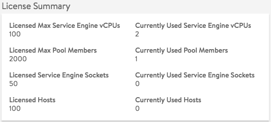

Avi Vantage software requires a <a href="/terms-of-avi-vantage-license/">license</a>. This article describes how to procure, install and manage Avi Vantage licenses.

## Obtaining an Avi Vantage License

Avi Vantage licenses can be downloaded from the <a href="https://avinetworks.com/portal">Avi Networks customer portal</a> or procured through the Avi sales team.

To activate a license, it will need to be added to the Avi Controller.

## Adding a New License

After obtaining a license from Avi Networks, the license can be activated by adding it to the Avi Controller.

1. Log onto the web interface and navigate to Administration > Settings > Licensing.
1. Click Upload License File and navigate to the file.
1. After the license file is uploaded, the new license appears in the Avi Controller's license list. Information about the license, including the start date and expiration date, is shown.

 

## Updating an Existing License

Updating an existing license follows the same process as adding a new license. When a license file has the same license ID (with updated limit and/or expiration date), uploading this license file will update the existing entry in place.

## Checking License Usage

To check license usage information, navigate to Administration > Settings > Licensing. The license limits and current usage are shown.

## Reaching the License Limit

When the license limit is reached, new SEs are neither created nor registered with the Avi Controller. Existing service engines can be used for existing or new virtual services.

In the case of container cloud environments, after the license limit has been reached, new SEs are not created even if new hosts are added to the cluster. Any new tasks or containers created on new container hosts may have degraded access to the existing load-balanced applications as SEs not present on those hosts.

## License Expiration

If the Avi Vantage license is allowed to expire, the Avi Controller prevents creation of any new virtual services (applications) or SEs. There is no impact to existing virtual services. After the license expires, the system defaults to the free perpetual limits.

### License Expiration Events

Avi Vantage automatically generates a LICENSE_EXPIRY_NOTIF event once every day starting one month before expiry and one event every hour starting two days before expiration.

The events are included in the events table. (Navigate to Operations > Events).

### License Expiration Alerts

Optionally, Avi Vantage can be configured to generate license-expiration <a href="/alerts-overview/">alerts</a>. Based on the alert configuration, the alerts are triggered by license expiration events and are manifested as emails, syslog messages, SNMP traps, and/or ControlScript executions.