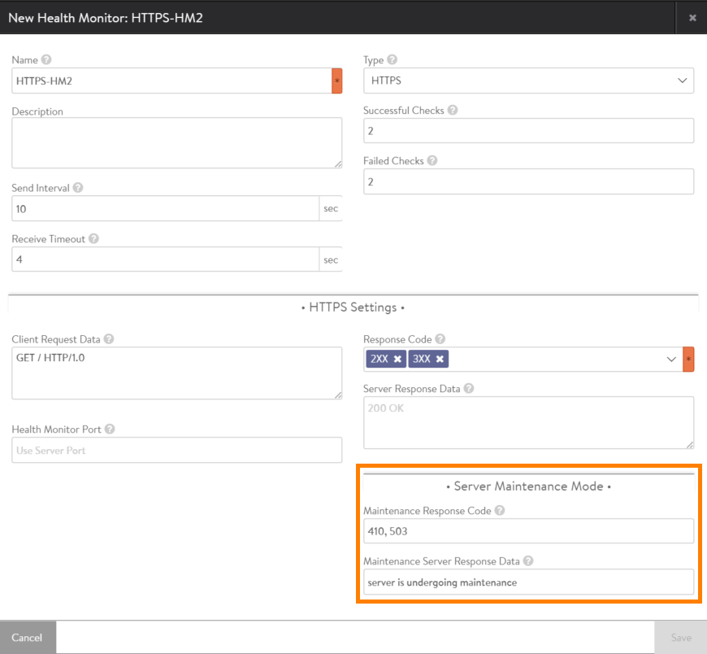

Avi Vantage provides a way to actively <a href="/disabling-back-end-servers-for-maintenance">disable back-end servers</a> for maintenance.

Vantage also can be configured to use information in the health-check responses from servers to detect when a server is in maintenance mode. Administrators and application developers can use information in the health-check responses from servers to detect when a server is in maintenance mode.

The information can be a specific response code (example: HTTP code 503) or a specific response message string (example: "Server is under maintenance"). Such an event is operationally different from a case where the server process is down due to a software issue. During the time a server is under maintenance, new connections should not be sent to the server, and existing connections should be drained.

## Maintenance Mode Detection

Beginning in Avi Vantage 16.2, some types of health monitors can be configured to detect when a server has entered maintenance mode, based on specific response codes or response data contained in the server's responses to health checks. This monitor must be associated with the pool the server is in.

* Response code: HTTP and HTTPS health monitors can be configured to filter for a specific HTTP response code (101-599). If the code is detected in a server's response to a health check based on the HTTP or HTTPS monitor, Vantage changes the server's status to "down for maintenance."

* Response data: TCP, UDP, HTTP, and HTTPS health monitors can be configured to filter for specific data (a response string). If the string is detected in a server's response to a health check based on the HTTP or HTTPS monitor, Vantage changes the server's status to "down for maintenance." The response data must be within the first 2 K bytes of the response data.

An HTTP or HTTPS health monitor can filter for up to 4 maintenance response codes.

HTTP and HTTPS health monitors can contain any combination of filters for detecting a maintenance mode:

* Response string
* Multiple response codes
* Maintenance response string
* Up to four maintenance response codes

TCP and UDP health monitors can contain filter for maintenance mode based on either or both of the following:

* Response string
* Maintenance response string

## Maintenance Mode Indication

When Vantage detects that a server has entered maintenance mode, the server's health status is changed to "down for maintenance."

When a server is marked down for maintenance, the existing connections to the server are left untouched and are allowed to close on their own. Vantage continues to send health checks to the server. When the server stops responding with the maintenance string or code, this indicates to Vantage that the maintenance mode has concluded, and changes the server's health status to "up."

Likewise, the server's change into and back out of maintenance mode is indicated in the event log.

## Configuring a Health Monitor To Detect Server Maintenance Mode

### Web Interface

1. Navigate to the configuration popup for the health monitor:

1. Navigate to Templates > Health Monitor.
1. Click the edit icon next to the name of the health monitor.
1. If creating a new health monitor, click Create, enter a name, and select the monitor type: TCP or UDP for layer 4, HTTP or HTTPS for layer 7.
1. In the Server Maintenance Mode section, enter the response code(s) or data to use as the indicator that a server is in maintenance mode.
1. Click Save.

**Example HTTPS Health Monitor with Maintenance Mode Detection**

**Example TCP Health Monitor with Maintenance Mode Detection**

### Attaching a Health Monitor to a Pool

The health monitor is used only for the pools the monitor is attached to. To attach a health monitor to a pool, select the monitor from the Add Active Monitor pull-down menu, on the Settings tab of the configuration pop for the pool:

### CLI

The following commands configure an HTTP health monitor to filter for the string "under construction" in health-check responses from servers:
<pre class="">: &gt; configure healthmonitor System-HTTP
: healthmonitor&gt; http_monitor
: healthmonitor:http_monitor&gt; maintenance_response "under construction"
: healthmonitor:http_monitor&gt; save
: healthmonitor&gt; save
</pre>

The following commands configure the same HTTP health monitor to filter for response codes 500 and 501 in health-check responses from servers:
The following commands configure an HTTP health monitor to filter for the string "under construction" in health-check responses from servers:

<pre class="">: &gt; configure healthmonitor System-HTTP
: healthmonitor&gt; http_monitor
: healthmonitor:http_monitor&gt; maintenance_code 500
: healthmonitor:http_monitor&gt; maintenance_code 501
: healthmonitor:http_monitor&gt; save
: healthmonitor&gt; save
</pre>

The following commands edit the health monitor's configuration to remove the filter a response string:

<pre class="">: &gt; configure healthmonitor System-HTTP
: healthmonitor&gt; http_monitor
: healthmonitor:http_monitor&gt; no maintenance_response
: healthmonitor:th&gt; save
: healthmonitor&gt; save
</pre>