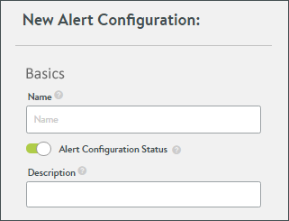
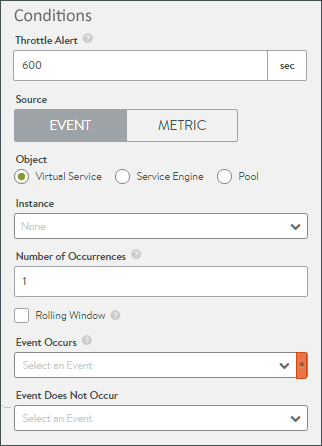
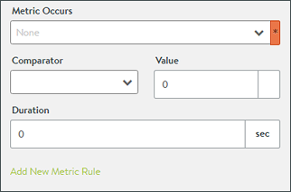

<html>
 <head></head>
 <body>
  --- title: Alert Config layout: default --- 
  Events trigger alerts to actively highlight important information. Avi Vantage includes a number of default alerts via the Operations &gt; Alerts &gt; Alert Config page. The default system alerts may not be deleted, but can be modified or disabled. Alert configs are triggers that determine whether or not an alert should be generated. See the 
  <a href="/docs/latest">Alerts Overview</a> for a broader description of the entire process depicted in the above graphic. &nbsp; ### ### Create an Alert Config Alert config objects are triggers which determine if a set conditions are true, and then execute the configured actions. The create/edit modal is organized into three sections. 
   ### Basics: * **Name**: Enter a unique name for the alert configuration. * **Status**: Enable or disable the alert configuration from generating alerts. * **Description**: Enter a custom description. &nbsp; ### Condition: The conditions must be true for the alert config to trigger the alert. If multiple conditions exist, then all conditions must be true. * **
  Throttle Alert**: The alert may only be triggered once within the specified timeframe. A value of 0 indicates there will be no time-based throttling. The timer begins once the alert is triggered. * **Source - Event**: An event&nbsp;triggers&nbsp;the alert. &nbsp;See the 
  <a href="/events-list/">Event List</a> for a list and brief description of all events. * **Object**: Listen for the desired event within a specified virtual service, Service Engine, or pool. * **Instance**: Choose from&nbsp;a list of objects, based on the previously defined object type. * **Number of Occurrences**: The event must be seen X many times before the alert condition is met. * **Rolling Window**: When unchecked, the condition is true when the Number of Occurrences is met. If the Occurrences value is set to 1, then every occurrence will trigger the alert (though the Throttle Alert may suppress any alerts beyond the first one). If the Occurrences is set to a higher number, such as 100, then the alert is triggered every 100 times the event happens. When the Rolling Window is checked, a corresponding Time Window field must be populated. If the number of Occurrences is true within the specified window of time, then the alert is triggered. Once the time window expires, the Number of Occurrences is reset and the counter begins again. For example, if a client attempts more than 100 TCP connections within a five minute window, trigger the alert. * **Event Occurs**: Name&nbsp;the event that would trigger the alert. * **Event Does Not Occur**: This field is optional. When set, this event must not be true during the same time window and number of occurrences as the event defined in the Event Occurs field. &nbsp; * **
  Source - Metric**: &nbsp;Metrics trigger the alert. When the Source is set to Metric, a few&nbsp;different options are presented. See the 
  <a href="/metrics-list/">Metric List</a> for a list and brief description of all metrics. * **Metric Occurs**: &nbsp;Select the desired metric. * **Comparator**: The metric entry is compared via *greater than or equals*, *equals*, or *less than&nbsp;or equals*&nbsp;to the averaged entry in the Value&nbsp;field over the specified number of seconds. * **Value**: Enter&nbsp;the scalar portion&nbsp;of the metric. For&nbsp;example, if one means to specify&nbsp;"2 milliseconds," "2" is the scalar and "milliseconds" is&nbsp;the unit of measure. After&nbsp;a selection is made in the Metric Occurs field, Vantage will auto-populate the unit&nbsp;portion of the Value field. The units of measurement for the various metrics&nbsp;are documented in the&nbsp;
  <a href="/docs/api-guide/api-guide-metrics-query-api/">Metrics Query API</a>. * **Duration**: The alert is triggered if the metric's value is &gt;=, =, or &lt;= to the specified value field, averaged over the period of time specified by the duration. * **Add New Metric Rule**: Additional rules may be specified. When multiple rules exist, all of them must be true. &nbsp; ### Actions: * 
  Alert Action: Specify an alert action, which defines the type of notifications to generate or other tasks resulting from the triggered alert. * Alert Expiry Time: The triggered alert will be visible in the Vantage web interface for this duration of time, after which it is deemed expired and deleted. &nbsp; &nbsp;
 </body>
</html>