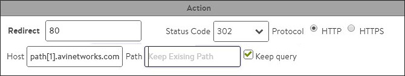

Policies allow advanced customization of network layer security, HTTP security, HTTP requests, and HTTP responses. A policy may be used to control security, client request attributes, or server response attributes. Policies are comprised of *matches* and *actions*, similar to an if/then logic. If something is true, then it matches the policy, therefore, perform the following action.

Policies are comprised of one or more rules, which are match/action pairs. A rule may contain many matches, or have many actions. Multiple policies may be configured for a virtual service. Policies may alter the default behavior of the virtual service, or if matching criteria is not met, they may be benign for a particular connection, request, or response.

Policies are not shared; they are defined on a per virtual service basis. While powerful, policies are intended to be simple point and click functionality.

For more advanced capabilities, see <a href="/docs/latest/overview-of-datascript/">DataScripts</a>.

Policies are configured within the policy tab of the virtual service edit screen.

### Prioritizing Policies

Policies may be used to recreate similar functionality found elsewhere within Vantage. For instance, a policy may be configured to generate an HTTP redirect from HTTP to HTTPS. This same functionality may be configured within the Secure-HTTP application profile. Because a policy is more specific than a general purpose profile, the policy will take precedence.

If the profile is set to redirect HTTP to HTTPS via port 443, and the policy is set to redirect HTTP to HTTPS on port 8443, the client will be sent to port 8443. (See <a href="/docs/latest/datascript-execution-priority/">Execution Priority</a> for more on this topic.)

A virtual service may have multiple policies defined, one for each of the four types. Once defined, policies for the four types are implemented in the following order of priority.
<ol> 
 <li>Network security policy</li> 
 <li>HTTP security policy</li> 
 <li>HTTP request policy</li> 
 <li>HTTP response policy</li> 
</ol> 

For example, a network policy that is set to discard traffic takes precedence over an HTTP request policy to modify a header. Since the connection is discarded, the HTTP request policy will not execute. Each policy type may contain multiple rules, which in turn can be prioritized to process in a specified order. This is done by moving the policies up or down in the ordered list within the Vantage UI.

### Match / Action

All policies are made up of match and action rules, which are similar in concept to "if / then" logic. Administrators set match criteria for all connections, requests, or response to the virtual service. Vantage then executes the configured actions for all traffic that meets the match criteria.

A single match with multiple entries is treated as "or" operation. For example, if a single match type has the criteria "marketing", "sales", and "engineering" set, then the match is true if the path contains "marketing", or "sales", or "engineering".

If a rule has multiple matches configured, then all match types must be true for the action to be executed. In the figure above, both the path and HTTP method matches must be true. Within each of these two match types, only one of the entries to be true for that match type to be true. For HTTP method, a client request must be of type GET or HEAD. Multiple rules may be configured for each policy, and they may be configured to occur in a specified order. If no match is applied, the condition is automatically met and the actions will execute for each connection as appropriate for the policy type.

Matches against HTTP content are case insensitive. This is true for header names and values, cookies, host names, paths, and queries. For HTTP policies, Vantage compares Uniform Resource Identifier (URI) matches against the decoded HTTP URI. Many browsers and web servers encode human-readable format content differently. For example, a browser’s URI encoding might translate the dollar character "$" to "%24". The Service Engine (SE) translates the "%24" back to "$" before evaluating it against the match criteria.

### Create a Policy

The Virtual Service editor defines policies that consist of one or more rules that control the flow of requests through the virtual service. To create a policy:
<ol> 
 <li><strong>Policy Type:</strong> First select the policy type to add by selecting one of the following categories: 
  <ul> 
   <li><strong>HTTP Security:</strong> HTTP security policies perform defined actions such as allow/deny, redirect to HTTPS, or respond with a static page.</li> 
   <li><strong><strong>Network Security:</strong> </strong>Is configured to explicitly allow or block traffic of user-defined types onto the network.</li> 
   <li><strong>HTTP Request:</strong> HTTP request policies allow manipulation of HTTP Requests and content switching; they allow customized actions based on client HTTP requests.</li> 
   <li><strong>HTTP Response:</strong> HTTP response policies evaluate responses from the server, and can be used to modify the server’s response headers. HTTP response policies are most often used in conjunction with HTTP request policies to provide an Apache Mod_ProxyPass capability for rewriting a website’s name between the client and server.</li> 
  </ul> </li> 
 <li><strong>Create Rule:</strong> Create a new rule by clicking the green add rule button and then entering the following information for the new rule: 
  <ul> 
   <li><strong>Enable/Disable:</strong> By default, the new rule will be enabled. The green icon can be clicked to change to gray, which means this rule will be disabled, and will have no effect on traffic while in this state.</li> 
   <li><strong>Rule Name:</strong> Enter a unique name for the rule in the rule name field, or leave the default system generated name in place.</li> 
   <li><strong>Logging:</strong> Select the checkbox if you want logging enabled for this rule. When enabled, a log will be generated for any connection or request that matches the rule’s match criteria. If a virtual service is already set to log all connections or requests, this logging checkbox will not create a duplicate log. Client logs will be flagged with an entry for the policy type and rule name that matched. When viewing the policy’s logs within the logs tab of the virtual service, the logs will be part of the Significant logs option unless the specific connection or request is an error, in which case it may be visible via the default Non-Significant logs filter.</li> 
   <li><strong>Match:</strong> Add one or more matches using the pull-down menu. The match options will vary depending on the context defined by the policy type you are creating. If a rule is not given a match, then all connections or requests will be considered true or matched.</li> 
   <li><strong>Action:</strong> Add one or more actions to be taken when the matches are true. The available options will vary depending on the type of rule you are creating.</li> 
   <li><strong>Save:</strong> Click the save rule button to save the new rule.</li> 
  </ul> </li> 
 <li><strong>Ordering:</strong> Rules are enforced in the order in which they appear in the list. For example, if you add a rule to close a connection based on a client IP address followed by a rule that redirects an HTTP request from that IP address to a secure HTTP (HTTPS) connection, then Avi Vantage will close the connection without forwarding the request. Alter the order in which rules are applied by clicking the up and down arrow icons until the rules are in the desired order.</li> 
</ol> 

### Network Security

The following table lists both the available Network Security Match Criteria and the configurable Actions that can occur when a match is made.

<table class="table table-hover table table-bordered table-hover">  
<tbody>      
<tr>   
<td rowspan="2">Match</td>
<td><strong>Client IP:</strong> Client IP address or a Group of client addresses.

 
<ul> 
 <li>Use a "-" to specify a range: <code>10.0.0.0-10.1.255.255</code></li> 
 <li>Use a "/" to specify a netmask: <code>10.0.0.0/24</code></li> 
</ul></td>
</tr>
<tr>  
<td><strong>Service Port:</strong> The ports the Virtual Service is listening on.</td>
</tr>
<tr>   
<td rowspan="3">Actions</td>
<td><strong>Logging:</strong> Selecting the logging checkbox causes Vantage to log when an action has been invoked.</td>
</tr>
<tr>  
<td><strong>Allow / Deny:</strong> Explicitly allow or deny any matched traffic. Denied traffic will be issued a reset (RST), unless the system is under a volumetric or denial of service attack, in which case the connection may be silently discarded.</td>
</tr>
<tr>  
<td><strong>Rate Limit:</strong> Restrict clients from opening greater than the specified number of connections per second in the Maximum Rate. Clients that exceed this number will have their excessive connection attempts silently discarded. If Burst Size is enabled, clients may be able to burst above the Max Rate provided they have not recently been opening connections. This feature may be applied to TCP or UDP. All clients that match the Match criteria will be treated as one bucket. For instance, if no Match is defined, any and all IP addresses will increment the Max Rate counter. Throttling will occur for all new connecting clients. To enable per client throttling, see the <a href="/docs/configuration-guide/applications/virtual-services/create-virtual-service/#vscreateadvanced">Advanced tab</a> for the virtual service. The manual for this page also contains a more robust description of connecting throttling.</td>
</tr>
</tbody>
</table> 

### HTTP Security

The following table lists both the available HTTP Security Match Criteria and the configurable Actions that can occur when a match is made.

<table class="table table-hover table table-bordered table-hover">  
<tbody>                   
<tr>   
<td rowspan="13">Match</td>
<td><strong>Client IP:</strong> Client IP address or a Group of client addresses.

 
<ul> 
 <li>Use a "-" to specify a range: <code>10.0.0.0-10.1.255.255</code></li> 
 <li>Use a "/" to specify a netmask: &lt;code</li> 
</ul></td>
</tr>
<tr>  
<td><strong>Service Port:</strong> The ports the Virtual Service is listening on.</td>
</tr>
<tr>  
<td><strong>Protocol Type:</strong> HTTP or HTTPS.  Example: <em><strong>https:</strong>//www.avinetworks.com/marketing/index.html?a=1&amp;b=2</em></td>
</tr>
<tr>  
<td><strong>HTTP Method:</strong> The method used by the client request. The match is true if any one of the methods that an administrator specifies is true.</td>
</tr>
<tr>  
<td><strong>HTTP Version:</strong> True if the client version is .9, 1.0, or 1.1</td>
</tr>
<tr>  
<td><strong>Path:</strong> The path or a group of paths. Paths do not need to begin with a forward slash ( / ). For comparison purposes, Vantage automatically omits any initial slash specified in the match field. Example: https://www.avinetworks.com/<b>marketing/index.html</b>?a=1&amp;b=2</td>
</tr>
<tr>  
<td><strong>Query:</strong> A query or a group of queries. Do not add the leading ‘?’ or ‘&amp;’ characters to a match.  Example: <em>https://www.avinetworks.com/marketing/index.html?<strong>a=1&amp;b=2</strong></em></td>
</tr>
<tr>  
<td><strong>Headers:</strong> True if a header exists, or if it exists and contains a specified value</td>
</tr>
<tr>  
<td><strong>Cookie:</strong> True if a cookie exists, or if it exists and contains a specified value</td>
</tr>
<tr>  
<td><strong>Host Header:</strong> The request’s host header.  Example: <em>https://<strong>www.avinetworks.com</strong>/marketing/index.html?a=1&amp;b=2</em></td>
</tr>
<tr>  
<td><strong>Location Header:</strong> The Location Header may not exist for every website.</td>
</tr>
<tr>  
<td><strong>HTTP Status:</strong> The status of the response, such as 200 (success), 404 (file not found), or similar. The statuses can be separated by commas, or be a range. For example: 301, 302, 307, 308, 300-599</td>
</tr>
<tr>  
<td><strong>Response Header:</strong> Match based on a specific header sent by the server.</td>
</tr>
<tr>   
<td rowspan="5">Actions</td>
<td><b>Logging:</b> Selecting the logging checkbox causes Vantage to log when an action has been invoked.</td>
</tr>
<tr>  
<td><b>Action Allow:</b> Allows matched requests to continue on to further policies or to the destination pool servers.</td>
</tr>
<tr>  
<td><b>Action Close Conn:</b> Matched requests will cause Vantage to close the TCP connection that received the request via a FIN. Many browsers open multiple connections, which are not closed unless requests sent over those connections also trigger a close connection action.</td>
</tr>
<tr>  
<td><b>Redirect To HTTPS:</b> Respond to the request with a temporary redirect to the desired port for SSL.</td>
</tr>
<tr>  
<td><b>Action Send Response:</b> Vantage may serve an HTTP response using HTTP status code 200 (success), 403 (unauthorized), or 404 (file not found). A default page is rendered by the browser for each of these status codes, or you may upload a custom .html file. This file may have links to images or other files, but only the initial html file will be stored and served via the Send Response.</td>
</tr>
</tbody>
</table> 

### Policy Tokens

In more complex scenarios, an administrator may wish to capture data from one location and apply it to another location. Vantage supports the use of variables and tokens, which can be used for this purpose.

Variables may be used to insert dynamic data into the Modify Header Actions of HTTP Request and HTTP Response policies. Two variables are supported, $client_ip and $vs_port. For example, a new header may be added to an HTTP request called origin_ip, with a value set to $client_ip, which will insert the client's source address as the value of the header.

Tokens may be used to find and reorder specific parts of the HTTP hostname or path. For example, it is possible to rewrite the original request **http://support.avinetworks.com/docs/index.htm** to **http://www.avinetworks.com/support/docs/index.htm**. Tokens can be used for HTTP host and HTTP path. The tokens are derived from the original URL. Token delimiter in host header is "." and in the URL path is "/".
> Example 1
 
<table class="table table-hover table table-bordered table-hover">  
<tbody>   
<tr>       
<td>Original request URL:</td>
<td>support</td>
<td>avinetworks</td>
<td>com</td>
<td>docs</td>
<td>index.htm</td>
</tr>
<tr>       
<td>Token:</td>
<td>host[0]</td>
<td>host[1]</td>
<td>host[2]</td>
<td>path[0]</td>
<td>path[1]</td>
</tr>
</tbody>
</table> 

In the example above, the client request is broken down into HTTP host and HTTP path. Each section of the host and path are further broken down according to the "." and "/" delimiters for host and path. A host or path token may be used in an Action to rewrite a header, a host, or a path. In the example below, a redirect of **http://www.avinetworks.com/support/docs/index.htm** would send requests to docs.avinetworks.com/support/docs/index.htm.

In addition to using the host[0], host[1], host[2] convention, a colon may be used to denote the system should continue till the end of the host or path. For instance, host[1:] implies to use avinetworks, followed by any further host fields. The result would be avinetworks.com. This is especially useful in a path, which may contain many levels. Tokens may also specify a range, such as path[2:5]. Host and path tokens may also be abbreviated as “h” and “p”, such as h[1:] and p[2].

In the rewrite URL, redirect, and rewrite location header actions, the host component of the URL can be specified in terms of tokens - the tokens can be constants strings, tokens from existing host and path component of the URL.
> Example 2
 

New URL: region.avinetworks.com/france/paris/index.htm

<table class="table table-hover table table-bordered table-hover">  
<tbody>     
<tr>        
<td>Request URL:</td>
<td>paris</td>
<td>france</td>
<td>avinetworks</td>
<td>com</td>
<td>region</td>
<td>index.htm</td>
</tr>
<tr>        
<td>Token:</td>
<td>host[0]</td>
<td>host[1]</td>
<td>host[2]</td>
<td>host[3]</td>
<td>path[0]</td>
<td>path[1]</td>
</tr>
<tr>   
<td>New Host:</td>
<td colspan="6">path[0].host[2:]</td>
</tr>
<tr>   
<td>New Path:</td>
<td colspan="6">/host[1]/host[0]/path[1]</td>
</tr>
</tbody>
</table> > Example 3
 
<table class="table table-hover table table-bordered table-hover">  
<tbody>       
<tr>         
<td>Request URL:</td>
<td>www1</td>
<td>avinetworks</td>
<td>com</td>
<td>sales</td>
<td>foo</td>
<td>index.htm</td>
<td>auth=true</td>
</tr>
<tr>         
<td>Token:</td>
<td>host[0]</td>
<td>host[1]</td>
<td>host[2]</td>
<td>path[0]</td>
<td>path[1]</td>
<td>path[2]</td>
<td>(query)</td>
</tr>
<tr>   
<td>New Host:</td>
<td colspan="8">www.host[1:]</td>
</tr>
<tr>   
<td>New Path:</td>
<td colspan="8">/host[0]/path[0:]</td>
</tr>
<tr>   
<td>Query:</td>
<td colspan="8">Keep Query enabled</td>
</tr>
<tr>   
<td>New URL:</td>
<td colspan="8">www.avi.com/www1/sales/foo/index.htm?auth=true</td>
</tr>
</tbody>
</table> 
* If the host header contains an IPv4 address and not a FQDN, and the rewrite URL or redirect action refers to a host token (e.g. host[0], host[1,2], etc.) the rule action is skipped and the next rule is evaluated.
* If the host header or path contains less tokens than that referenced in the action, then the rule action is skipped. For example, if the host name in host header has only 3 tokens (host name www.avinetworks.com - token host[0] = www, host<a href="img/apps_vs_policies_about1-1.jpg">1</a> = avinetworks, host<a href="img/apps_vs_policies_about2-1.jpg">2</a> = com). If the action refers to host[4] the rule action is skipped.
* If the location header in the HTTP response contains an IPv4 address and the response policy action is rewrite location header which refers to host tokens, the rule action is skipped.
* Rule engine does not recognize octal or hexadecimal IPv4 address in the host address. That is, the rule action will not be skipped if the host header has octal/hexadecimal IPv4 address and the action references a host token such as host<a href="/wp-content/uploads/2015/12/apps_vs_policies_about1-1.jpg">1</a>, etc.
* If an HTTP Request arrives with multiple host headers, the first host header will be used.
* Per RFC, HTTP 1.1 Requests must have a non-empty host header, else a 400 ‘Bad Request’ HTTP Response will be returned by Vantage.
* The HTTP processing is performed against decoded URIs.  