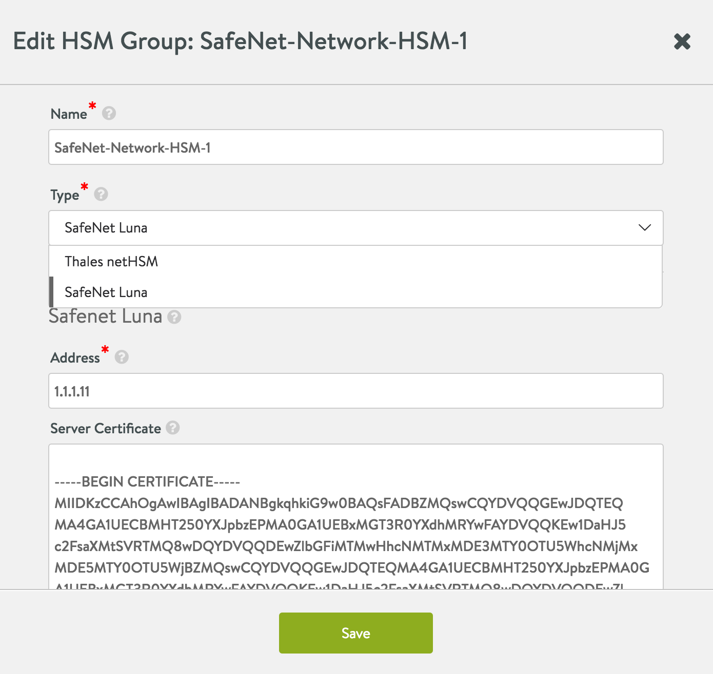

<html>
 <head></head>
 <body>
  --- title: Vantage Integration with SafeNet Network HSM layout: default --- ## Introduction Avi Vantage includes support for networked hardware security module (HSM) products, including SafeNet&nbsp;Network HSM and&nbsp;Thales nShield. This article covers the&nbsp;SafeNet Network HSM (formerly Luna SA) integration. For Thales nShield support, see 
  <a href="/thales-nshield-integration-2/">here</a>. This article describes how&nbsp;to configure Vantage to use the key generation and encryption/decryption services provided by SafeNet Network HSM. This enables use of SafeNet Network HSM to store keys associated with SSL/TLS resources configured on a virtual service. 
   ## Integration Support Avi Vantage release 16.2&nbsp;uses SafeNet Network HSM&nbsp;Client Software Release 5.4.1 for 64-bit Linux. Vantage can be configured to support a cluster of HSM devices in high availability (HA) mode. Vantage support of HSM devices requires installation of the user's SafeNet Client Software bundle, which can be downloaded from the 
  <a href="http://www.safenet-inc.com/">SafeNet</a>/Gemalto website. Starting with 16.2.2, Avi Vantage supports creation and usage of more than one HSM profile. 
   ### Prerequisites Before using Vantage with SafeNet Network&nbsp;HSM, the following are required: * SafeNet devices are installed on your network. * SafeNet devices are reachable from the Avi Controller and Avi Service Engines. * SafeNet devices have a virtual HSM partition defined before installing the client software. * Each Avi Controller and Service Engine must: 1) &nbsp;Have the client license from SafeNet to access the HSM. 2)&nbsp; Be able to reach the HSM at ports 22 and 1792 through Avi Controller, SE management, or SE data path interface. Note: Starting with 16.2.2, the&nbsp;SSL handshake-related communication between Avi SE and the HSM can also be performed by SE&nbsp;data path interfaces. As shown below, this can be accomplished in the CLI by setting the use_data_network to TRUE in the hardwaresecuritymodulegroup object. 
  <pre class="command-line language-bash" data-prompt="username@avi:~$" data-output="1-1,3-7, 10-10, 13-22"><code> : &gt; configure hardwaresecuritymodulegroup TestHSM Updating an existing object. Currently, the object is: +--------------------+------------------------------------------------------------------+ | &nbsp;Object settings that would normally appear here have been | &nbsp;edited out to keep this screen display short in this KB article. +--------------------+------------------------------------------------------------------+ : hardwaresecuritymodulegroup&gt; hsm : hardwaresecuritymodulegroup:hsm&gt; use_data_network Overwriting the previously entered value for use_data_network : hardwaresecuritymodulegroup:hsm&gt; save : hardwaresecuritymodulegroup&gt; save +--------------------+------------------------------------------------------------------+ | | &nbsp;Most of the object settings that would normally appear here | &nbsp;have been edited out to keep this screen display short in this | &nbsp;KB article. Immediately below is the output of greatest | &nbsp;interest for readers of this KB article. | | &nbsp; use_data_network | True &nbsp; &nbsp; &nbsp; &nbsp; &nbsp; &nbsp; &nbsp; &nbsp; &nbsp; &nbsp; &nbsp; &nbsp; &nbsp; &nbsp; &nbsp; &nbsp; &nbsp; &nbsp; &nbsp; &nbsp; &nbsp; &nbsp; &nbsp; &nbsp; &nbsp; &nbsp; &nbsp; &nbsp; &nbsp; &nbsp; | | tenant_ref &nbsp; &nbsp; &nbsp; &nbsp; | admin &nbsp; &nbsp; &nbsp; &nbsp; &nbsp; &nbsp; &nbsp; &nbsp; &nbsp; &nbsp; &nbsp; &nbsp; &nbsp; &nbsp; &nbsp; &nbsp; &nbsp; &nbsp; &nbsp; &nbsp; &nbsp; &nbsp; &nbsp; &nbsp; &nbsp; &nbsp; &nbsp; &nbsp; &nbsp; &nbsp;| +--------------------+------------------------------------------------------------------+ : &gt;</code></pre> Download: * SafeNet Network HSM&nbsp;client software (Version 5.4) * SafeNet Network HSM&nbsp;customer documentation ### HSM&nbsp;Group Updates Creation, update or deletion&nbsp;of an HSM group requires reloading of a new SafeNet configuration, which can only be achieved by restarting the Avi SEs. Restart of Avi SEs temporarily disrupts&nbsp;traffic. ## SafeNet Software Import To enable support for SafeNet Network HSM, the downloaded SafeNet client software bundle must be uploaded to the Avi Controller. It must be&nbsp;named ***"safenet.tar"*** and can be prepared as follows: * Copy files from the downloaded software into any given directory (e.g., safenet_pkg). * Change directory (cd) to that&nbsp;directory, and enter the following **cp** commands: 
  <pre class="command-line language-bash" data-prompt="username@avi:~$"><code>cd safenet_pkg</code></pre> 
  <pre class="command-line language-bash" data-prompt="username@avi/safenet_pkg:~$"><code>cp 610-012382-008_revC/linux/64/configurator-5.4.1-2.x86_64.rpm configurator-5.4.1-2.x86_64.rpm
cp 610-012382-008_revC/linux/64/libcryptoki-5.4.1-2.x86_64.rpm libcryptoki-5.4.1-2.x86_64.rpm
cp 610-012382-008_revC/linux/64/vtl-5.4.1-2.x86_64.rpm vtl-5.4.1-2.x86_64.rpm
cp 610-012382-008_revC/linux/64/lunacmu-5.4.1-2.x86_64.rpm lunacmu-5.4.1-2.x86_64.rpm
cp 610-012382-008_revC/linux/64/cklog-5.4.1-2.x86_64.rpm cklog-5.4.1-2.x86_64.rpm
cp 610-012382-008_revC/linux/64/multitoken-5.4.1-2.x86_64.rpm multitoken-5.4.1-2.x86_64.rpm
cp 610-012382-008_revC/linux/64/ckdemo-5.4.1-2.x86_64.rpm ckdemo-5.4.1-2.x86_64.rpm
cp 610-012382-008_revC/linux/64/lunacm-5.4.1-2.x86_64.rpm lunacm-5.4.1-2.x86_64.rpm
tar -cvf safenet.tar configurator-5.4.1-2.x86_64.rpm libcryptoki-5.4.1-2.x86_64.rpm vtl-5.4.1-2.x86_64.rpm lunacmu-5.4.1-2.x86_64.rpm cklog-5.4.1-2.x86_64.rpm multitoken-5.4.1-2.x86_64.rpm ckdemo-5.4.1-2.x86_64.rpm lunacm-5.4.1-2.x86_64.rpm</code></pre> * In Vantage 16.2, HSM package upload is supported only through the CLI. You can use the following command in the Avi Controller CLI shell to upload the HSM package: 
  <pre class="command-line language-bash" data-prompt=":&nbsp;>" data-output="2-99"><code>upload hsmpackage filename /tmp/safenet_pkg/safenet.tar
HSM Package uploaded successfully</code></pre> This command uploads the packages and installs them on the Avi Controller or Avi Controllers (if clustered). If the Controller is deployed as a 3-node cluster, the command installs the packages on all 3 nodes. Upon completion, "HSM Package uploaded successfully" should appear as shown above. * Avi SEs in an SE group referring to an HSM group need a one-time reboot for auto-installation of the HSM packages. To reboot an Avi SE, issue the following CLI shell command: 
  <pre class="command-line language-bash" data-prompt=":&nbsp;>"><code>reboot serviceengine Avi-se-ksueq</code></pre> * To allow Avi Controllers to talk to SafeNet HSM, the SafeNet client software bundle distributed with the product must be uploaded to Avi Vantage. The software bundle preparation and upload is described above.&nbsp;In this example, note that the Avi SE name is "Avi-se-ksueq." ## Enabling&nbsp;HSM&nbsp;Support in Avi Vantage After using the above steps to install the&nbsp;SafeNet software bundle onto the Avi Controller, the Controller may be configured to secure virtual services with HSM certificates. Note: Starting with release 16.2.2, 
  <a href="/docs/latest/certificate-management-integration-for-csr-automation">automated CSR workflow for SafeNet HSM</a> is supported. 1. Create the HSM group and add the HSM devices to it. 1. Register the client with HSM devices. 1. Set up HA across HSM devices (optional). 1. Associate the HSM group with the SE group. 1. Add the application certificates and keys by importing them. These are the keys and certificates generated out of band. 1. Enable HSM support on a virtual service. Detailed steps are provided in the following sections. ### Step 1: Create the HSM group and Add the HSM Devices to it. To begin, use the following commands on controller bash shell to fetch the certificates of the HSM servers. The example below fetches certificates from two servers 1.1.1.11 and 1.1.1.13 
  <pre class="command-line language-bash" data-prompt="username@avi:$"><code>sudo scp admin@1.1.1.11:server.pem hsmserver11.pem
sudo scp admin@1.1.1.13:server.pem hsmserver13.pem</code></pre> The contents of these certificates are used while creating the HSM Group. Next, create the HSM group. From the GUI, navigate to Templates &gt; Security &gt; HSM Groups.&nbsp; Multiple HSMs may be included in the group via the green *Add Additional HSM* button. 
   This can also be configured using the Controller CLI shell: 
  <pre class="command-line language-bash" data-prompt=":&nbsp;>" data-output="2-99"><code>configure hardwaresecuritymodulegroup safenet-network-hsm-1
hardwaresecuritymodulegroup &gt; hsm type hsm_type_safenet_luna
hardwaresecuritymodulegroup:hsm &gt;sluna
hardwaresecuritymodulegroup:hsm:sluna &gt;server
New object being created
hardwaresecuritymodulegroup:hsm:sluna:server &gt;remote_ip 1.1.1.11
hardwaresecuritymodulegroup:hsm:sluna:server &gt;server_cert --
Please input the value for field server_cert (Enter END to terminate input):
-----BEGIN CERTIFICATE-----
MIIDKzCCAhOgAwIBAgIBADANBgkqhkiG9w0BAQsFADBZMQswCQYDVQQGEwJDQTEQ
MA4GA1UECBMRF250YXJpbzEPMA0GA1UEBxMGT3R0YXdhMRYwFAYDVQQKEw1DaHJ5
c2FsaXMtSVRTMQ8wDQYDVQQDEwZlbGFiMTEwHhcNMTMwNzI1MTQxODQzWhcNMjMw
gpQYJSXhgURy50VOkfRlKY9slVBOPBhofpzPgJut3Pckjdfskljsadlkjdsfkjjj
8M5XErJL0Wek4AkZg7kvM9JuKFJpvdLqkdbJfNFKfjAKEI3fpupmREPXMvAXgeU=
NzI3MTQxODQzWjBZMQswCQYDVQQGEwJDQTEQMA4GA1UECBMHT250YXJpbzEPMA0G
A1UEBxMGT3R0YXdhMRYwFAYDVQQKEw1DaHJ5c2FsaXMtSVRTMQ8wDQYDVQQDEwZl
bGFiMTEwggEiMA0GCSqGSIb3DQEBAQUAA4IBDwAwggEKAoIBAQDCLU9aV615D4m9
XeCN0yWtik1qDMNj2dnyo8qIy61VJuS1yBVsc4e+q2Hi+jWczb1kg5C819RQICMD
qkPMgNLPWNf9g9ZDtjabCS0WBE8qOs/HEuDWWC7w3r9KDvfYU8XQAhiDyRMt4QM7
y/zVP/HAmEi0ojsfzWlKP5rq44iZ4dYNuzATdhzG8N8otIwQ5yCPcePZ0p7OGwU1
pqu7AWmgCB+7Det/EafrY01S2vawnlF9i+oj5nYfB+Yz/vIZgVMvMJiDwG5waJ0t
k6bjZ9b8wvYjLc2CfL9utryO5h7c2Bh1cO77YjrC1gAWcwR0yKa0qm7NHy3ZfR9P
X1b6xOIJAgMBAAEwDQYJKoZIhvcNAQELBQADggEBAIBzlE0PuI51b0UR/TK3LAlI
Yso/F5pp4qnXgCYMgBG8Zt06WfHRR88ve7xun2FBPBSxpLGrwKwcsRbGyQqTfOgV
3/OZYg+ZZgHKcx7hlWp3oAdU622pxMedbgq9lDaAPhQfRBEby1KJDMNzNNDQLFmi
8ak+1oIyA2Fth4pBGK8og81EWx/F8Cs78vlXYhvnPVkr5qRiPRTIC+u3Bp09Ph6y
MvlO/wfJ+WDa7si8pKW3FgpQYJSXhgURy50VOkfRlKY9slVBOPBhofpzPgJut3Pc
8M5XErJL0Wek4AkZg7kvM9JuKFJpvdLqkdbJfNFKfjAKEI3fpupmREPXMvAXgeU=
-----END CERTIFICATE-----
END
hardwaresecuritymodulegroup:hsm:sluna:server &gt;partition_passwd my_partition_password
hardwaresecuritymodulegroup:hsm:sluna:server &gt;save
hardwaresecuritymodulegroup:hsm:sluna server &gt;
New object being created
hardwaresecuritymodulegroup:hsm:sluna:server &gt;remote_ip 1.1.1.13
hardwaresecuritymodulegroup:hsm:sluna:server &gt;server_cert --
Please input the value for field server_cert (Enter END to terminate input):
-----BEGIN CERTIFICATE-----
MIIDKzCCAhOgAwIBAgIBADANBgkqhkiG9w0BAQsFADBZMQswCQYDVQQGEwJDQTEQ
MA4GA1UECBMHT250YXJpbzEPMA0GA1UEBxMGT3R0YXdhMRYwFAYDVQQKEw1DaHJ5
c2FsaXMtSVRTMQ8wDQYDVQQDEwZlbGFiMTMwHhcNMTMxMDE3MTY0OTU5WhcNMjMx
N7y9UMf7bfF9w0OrXt0gpUUTAUOpULXIiDCf+HzSRGVjhfsdjhfdjdjjjdjdjhw1
K5fTJ/s+1YurTZOGnSoBve3YQtdby4FAIo4UZpErGFCeCEihu31Do+i4ZCTuJHA=
MDE5MTY0OTU5WjBZMQswCQYDVQQGEwJDQTEQMA4GA1UECBMHT250YXJpbzEPMA0G
A1UEBxMGT3R0YXdhMRYwFAYDVQQKEw1DaHJ5c2FsaXMtSVRTMQ8wDQYDVQQDEwZl
bGFiMTMwggEiMA0GCSqGSIb3DQEBAQUAA4IBDwAwggEKAoIBAQCuDVmYNQ9kxX02
9DTZmLCtXisbZI4jurnRI0OUuHhK+XIokNsdZTBSDKvkzVQieHMMl6Sw4kFxi1Fc
8SCSKeqDdbF72T+AFAL+qPqoCNxP0yKnklvx70aBIHryehhOIXsZinUkjcE75O8k
aBw2+ImAo/WAYjWSo61nsVW2i4/0GlpqMDuzMus0P0jivVt9Lt5MBmsk8a1UHmER
9M24X9tmX6nYuclPtEiji970JaCNpbf37myAXV7g9oiGHHecmJ5jhKaMGyNXvi6A
lJ2xThGX7zg4C0S1/W97N20SC6H6hpRq0WoFuGXMv0uSKOGOiPVnWsraJjSy2jIr
3Ob/y+bVAgMBAAEwDQYJKoZIhvcNAQELBQADggEBAF0+KnlxuP3C0OusYBCiqODg
/3UB9wYoe8RAsjzNWRfzDZMBokLXvGfpSrcGaBnhOk4iRWRQjGdWrmYySwkoKm4j
sKtJi305h2B4/Qlf48ppKAcz1QQynVFCTVmfNJCUHsmh6amzTDwujaW2kyPs6DhR
rTeW+4w5YzB8Ih8gcBo4Ngm5TMHYnKj++6WMESPVXEMRO8UsLWGiiroPvX+3vYLI
AldyShOxC3au8czFeWK5sN7y9UMf7bfF9w0OrXt0gpUUTAUOpULXIiDCf+HzSRGV
K5fTJ/s+1YurTZOGnSoBve3YQtdby4FAIo4UZpErGFCeCEihu31Do+i4ZCTuJHA=
-----END CERTIFICATE-----
END
hardwaresecuritymodulegroup:hsm:sluna:server &gt;partition_passwd my_partition_password
hardwaresecuritymodulegroup:hsm:sluna:server &gt;save
hardwaresecuritymodulegroup:hsm:sluna &gt;save
hardwaresecuritymodulegroup:hsm &gt;save
hardwaresecuritymodulegroup &gt;save</code></pre> In the above and below example, "my_partition_password" use the password provided by the SafeNet Network HSM administrator. ### Step 2: Register the Client with HSM Devices. Follow these steps: 1. From the controller bash shell, copy the client certificate file (under /etc/luna/cert/client/aviClient.pem) to all the HSM devices.
  <pre class="command-line language-bash" data-prompt="username@avi:~$"><code>scp aviClient.pem admin@1.1.1.11:</code></pre> 1. Register the client on the HSM.
  <pre class="command-line language-bash" data-prompt="username@avi:~$" data-output="2-99"><code>ssh admin@1.1.1.11
admin@1.1.1.11's password:
Last login: Thu May 12 19:52:00 2016 from 12.97.16.194
Luna SA 5.4.7-1 Command Line Shell - Copyright (c) 2001-2014 SafeNet, Inc. All rights reserved.
[1.1.1.11] lunash: client register -c aviClient -h aviClient 'client register' successful. Command Result : 0 (Success)
[1.1.1.11] lunash: client assignPartition -c aviClient -p par43 'client assignPartition' successful. Command Result : 0 (Success)
[1.1.1.11] lunash: exit</code></pre> 1. Perform the above steps (1) and (2) for all HSM devices. 1. On the Avi Controller bash shell, the application ID must be opened before the Avi SE can communicate with the HSM. This can be done using the following command which will automatically be replicated to each Avi Controller in the cluster:
  <pre class="command-line language-bash" data-prompt="username@avi:~$" data-output="2-99"><code>/opt/avi/scripts/safenet.py -p SafeNet-Network-HSM-1 -c "/etc/luna/bin/sautil -v -s 1 -i 1792:1793 -o -p my_partition_password"
Copyright (C) 2009 SafeNet, Inc. All rights reserved.
sautilis the property of SafeNet, Inc. and is provided to our customers for
the purpose of diagnostic and development only. &nbsp;Any re-distribution of this
program in whole or in part is a violation of the license agreement.
Config file: /etc/Chrystoki.conf.
Will use application ID [1792:1793].
Application ID [1792:1793] opened.
Open ok.
Session opened. Handle 1
HSM Slot Number is 1.
HSM Label is "ha1 &nbsp; &nbsp; &nbsp; &nbsp; &nbsp; &nbsp; &nbsp; &nbsp; &nbsp; &nbsp; &nbsp; &nbsp; &nbsp; &nbsp; ".WARNING: Application Id 1792:1793 has been opened for access. Thus access will
remain open until all sessions associated with this Application Id are
closed or until the access is explicitly closed.</code></pre> Note: In the step above, if an error message appears stating that the application is already open, you can close it using the following command. After closing it, reopen the application. 
  <pre class="command-line language-bash" data-prompt="username@avi:~$" data-output="2-99"><code>/opt/avi/scripts/safenet.py -p SafeNet-Network-HSM-1 -c "/etc/luna/bin/sautil -v -s 1 -i 1792:1793 -c"
Copyright (C) 2009 SafeNet, Inc. All rights reserved.
sautilis the property of SafeNet, Inc. and is provided to our customers for
the purpose of diagnostic and development only. &nbsp;Any re-distribution of this
program in whole or in part is a violation of the license agreement.
Config file: /etc/Chrystoki.conf.
Close ok.</code></pre> ### Step 3: Setting Up HA Across HSM Devices *(optional)*. The **listSlots**command provides details about the HSM devices to be set up. The serial number provided in the output of this command is needed to set up HA across these devices. The **haAdmin**subcommand under the **vtl**command provides these options. Once an HA group is created, additional members can be added using the **addMember**command, by providing the group number. The group number can be queried using **vtl haAdmin show**. Also note there are subsequent configuration options for **haAdmin**. More details about each of these commands can be found in the SafeNet documentation. 
  <pre class="command-line language-bash" data-prompt="username@avi:~$" data-output="2-13, 16-40"><code>/opt/avi/scripts/safenet.py -p SafeNet-Network-HSM-1 -c "/usr/safenet/lunaclient/bin/vtl listSlots"
Number of slots: 5

The following slots were found:

Slot # Description Label Serial # Status
========= ==================== =============================== ========== ============
slot #1 LunaNet Slot par43 156908040 Present
slot #2 LunaNet Slot par40 156936072 Present
slot #3 - - - Not present
slot #4 - - - Not present
slot #5 - - - Not present

sudo /opt/avi/scripts/safenet.py -p SafeNet-Network-HSM-1 -c "/usr/safenet/lunaclient/bin/vtl haAdmin newGroup -serialNum 156908040 -label my_ha_label -p my_partition_password"
sudo /usr/safenet/lunaclient/bin/vtl haAdmin show

================ HA Global Configuration Settings ===============

HA Proxy: disabled
HA Auto Recovery: disabled
Maximum Auto Recovery Retry: 0
Auto Recovery Poll Interval: 60 seconds
HA Logging: enabled
HA Log File: /tmp/haErrorLog.txt
Maximum HA Log File Length: 262144 bytes
Only Show HA Slots: no

================ HA Group and Member Information ================

HA Group Label: my_ha_label
HA Group Number: 1156908040
HA Group Slot #: 6
Synchronization: enabled
Group Members: 156908040
Standby members:

Slot # Member S/N Member Label Status
====== ========== ============ ======
1 156908040 par43 alive

sudo /opt/avi/scripts/safenet.py -p SafeNet-Network-HSM-1 -c "/usr/safenet/lunaclient/bin/vtl haAdmin addMember -group 1156908040 -serialNum 156936072"
sudo /opt/avi/scripts/safenet.py -p SafeNet-Network-HSM-1 -c "/usr/safenet/lunaclient/bin/vtl haAdmin HAOnly -enable"
sudo /opt/avi/scripts/safenet.py -p SafeNet-Network-HSM-1 -c "/usr/safenet/lunaclient/bin/vtl haAdmin autorecovery -retry 500"
sudo /opt/avi/scripts/safenet.py -p SafeNet-Network-HSM-1 -c "/usr/safenet/lunaclient/bin/vtl haAdmin synchronize -group 1156908040"</code></pre> Once HA has been set up, update the configuration to reflect this change. From the Avi Controller shell run the following commands.&nbsp; This will be automatically synced to each Controller in the cluster: 
  <pre class="command-line language-bash" data-prompt=":&nbsp;>" data-output="2-99"><code>configure hardwaresecuritymodulegroup safenet-network-hsm-1
hardwaresecuritymodulegroup &gt; hsm type hsm_type_safenet_luna
hardwaresecuritymodulegroup:hsm &gt;sluna
hardwaresecuritymodulegroup:hsm:sluna &gt;is_ha
hardwaresecuritymodulegroup:hsm:sluna &gt;save
hardwaresecuritymodulegroup:hsm &gt;save
hardwaresecuritymodulegroup &gt;save</code></pre> Alternatively, this can also be done in the web interface by selecting the HSM group. ### Step 4: Associate the HSM Group with an SE Group. The HSM group must be added to the SE group that will be used by virtual service. Navigate to&nbsp;Infrastructure &gt; Cloud &gt; Default-Cloud &gt; Service Engine Group &gt; Default Group. 
   This also can be configured using the Avi Controller CLI shell: 
  <pre class="command-line language-bash" data-prompt=":&nbsp;>" data-output="2-99"><code>configure serviceenginegroup Default-Group hardwaresecuritymodulegroup_ref safenet-network-hsm-1</code></pre> In the above, replace "safenet" with the name you used when creating the HSM group. ### Step 5: Add the Application Certificates and Keys by Importing Them. Use a browser to navigate to the Avi Controller’s management IP address. If Vantage is deployed as a 3-node Controller cluster, navigate to the management IP address of the cluster. Use this procedure to import the private keys created using the SafeNet&nbsp;cmu/sautil utilities, and the associated certificates. More details about this can be found in the Appendix section of this KB. 1. Navigate to Templates &gt; Security &gt; SSL/TLS Certificates, and click Create &gt; Application Certificate.
   1. Enter a name for the certificate definition. 1. Click Import. 1. Prepare to import the private key for the server certificate. 1. Above the Key field, in the Certificate Information section, select Paste text (to copy-and-paste the certificate text directly in the web interface) or Upload File. 1. If the key file is secured by a passphrase, enter it in the Key Passphrase field. 1. Paste the key file (if copy-and-pasting) or navigate to the location of the file (if uploading). 1. Prepare to import the server certificate: 1. Above the Certificate field, select Paste text or Upload File. 1. Paste the key file (if copy-and-pasting) or navigate to the location of the file (if uploading). 1. Click Validate. Vantage checks the key and certificate files to ensure they are valid. ### Step 6: Enable HSM Support on a Virtual Service. 1. In the Controller web management interface, navigate to Applications &gt; Virtual Services. 1. Click New or Edit. 1. If configuring a new virtual service, enter the name of the&nbsp;VIP. 1. Select the HSM certificate from the SSL Certificate drop-down list. 1. Enter the virtual service name and VIP address. 1. In the Service Port section, enable SSL. 1. Click Advanced. On the Advanced page, select the SE group to which the HSM group was added. 1. Click Save. The virtual service is now ready to handle SSL/TLS traffic using the encryption/decryption services of the SafeNet Network HSM device. ## Appendix: Vantage CLI Commands to Create Key and Sign Certificates (When Using SafeNet HSM) As an alternative to using the web interface, the CLI can be used to create a public/private key pair on the HSM and sign certificates. To generate 2048-bit RSA keys: 
  <pre class="command-line language-bash" data-prompt=":&nbsp;>" data-output="2-99"><code>/opt/avi/scripts/safenet.py -p SafeNet-Network-HSM-1 -c "/usr/safenet/lunaclient/bin/cmu generatekeypair -slot 1 -keyType RSA -modulusBits=2048 -publicExp=65537 -labelPublic=my-public-key -labelPrivate=my-private-key -sign=True -verify=True -encrypt=True -decrypt=True -wrap=False -unwrap=False -extractable=False -modifiable=False"</code></pre> To download the fake private key: 
  <pre class="command-line language-bash" data-prompt=":&nbsp;>" data-output="2-99"><code>/opt/avi/scripts/safenet.py -p SafeNet-Network-HSM-1 -c "/etc/luna/bin/sautil -s 1 -i 1792:1793 -a 0:RSA -f /tmp/my-pkey.pem"</code></pre> To generate a self-signed certificate: 
  <pre class="command-line language-bash" data-prompt=":&nbsp;>" data-output="2-99"><code>/opt/avi/scripts/safenet.py -p SafeNet-Network-HSM-1 -c "openssl req -engine gem -key /tmp/my-pkey.pem -new -x509 -days 365 -out /tmp/my-cert.crt"</code></pre> To generate ECDSA keys: 
  <pre class="command-line language-bash" data-prompt=":&nbsp;>" data-output="2-99"><code>/opt/avi/scripts/safenet.py -p SafeNet-Network-HSM-1 -c "openssl ecparam -out ecparam.pem -name prime256v1" </code></pre> 
  <pre class="command-line language-bash" data-prompt=":&nbsp;>" data-output="2-99"><code>/opt/avi/scripts/safenet.py -p SafeNet-Network-HSM-1 -c "/etc/luna/bin/sautil -v -s 1 -i 1792:1793 -m OID_:ecparam.pem -f my-ecdsa-key.pem"</code></pre> To generate a self-signed certificate: 
  <pre class="command-line language-bash" data-prompt=":&nbsp;>" data-output="2-99"><code>/opt/avi/scripts/safenet.py -p SafeNet-Network-HSM-1 -c "openssl req -engine gem -key my-ecdsa-key.pem -new -x509 -days 365 -out my-cert-1.crt"</code></pre>
 </body>
</html>