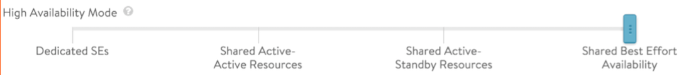
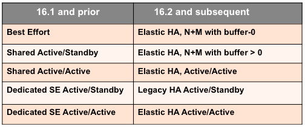
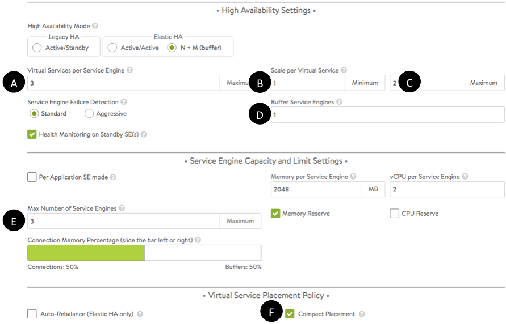

This article maps Avi Vantage's pre-16.2 SE-group high availability modes to those supported thereafter.

Prior to 16.2, HA modes ranged from dedicated SEs to shared best effort, as depicted in figure 1.
 Figure 1. SE group HA modes prior to Vantage release 16.2

 

 

 

 

 

Starting in Vantage 16.2, the High Availability Settings section of the SE Group editor offers three HA modes, as depicted in figure 2.
 Figure 2. HA modes, as defined in Vantage 16.2 and thereafter

The below table shows the correspondence between the previous and 16.2 HA modes.

 Table 1. HA mode correspondence

### Details

Pre-16.2 modes can be mimicked by choosing one of three modes and setting as many as seven options. [Note: Prior to 16.2, there was no equivalent to <a href="/docs/latest/legacy-ha-for-avi-service-engines">legacy active/standby HA</a>.] Refer to table 2 for suggested settings of the fields labeled A-F in figure 3.

 
 Figure 3. Basic SE group options

 

 Table 2. Settings found within the SE group editor

 

A variety of factors will affect the maximum number of SEs deployed in any one of the four modes, including:

* Native SE balancing versus BGP-based.
* Available resources.

To mimic a "dedicated SE active/active" environment, the maximum SE count of the active/active group should be double maxVS, the maximum number of virtual services intended for the SE group.