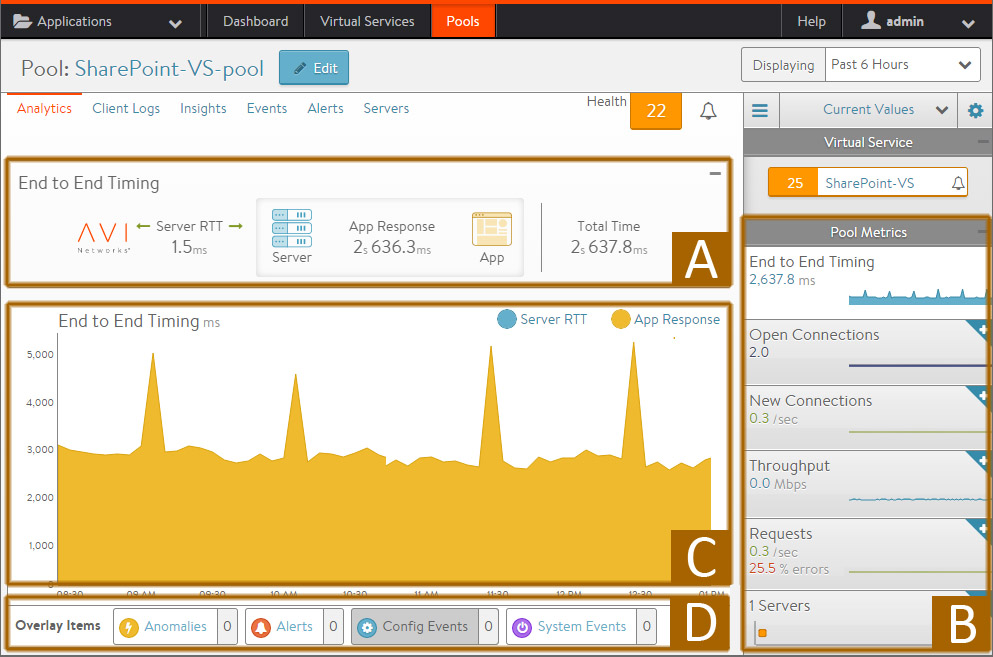
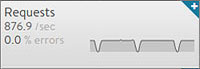

This chapter contains the following sections:

* <a href="img/apps_pools_details_servers.jpg">Pool Page</a>
* <a href="img/apps_servers_details_page.jpg">Pool Analytics Page</a>
* <a href="#logs">Pool Logs Page</a>
* <a href="#health">Pool Health Page</a>
* <a href="#servers">Pool Servers Page</a>
* <a href="#events">Pool Events Page</a>
* <a href="#alerts">Pool Alerts Page</a> 

Pools maintain the list of servers assigned to them and perform health monitoring, load balancing, persistence, and functions that involve Vantage-to-server interaction. A typical virtual service will point to one pool; however, more advanced configurations may have a virtual service content switching across multiple pools via <a href="http-request-policy/">HTTP request policies</a> or <a href="/docs/16.2.2/overview-of-datascript/">DataScripts</a>. A pool may only be used or referenced by only one virtual service at a time.

Creating a virtual service using the basic method automatically creates a new pool for that virtual service, using the name of the virtual service with a *-pool* appended. When creating a virtual service via the advanced mode, an existing, unused pool may be specified, or a new pool may be created.

## Pools Page

Select *Applications > Pools* to open the pools page. This page displays a high level overview of configured pools. This page includes the following functions:

 **Search**: Filter the list of pools by entering full or partial name of a pool.

 **Create**: Opens the create pool popup.

 **Edit**: Opens the edit pool popup.

 **Delete**: Select one or more pools in the table and click the delete button at the top left of the table to delete the pools. Only unused pools (with a gray health score) may be deleted. Pools that are in use (e.g. pools referenced by a virtual service) must first be disassociated from the virtual service by deleting or editing the VS.

The table on this page displays the following information for each pool. The columns shown may be modified via the sprocket icon in the top right of the table:

* **Name**: Lists the name of each pool. Clicking the name opens the Analytics tabof the Pool Details page.
* **Health**: Provides both a number from 1-100 and a color-coded status to provide quick information about the health of each pool. This will be gray if the pool is unused, such as not associated with a virtual service or associated with a VS that can not or has not been placed on a Service Engine.  
    * Hovering the cursor over the health score opens the pool's Health Score popup.
    * Clicking the View Insights link at the bottom of the pool's Health Score popup opens the health Insights tab of the Pool Detail page.
    * Clicking elsewhere within the pool's Health Score popup opens the Analytics tab of the Pool Details page.
* **Servers**: Displays the number of servers in the pool that are up out of the total number of servers assigned to the pool. For example, *2/3* indicates that two of the three servers in the pool are successfully passing health checks and are considered up.
* **Virtual Service**: The VS the pool is assigned to. Clicking a name in this column opens the VS Analytics tab of the Virtual Service Details page. If no virtual service is listed, this pool is considered unused.
* **Throughput**: Thumbnail chart of the throughput in Mbps for each pool for the time frame selected.  
    * Hovering the cursor over this graph shows the throughput at the selected time.
    * Clicking a graph opens the Analytics tab of the pool's Details page. 

### Pool Details Page

Clicking into a pool brings up the Details pages, which provide deeper views into the current pool.

This page contains the following sub-pages:

* <a href="img/apps_servers_details_page.jpg">Analytics</a>
* <a href="#logs">Logs</a>
* <a href="#health">Health</a>
* <a href="#servers">Servers</a>
* <a href="#events">Events</a>
* <a href="#alerts">Alerts</a> 

## Pool Analytics Page

The pool's Analytics tab presents information about various pool performance metrics. Data shown is filtered by the time period selected.

See the following for detailed information about this tab:

* (A) End-to-End Timing
* (B) Metric Tiles
* (C) Chart Pane
* (D) Overlays Pane  
    * Anomalies
    * Alerts
    * Config Events
    * System Events 

### Pool End-to-End Timing

The End to End Timing pane at the top of the Analytics tab of the Pool Details Page provides a high-level overview of the quality of the end-user experience and where any slowdowns may be occurring. The chart breaks down the time required to complete a single transaction, such an HTTP request.

It may be helpful to compare the end-to-end time against other metrics, such as throughput, to see how increases in traffic impact the ability of the application to respond. For instance, if new connections double but the end-to-end time quadruples, you may need to consider adding additional servers.

From left to right, this pane displays the following timing information:

* **Server RTT:** This is Service Engine to server round trip latency. An abnormally high Server RTT may indicate either that the network is saturated or more likely that a server’s TCP stack is overwhelmed and cannot quickly establish new connections.
* **App Response:** The time the servers take to respond. This includes the time the server took to generate content, potentially fetch back-end database queries or remote calls to other applications, and begin transferring the response back to Vantage. This time is calculated by subtracting the Server RTT from the time of the first byte of a response from the server. If the application consists of multiple tiers (such as web, applications, and database), then the App Response represents the combined time before the server in the pool began responding. This metric is only available for a layer 7 virtual service.
* **Data Transfer:** Data Transfer represents the average time required for the server to transmit the requested file. This is calculated by measuring from the time the Service Engine received the first byte of the server response until the client has received the last byte, which is measured as the when the last byte was sent from the Service Engine plus one half of a client round trip time. This number may vary greatly depending on the size of objects requested and the latency of the server network. The larger the file, the more TCP round trip times are required due to ACKs, which are directly impacted by the Client RTT and Server RTT. This metric is only used for a Layer 7 virtual service.
* **Total Time:** Total time from when a client sent a request until they receive the response. This is the most important end-to-end timing number to watch, because it is the sum of the other four metrics. As long as it is consistently low, the application is probably successfully serving traffic. 

### Pool Metrics

The sidebar metrics tiles contain the following metrics for the pool. Clicking any metric tile will change the main chart pane to show the chosen metric.

* **End to End Timing:** Shows the total time from the pool's End to End Timing graph. To see the complete end-to-end timing, including the client latency, see the <a href="/docs/16.2.2/../../../architectural-overview/applications/virtual-services/vs-analytics/">Analytics tab</a> of the Virtual Service Details page, which includes the client to Service Engine metric.
* **Open Connections:** The number of open (existing) connections during the selected time period.
* **New Connections:** The number of client connections that were completed or closed over the selected time period. See this <a href="/docs/16.2.2/new-connections-metric/">article </a>for an explanation of new versus closed connections per second.
* **Throughput:** Total bandwidth passing between the virtual service and the servers assigned to the pool. This throughput number may be different than the virtual service throughput, which measures throughput between the client and the virtual service. Many features may affect these numbers between the client and server side of Vantage, such as caching, compression, SSL, and TCP multiplexing. Hovering your mouse cursor over this graph displays the throughput in Mbps for the selected time period.
* **Requests:** The number of HTTP requests sent to the servers assigned to the pool. This metric also shows errors sent to servers or returned by servers. Any client requests that received an error generated by Vantage as a response (such as a 500 when no servers are available) are not be forwarded to the pool and will not be tracked in this view.
* **Servers:** Displays the number of servers in the pool and their health. The X-axis represents the number of HTTP requests or connections to the server, while the Y-axis represents the health score of the server. The chart allows you to view servers in relation to their peers within the pool, thus helping to spot outliers. Within the chart pane, click and drag the mouse over server dots to select and display a table of the highlighted servers below the Chart pane. The table provides more details about these servers, such as hostname, IP address, health, new connections or requests, health score, and the server’s static load balanced ratio. Clicking on the name of a server will jump to the pool's Server Insight page, which shows additional health and resource status. 

### Pool Chart Pane

The main chart pane in the middle of the Analytics tab displays a detailed historical chart of the selected metric tile for the current pool.

* Hovering the mouse over any point in the chart will display the results for that selected time in a popup window.
* Clicking within the chart will freeze the popup at that point in time. This may be useful when the chart is scrolling as the display updates over time.
* Clicking again will unfreeze the highlighted point in time. 

Many charts contain radio buttons in the top right that allow customization of data that should be included or excluded from the chart. For example, if the End to End Timing chart is heavily skewed by one very large metric, then deselecting that metric by clearing the appropriate radio button will re-factor the chart based on the remaining metrics shown. This may change the value of the vertical Y-axis.

Some charts also contain overlay items, which will appear as color-coded icons along the bottom of the chart.

### Pool Overlays Pane

The overlays pane is used to highlight important events within the timeline of the chart pane. This feature helps correlate anomalies, alerts, configuration changes, or system events with changes in traffic patterns.

Within the overlays pane:

* Each overlay type displays the number of entries for the selected time period.
* Clicking an overlay button toggles that overlay's icons in the chart pane. The button lists the number of instances (if any) of that event type within the selected time period.
* Selecting an overlay button displays the icon for the selected event type along the bottom of the chart pane. Multiple overlay icon types may overlap. Clicking the overlay type's icon in the chart pane will bring up additional data below the overlay Items bar. The following overlay types are available:  
    * **Anomalies**: Display anomalous traffic events, such as a spike in server response time, along with corresponding metrics collected during that time period.
    * **Alerts**: Display alerts, which are filtered system-level events that have been deemed important enough to notify an administrator.
    * **Config Events**: Display configuration events, which track configuration changes made to Vantage by either an administrator or an automated process.
    * **System Events**: Display system events, which are raw data points or metrics of interest. System Events can be noisy, and are best used as the basis of alerts which filter and classify raw events by severity. 

### Pool Anomalies Overlay

The anomalies overlay displays periods during which traffic behavior was considered abnormal based on recent historical moving averages. Changing the time interval will provide greater granularity and potentially show more anomalies.

Clicking the Anomalies Overlay button  displays yellow anomaly icons in the chart pane.  Selecting one of these icons within the chart pane brings up additional information in a table at the bottom of the page. During times of anomalous traffic, Vantage records any metrics that have deviated from the norm, which may provide hints as to the root cause of the anomaly.

An anomaly is defined as a metric that has a deviation of 4 sigma or greater across the moving average of the chart.

Anomalies are not recorded or displayed while viewing with the Real Time display period.

* **Timestamp:** Date and time when the anomaly was detected. This may either span the full duration of the anomaly, or merely be near the same time window.
* **Type:** The specific metric deviating from the norm during the anomaly period. To be included, the metric deviation must be greater than 4 sigma. Numerous types of metrics, such as CPU utilization, bandwidth, or disk I/O may trigger anomalous events.
* **Entity:** Name of the specific object that is reporting this metric.
* **Entity Type:** Type of entity that caused the anomaly. This may be one of the following:  
    * Virtual Machine (server); these metrics require Vantage to be configured for either read or write access to the virtualization orchestrator such as vCenter or OpenStack. In the example shown above, CPU utilization of the two servers was learned by querying vCenter.
    * Virtual service
    * Service Engine
* **Time Series:** Thumbnail historical graph for the selected metric, including the most current value for the metric which will be data on the far right. Moving the mouse over the chart pane will show the value of the metric for the selected time. Use this to compare the normal, current, and anomaly time periods.
* **Deviation**: Change or deviation from the moving average, either higher or lower. The time window for the moving average depends on the time series selected for the Analytics tab. 

### Pool Alerts Overlay

The alerts overlay displays the results of any events that meet the filtering criteria defined in the alerts tab. Alerts notify administrators about important information or changes to a site that may require immediate attention.

Alerts may be transitory, meaning that they may expire after a defined period of time. For instance, Vantage may generate an alert if a server is down and then allow that alert to expire after a specified time period once the server comes back online. The original event remains available for later troubleshooting purposes.

Clicking the alerts icon  in the overlay items bar displays any red alerts icons in the chart pane. Selecting one of these chart alerts will bring up additional information below the overlay Items bar, which will show the following information:

* **Timestamp**: Date and time when the alert occurred.
* **Resource Name**: Name of the object that is reporting the alert.
* **Level**: Severity of the alert. You can use the priority level to determine whether additional notifications should occur, such as sending an email to administrators or sending a log to Syslog servers. The level may be one of the following:  
    * **High**: Red
    * **Medium**: Yellow
    * **Low**: Blue
* **Summary**: Brief description of the event.
* **Actions**:  
    * **Dismiss** the alert with the red **X** to remove it from both the list shown and the alert icon the chart pane. Dismissing an alert here is the same as dismissing it via the bell icon at the top of the screen next to the health score, or dismissing it via the alerts tab.
    * **Edit** the alert filter to make Vantage more or less sensitive to generating new Alerts.
* **Expand/Contract**: Clicking the plus (+) or minus sign (-) for an Alert opens and closes a sub-table showing more detail about the alert. This will typically show the original events that triggered the alert. 

### Pool Config Events Overlay

The config events overlay displays configuration events, such as changing the Vantage configuration by adding, deleting, or modifying a pool, virtual service, or Service Engine, or an object related to the object being inspected. If traffic dropped off at precisely 10:00am, and at that time an administrator made a change to the virtual services security settings, there's a good chance the cause of the change in traffic was due to the (mis)configuration.

Clicking the Config Events icon  in the Overlay Items bar displays any blue config event icons in the chart pane. Selecting one of these chart alerts will bring up additional information below the Overlay Items bar, which will show the following information:

* **Timestamp**: Date and time when the configuration change occurred.
* **Event Type**: This event type will always be scoped to configuration event types.
* **Resource Name**: Name of the object that has been modified.
* **Event Code**: There are three event codes:  
    * CONFIG_CREATE
    * CONFIG_UPDATE
    * CONFIG_DELETE
* **Description**: Brief description of the event.
* **Expand/Contract**: Clicking the plus (+) or minus sign (-) for a configuration event either expands or contracts a sub-table showing more detail about the event. When expanded, this shows a difference comparison of the previous configuration versus the new configuration, as follows:  
    * Additions to the configuration, such as adding a health monitor, will be highlighted in green in the new configuration.
    * Removing a setting will be highlighted in red in the previous configuration.
    * Changing an existing setting will be highlighted in yellow in both the previous and new configurations. 

### Pool System Events Overlay

This overlay displays system events relevant to the current object, such as a server changing status from up to down or the health score of a virtual service changing from 50 to 100.

Clicking the system events icon  in the overlay items bar displays any purple system event icons in the Chart Pane. Select a system event icon in the chart pane to bring up more information below the overlay items bar.

* **Timestamp**: Date and time when the system even occurred.
* **Event Type**: This will always be system.
* **Resource Name**: Name of the object that triggered the event.
* **Event Code**: High-level definition of the event, such as VS_Health_Change or VS_Up.
* **Description**: Brief description of the system event.
* **Expand/Contract**: Clicking the plus (+) or minus sign (-) for a system event expands or contracts that system event to show more information. 

## Pool Logs Page

Client logs viewed from within a pool are identical to the logs shown within a virtual service, except they are filtered to only show log data specific to the pool.  For instance, information such as End to End Timing is only shown from the Service Engine to the servers, rather than from the clients to the servers. Viewing logs within a pool may be useful when a virtual service is performing content switching across multiple pools. It is still possible within the virtual service logs page to add a filter for a specific pool, which would then provide complete End to End Timing for connections or requests sent to the specified pool.

For the complete descriptions of logs, see the <a href="/docs/16.2.2/../../../architectural-overview/applications/virtual-services/vs-logs/">VS logs page</a> help.

## Pool Health Page

The health tab presents a detailed breakdown of health score information for the pool.

The health score of a pool is comprised from the following scores:

* **Performance**: Performance score (1-100) for the selected item. A score of 100 is ideal, meaning clients are not receiving errors and connections or requests are quickly returned.
* **Resource Penalty**: Any penalty assessed because of resource availability issues is assigned a score, which is then subtracted from the performance score. A penalty score of 0 is ideal, meaning there are no obvious resource constraints on Vantage or servers.
* **Anomaly Penalty**: Any penalty assessed because of anomalous events is assigned a score, which is then subtracted from the performance score. An ideal score is 0, which means Avi Vantage has not seen recent anomalous traffic patterns that may imply future risk to the site.
* **Health Score**: The final health score for the selected item equals the performance score minus the Resource and anomaly penalty scores 

The sidebar tiles show the scores of each of the three subcomponents of the health score, plus the total score. To determine why a pool may have a low health score, select one of the first three tiles that is showing a sub-par score.

This will bring up additional sub-metrics which feed into the top level metric / tile selected. Hover the mouse over a time period in the main chart to see the description of the score degradation. Some tiles may have additional information shown in the main chart section that requires scrolling down to view.

## Pool Servers Page

Information for each server within a pool is available within the Server Details Page. This page allows views into correlation between server resources, application traffic, and response times.

### Server Page

The Server Page may be accessed by clicking on the server's name from either the Pool > Servers page or the Pool > Analytics Servers tile. When viewing the Server Details page, the server shown is within the context of the pool it was selected within. Rephrased, if the server (IP:Port) is a member of two or more pools, the stats and health monitors shown are only for the server within the context of the viewed pool.

Not all metrics within the Server Page are available in all environments. For instance, servers that are not virtualized or hooked into a hypervisor are not able to have their physical resources displayed.

The statistics can be changed or skewed by switching between Average Values, Peak Values, and Current Values. To see the highest CPU usage over the past day, change the time to 24 hour and the Value to Peak. This will show the highest stats recorded during the past day.

* **CPU Stats:** The CPU Stats box shows the CPU usage for this server, the average during this time period across all servers in the pool, and the hypervisor host.
* **Memory Stats:** The memory Stats box shows the Memory usage for this server, the average during this time period across all servers in the pool, and the hypervisor host.
* **Health Monitor**: This table shows the name of any health monitors configured for the pool. The Status column shows the most current up or down health of the server. The Success column shows the percentage of health monitors that passed or failed during the display time frame. Clicking the plus will expand the table to show more info for a down server. See <a href="/docs/16.2.2/why-is-a-server-marked-down/">Why a Server Can Be Marked Down</a>.
* **Main Panel**: The large panel shows the highlighted metric, similar to the Virtual Service Details and Pool Details pages. Overlay Items shows anomalies, alerts, configuration events, and system events that are related to this server within the pool.
* **Pool Tile Bar**: The pool in the top right bar shows the health of the pool. This can also be used to jump back up to the Pool Page. Under the pool name is a pull-down menu that allows quick access to jumping to the other servers within the pool.
* **Metrics Tile Bar**: The metrics options will vary depending on the hypervisor Vantage is plugged into. For non-virtualized servers, the metrics are limited to non-resource metrics, such as end-to-end timing, throughput, open connections, new connections, and requests. Other metrics that may be shown include CPU, memory, and virtual disk throughput. 

## Pool Events Page

The events tab presents system-generated events over the time period selected for the pool. System events are applicable to the context in which you are viewing them. For example, when viewing events for a pool, only events that are relevant to that pool are displayed.

The top of this tab displays the following items:

* **Search**: The search field allows you to filter the events using whole words contained within the individual events.
* **Refresh**: Clicking refresh updates the events displayed for the currently-selected time.
* **Number**: The total number of events being displayed. The date/time range of those events appear beneath the search field on the left.
* **Clear Selected**: If filters have been added to the Search field, clicking the Clear Selected (**X**) icon on the right side of the search bar will remove those filters. Each active search filter will also contain an X that you can click to remove the specific filter.
* **Histogram**: The histogram shows the number of events over the period of time selected. The X-axis is time, while the Y-axis is the number of events during that bar’s period of time.  
    * Hovering the cursor over a histogram bar displays the number of entries represented by that bar, or period of time.
    * Click and drag inside the histogram to refine the date/time period which further filters the events shown. When drilling in on the time in the histogram, a zoom to selected link appears above the histogram. This expands the drilled in time to expand to the width of the histogram, and also changes the displaying pull-down menu to custom. To return to the previously selected time period, use the displaying pull-down menu. 

The table at the bottom of the events tab displays the events that matched the current time window and any potential filters. The following information appears for each event:

* **Timestamp**: Date and time the event occurred. Highlighting a section of the histogram allows further filtering of events within a smaller time window.
* **Event Type**: This may be one of the following:  
    * **System**: System events are generated by Vantage to indicate a potential issue or create an informational record, such as VS_Down,
    * **Configuration**: Configuration events track changes to the Vantage configuration. These changes may be made by an administrator (through the CLI, API, or GUI), or by automated policies.
* **Resource Name**: Name of the object related to the event, such as the pool, virtual service, Service Engine, or Controller.
* **Event Code**: A short event definition, such as Config_Action or Server_Down.
* **Description**: A complete event definition. For configuration events, the description will also show the username that made the change.
* **Expand/Contract**: Clicking the plus (+) or minus sign (-) for an event log either expands or contracts that event log. Clicking the + and – icons in the table header expands and collapses all entries in this tab. 

For configuration events, expanding the event displays a difference comparison between the previous and new configurations.

* New fields will appear highlighted in green in the new configuration
* Removed fields will appear highlighted in red.
* Changed fields will show highlighted in yellow 

## Pool Alerts Page

The alerts tab displays user-specified events for the selected time period. You can configure alert actions and proactive notifications via Syslog or email in the Notifications tab of the Administration page. Alerts act as filters that provide notification for prioritized events or combinations of events through various mechanisms. Avi Vantage includes a number of default alerts based on events deemed to be universally important.

The top of this tab shows the following items:

* **Search**: The search field allows you to filter the alerts using whole words contained within the individual alerts.
* **Refresh**: Clicking refresh updates the alerts displayed for the currently-selected time.
* **Number**: The total number of alerts being displayed. The date/time range of those alerts appear beneath the search field on the left.
* **Dismiss**: Select one or more alerts from the table below then click dismiss to remove the alert from the list. 

Alerts are transitory, which means they will eventually and automatically expire. Their intent is to notify an administrator of an issue, rather than being the definitive record for issues. Alerts are based on events, and the parent event will still be in the Events record.

The table at the bottom of the Alerts tab displays the following alert details:

* **Timestamp**: Date and time when the alert was triggered. Changing the time interval using the display pull-down menu may potentially show more alerts.
* **Resource Name**: Name of the object that is the subject of the alert, such as a Server or virtual service.
* **Level**: Severity level of the alert, which can be high, medium, or low. Specific notifications can be set up for the different levels of alerts via the Administration page's Alerts Overlay.
* **Summary**: Summarized description of the alert.
* **Action**: Click the appropriate button to act on the alert:  
    * **Dismiss**: Clicking the red X dismisses the alert and removes it from the list of displayed alerts.
    * **Edit**: Clicking the blue pencil icon opens the Edit Alert Configpopup for the alert configuration that triggered this alert. This can include a verbose and customized description of the alert or allow an administrator to alter settings such as the severity of the alert.
* **Expand/Contract**: Clicking the plus (+) or minus sign (-) for an event log either expands or contracts that event log to display more information. Clicking the + and – icon in the table header expands and collapses all entries in this tab 

### Create Pool

The Create Pool popup and the Edit Pool popup share the same interface that consists of the following tabs:
<ol> 
 <li>Settings</li> 
 <li>Servers</li> 
 <li>Advanced</li> 
 <li>Review</li> 
</ol> 

### Create Pool: 1 Settings

The Create/Edit Pool > Settings tab contains the basic settings for the pool. The exact options shown may vary depending on the types of clouds configured in Vantage. For instance, servers in VMware may show an option to "Select Servers by Network" or Cisco ACI integration may show lists of "End Point Groups".

To add or edit Pool settings:

* **Name:** Provide a unique name for the pool.
* **Default Server Port:** Select one of the following:  
    * **Default Server Port:** New connections to servers will use this destination service port. The default port is 80, unless it is either inherited from the virtual service (if the pool was created during the same workflow), or the port was manually assigned. The default server port setting may be changed on a per-server basis by editing the Service Port field for individual servers in the Servers tab.
    * **SSL:** Enables SSL encryption between the Vantage Service Engine and the back-end servers. This is independent from the SSL option in the virtual service, which enables SSL encryption from the client to the Vantage Service Engine.  
            * **SSL Profile:** Determines which SSL versions and ciphers Vantage will support when negotiating SSL with the server.
            * **Server SSL Certificate Validation PKI Profile:** This option validates the certificate presented by the server. When not enabled, the Service Engine automatically accepts the certificate presented by the server when sending health checks. See the PKI Profile section for additional help on certificate validation.
            * **Service Engine Client Certificate:** When establishing an SSL connection with a server, either for normal client-to-server communications or when executing a health monitor, the Service Engine will use this certificate to present to the server.
        
        
        
* **Load Balance:** Select a load-balancing algorithm using the Algorithm pull-down menu. This choice determines the method and prioritization for distributing connections or HTTP requests across available servers. The available options are:      
    * **Consistent Hash:** New connections are distributed across the servers using a hash that is based on a key specified in the field that appears below the LB Algorithm field. This algorithm inherently combines load balancing and persistence, which minimizes the need to add a persistence method. This algorithm is best for load balancing large numbers of cache servers with dynamic content. It is ‘consistent’ because adding or removing a server does not cause a complete recalculation of the hash table. For the example of cache servers, it will not force all caches to have to re-cache all content. If a pool has nine servers, adding a tenth server will cause the pre-existing servers to send approximately 1/9 of their hits to the newly-added server based on the outcome of the hash. Hence persistence may still be valuable. The rest of the server's connections will not be disrupted. The available hash keys are:  
        * **Custom Header:** Specify the HTTP header to use in the Custom Header field, such as Referer. This field is case sensitive. If the field is blank or if the header does not exist, the connection or request is considered a miss, and will hash to a server.
        * **Source IP Address** of the client.
        * **Source IP Address and Port** of the client.
        * **HTTP URI,** which includes the Host header and the Path. For instance, www.avinetworks.com/index.htm
    * **Fastest Response:** New connections are sent to the server that is currently providing the fastest response to new connections or requests. This is measured as time to first byte. In the End to End Timing chart, this is reflected as Server RTT plus App Response time. This option is best when the pool’s servers contain varying capabilities or they are processing short-lived connections. A server that is having issues, such as a lost connection to the data store containing images, will generally respond very quickly with HTTP 404 errors. It is best practice when using the Fastest Response algorithm to also enable the Passive Health Monitor, which recognizes and adjusts for scenarios like this by taking into account the quality of server response, not just speed of response.> <strong>Note:</strong> A server that is having issues, such as a lost connection to the data store containing images, will generally respond very quickly with HTTP 404 errors. You should therefore use the Fastest Response algorithm in conjunction with the Passive Health Monitor, which recognizes and adjusts for scenarios like this.

    * **Fewest Servers:** Instead of attempting to distribute all connections or requests across all servers, Avi Vantage will determine the fewest number of servers required to satisfy the current client load. Excess servers will no longer receive traffic and may be either de-provisioned or temporarily powered down. This algorithm monitors server capacity by adjusting the load and monitoring the server’s corresponding changes in response latency. Connections are sent to the first server in the pool until it is deemed at capacity, with the next new connections sent to the next available server down the line. This algorithm is best for hosted environments where virtual machines incur a cost.
    * **Least Connections:** New connections are sent to the server that currently has the least number of outstanding concurrent connections. This is the default algorithm when creating a new pool and is best for general-purpose servers and protocols. New servers with zero connections are introduced gracefully over a short period of time via the Connection Ramp setting in the Step 3: Advanced tab, which slowly brings the new server up to the connection levels of other servers within the pool.> <strong>Note:</strong> A server that is having issues, such as rejecting all new connections, will have a concurrent connection count of zero and be the most eligible to receive all new connections that will fail. Use the Least Connections algorithm in conjunction with the Passive Health Monitor which recognizes and adjusts for scenarios like this.

    * **Least Load:** New connections are sent to the server with the lightest load, regardless of the number of connections that server has. For example, if an HTTP request that will require a 200k response is sent to a server and a second request that will generate a 1k response is sent to a server, this algorithm will estimate that —based on previous requests— the server sending the 1k response is more available than the one still streaming the 200k of data. The idea is to ensure that a small and fast request does not get queued behind a very long request. This algorithm is HTTP specific. For non-HTTP traffic, the algorithm will default to the Least Connections algorithm.
    * **Round Robin:** New connections are sent to the next eligible server in the pool in sequential order. This static algorithm is best for basic load testing, but is not ideal for production traffic because it does not take the varying speeds or periodic hiccups of individual servers into account.
    
    There are several other factors beyond the Load Balancing algorithm that can affect connection distribution, such as Connection Multiplexing, server Ratio, Connection Ramp, and server Persistence.
    
* **Persistence:** By default, Avi Vantage will load balance clients to a new servers each time the client opens a new connection to a virtual sService, and there is no guarantee that the client will reconnect to the same server that they were previously connected to. A Persistence Profile ensures that subsequent connections from the same client will connect to the same server. Persistence can be thought of as the opposite of load balancing: a client's first connection to Avi Vantage is load balanced; thereafter, that client and any connections made by it will be persisted to the same server for the desired duration of time. Persistent connections are critical for most servers that maintain client session information locally. For example, many HTTP applications will keep a user’s information in memory for 20 minutes, which allows the user to continue their session by reconnecting to the same server.As a best practice, HTTP virtual services requiring persistence should use HTTP Cookies, while general TCP or UDP applications requiring persistence will use Source IP. For more information on persistence types, see Persistence Profiles.
* **Health Monitor:** Vantage uses health monitors to generate synthetic connections or requests to servers to ensure the integrity of the server’s health. You may add one or more health monitors to the pool by clicking the green add button and either selecting a health monitor or clicking the create health monitor button. You may also:  
    * Disassociate a health monitor from the pool by clicking the trash can icon to the right of the monitor name.
    * Edit an associated health monitor by clicking the blue edit pencil icon to the right of the associated monitor’s name.
* **Passive Health Monitor:** A passive health monitor watches all client interactions with the site. If servers are sending errors (such 500 Busy or TCP connection errors), then the passive health monitor will reduce the amount of connections or requests sent to that server. The reduction percentage depends on the number of servers available within the pool. As the server responds satisfactorily to the throttled requests directed to it, the passive health monitor will restore the server to full traffic volume. You may use this monitor in conjunction with any other health monitors. Errors are defined in the Analytics profile assigned to the virtual service. Best practice is to ensure Passive Health Monitor is enabled in addition to any synthetic check that may also be configured. 

### Create Pool: 2 Servers

The Servers tab contains the server list for the pool.

### Add Servers

* **IP Address, Range, or DNS Name:** Add one or more servers to the pool using one or more of the listed methods. The example below shows servers created using multiple methods.  
    * **Add by IP Address:** Enter the IP address for the server that you want to include in the Address field, then click the green Add Server button. You may also enter a range of IP addresses via a dash, such as 10.0.0.1-10.0.0.20.
    * **Add by DNS Resolvable Name:** Enter the name of the server in the Address field. If the server successfully resolves, the IP address will appear and the Add Server button will change to green. Click Add Server to include in the pool server list. See <a href="/docs/16.2.2/add-servers-to-pool-by-dns/">Add Servers by DNS</a>
    * **Select Servers by Network:** This option is only available if Vantage has read or write access to the cloud orchestrator. Click the Select Servers by Network button to open a list of reachable networks. Select a network to open a list of servers (virtual machines) available on that network. Filter the search for servers, such as searching for "apache" then select all matching servers. Click the green Add Servers button to include the new servers in the pool.Adding servers using the Select Servers by Network method allows Vantage to provide significantly richer information regarding the server. Avi Vantage is able to query the virtualization orchestrator for the virtual machine's CPU, memory, and disk utilization. This is useful for better load balancing and visibility, and is the best-practice method. Adding servers by IP address or name will not provide this information. After a server has been added via the method, the server's Network column in the server list table will be populated with the network or port group. See <a href="/docs/16.2.2/select-servers-by-network/">Select Servers by Network</a> for more help.
* **IP Group:** Rather than add servers to an individual pool, server IP addresses may be added to an IP Group. This may be useful if the same group is used elsewhere for IP whitelists, DataScripts, or similar automation purposes. Many common pool features are unavailable when using this method, such as manually disabling a server, setting a specific service port, or setting a ratio. The IP Group method for adding servers may not be used with other methods. 

### Servers

* **Changing Server Status:** Adding servers to the pool populates the primary table of the Servers tab, where you may now remove, enable, disable, or gracefully disable them. Changes to server status take effect immediately when you save your changes.  
    * **Remove:** Select one or more servers to remove from the pool. This will immediately reset any existing client connections for these servers and purge the server from the pool’s list.
    * **Enable:** Select one or more disabled servers, and then reactive them by clicking the Enable button. Enabling a server makes that server immediately available for load balancing, provided it passes its first health check.
    * **Disable:** Select one or more enabled servers to disable. Avi Vantage immediately marks a disabled server as unavailable for new connections and resets any existing client connections. A server will not receive health checks while it is in a Disabled state.
    * **Graceful Disable:** Similar to the Disable option, this also puts a server in an unavailable mode in that it will no long receive new connections; however, existing connections will be allowed to continue for the specified duration of time, in minutes. During this time, clients can finish their connections or data transfers. Any remaining open connections are reset when the timer expires. Valid timeouts range from 0 (immediate disable) to 60 minutes. A server will not receive health checks while it is in a gracefully-disabled state.
* **Editing Servers:** Servers added to the pool can be modified by editing their IP Address, Port, or Ratio fields.    
    * **Status:** A server may be in an Enabled or Disabled.
    * **Server:** Name of the server (or the IP address, if the server was added manually).
    * **IP Address:** Changing the IP address for an existing server will reset any existing connections for the server.
    * **Port:** This optional field overrides the default service port number for the pool by giving server a specific port number that might differ from the other servers in the pool.
    * **Ratio:** This optional field creates an unequal distribution of traffic to a server relative to its peers. Ratio is used in conjunction with the Load Balancing algorithm. For example, If Server A has a Ratio of two and Server B has a Ratio of one, then Server A will receive two connections for every one connection that is sent to Server B. The Ratio may be any number between 1 and 20.> <strong>Note:</strong> The Ratio is statically assigned to servers. Dynamic load balancing algorithms work with Ratio but may produce inexact results with Ratio, and are not recommended for normal environments. Ratio is most commonly used to send a small sampling of traffic to a test server (such as one running a newer, untested version of code).

    * **Network:** Shows networks of the servers in the pool if Select Servers by Network was used.
    * **Header Value:** This special field is used by the Custom HTTP Header persistence. Each server may be statically allocated an identifier, such as s1, s2, etc. If the selected client header exists, and the header value is s1, this server will receive the connection or request. 

### Create Pool: 3 Advanced

The Advanced tab of the Pool Create/Edit popup specifies optional settings for the pool.

**Placement Settings**

* **Server Network:** In some scenarios, a server may exist in multiple networks. Similarly, a network may have multiple IP subnets or a single subnet may exist in multiple networks. For example, VMware servers may have multiple Port Groups assigned to a single subnet, or a single Port Group is assigned to multiple subnets. Normally, Vantage will try to determine the network for the servers. However in scenarios where it cannot determine which network to use, an administrator may be required to manually select the server network to use. 

**Server Down Settings**

* **Pool Down Action:** If all servers in a pool are down, the default behavior of the virtual service is to close new client connection attempts by issuing TCP resets or dropping UDP packets. Existing connections are not terminated, even though their server is marked down. The assumption is the server may be slow but may still be able to continue processing the existing client connection.  
    * HTTP Local Response: returns a simple web page. Specify a status code of 200 or 503. If a custom HTML file has not been uploaded to Vantage, Vantage will return a basic page with the error code.
    * HTTP Redirect: returns a redirect HTTP response code, including a specified URL.
    * Close Connection: the default behavior of a pool for new client connections when all servers are down.
    * Backup Pool: sends new connections to the specified pool. If servers within the original pool come online, connections to the backup pool will remain on that pool for their duration. 

**Other Settings**

* **Disable Port Translation:** This feature is for virtual services that are listening on multiple service ports, such as Microsoft Lync, which has multiple listener ports. Instead of having all connections directed to a single port on the server (defined by the pool’s Default Server Port or the server’s optional Port field), they will be sent to the same port that they were received on the virtual service.
* **Description:** Enter an optional description of up to 256 characters in this field. This field is for user convenience only.
* **Connection Ramp:** Enabling this option by entering a number larger than 0 allows a graceful increase in the number of new connections sent to a server over the specified time period. For example, assume that the load balancing algorithm is set to Least Connections and a pool has two servers with 100 connections each. Adding a third server would immediately overwhelm that third server by immediately sending the next 100 consecutive connections to it. Setting a Connection Ramp adds traffic to a new server in a manner similar to using a Ratio. Over the specified period of time, the new server will receive an ever-increasing ratio of traffic in relation to its peers. For instance, setting the ramp to 4 seconds means that the new server will receive 1/4 of the traffic it would normally be given for the 1st second. By the 2nd second, the server will be receiving 1/2 the traffic it might otherwise be given. After the 4-second ramp time has elapsed, the server will receive the normal amount of traffic as determined by the load balancing algorithm.Setting a Connection Ramp adds traffic to a new server in a manner similar to using a Ratio. Over the specified period of time, the new server will receive an ever-increasing ratio of traffic in relation to its peers. For instance, setting the ramp to 4 seconds means that the new server will receive 1/4 of the traffic it would normally be given for the 1st second. By the 2nd second, the server will be receiving 1/2 the traffic it might otherwise be given. After the 4-second ramp time has elapsed, the server will receive the normal amount of traffic as determined by the load balancing algorithm.
* **Max Connections per Server:** Specify the maximum number of concurrent connections allowed for a server. If all servers in the pool reach this maximum the virtual service will send a reset for TCP connections or silently discard new UDP streams unless otherwise specified in the Pool Down Action, described above. As soon as an existing connection to the server is closed, that server is eligible to receive the next client connection. Valid values are 0, which disables the connection limit, or any number from 50 to 10,000. 

### Create Pool: 4 Review

The Review tab displays a summary of the information entered in the previous pool creation tabs.

Review this information and then click Save to finish creating the pool. If needed, you may return to any previous step by clicking the appropriate tab at the top of the popup window.
> <strong>Note:</strong> This tab only displays when you are creating a new pool; it does not display when editing an existing pool.
  