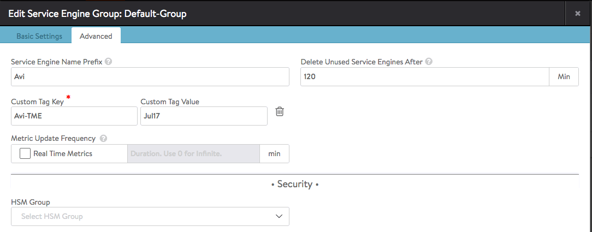

Starting in Avi Vantage v16.2, a user may optionally pass AWS a single key-value pair to better control the instantiation of SEs in EC2.The key string and its corresponding value are passed to EC2 with every request to instantiate a new SE.

In accordance with <a href="http://docs.aws.amazon.com/awsaccountbilling/latest/aboutv2/allocation-tag-restrictions.html">Amazon Web Services' documentation</a>, key names are 128 Unicode characters maximum, values 256 Unicode characters maximum. Choose from among these:

* a-z, A-Z
* 0 - 9
* + - = . _ : /
* whitespace

 

### Configuring a Tag in Avi Vantage UI

1. Browse to Infrastructure > Clouds > [AWS_Cloud_Name] > Service Engine Group.<a href="img/FIRST.png">    </a>
1. Edit "Service Engine Group" > Advanced. Click the Add Custom Tag hyperlink.
<a href="img/SECOND.png">  </a>
1. Key in a custom tag key and a custom tag value. Then click Save at lower right.
