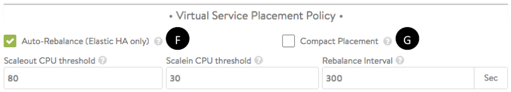

### High Availability Modes

Avi Vantage supports two Avi Service Engine (SE) elastic HA modes which combine scale-out performance as well as high availability: N+M mode (the default) and active/active. Vantage also provides a third alternative, <a href="/docs/latest/legacy-ha-for-avi-service-engines">legacy HA</a> mode, which enables a smooth migration from legacy appliance-based load balancers.

### Elastic HA N+M Mode

N+M is the default mode for elastic HA.

* In this mode, each virtual service is *typically* placed on just one SE.
* The "N" in "N+M" is the minimum number of SEs required to place virtual services in the SE group — this calculation is done by the Avi Controller based on the "Virtual Services per Service Engine" parameter (labeled A in the figures). N will vary over time, as virtual services are placed on or removed from the group.
* The “M”of "N+M" is the number of additional SEs the Avi Controller spins up to handle up to M SE failures without reducing the capacity of the SE group. M appears in the "Buffer Service Engines" field (labeled D in the figures).
 Figure 1. SE editor settings with elastic HA N+M mode selected.

### Elastic HA N+M Example

The left side of figure 2 shows 20 virtual service placements on an SE group. With Virtual Services per SE set to 8, N is 3 (20/8 = 2.5, which rounds to 3). With M = 1, a total of N+M = 3 + 1 = 4 SEs are required in the group. 2

Note that no single SE in the group is completely idle. Avi Controller places virtual services on *all* available SEs. In N+M mode, Vantage ensures enough buffer capacity exists *in aggregate* to handle one (M=1) SE failure. In this example, each of the 4 SEs has 5 virtual services placed. A total of 12 spare *slots* are still available for additional VS placements, which is sufficient to handle one SE failure.

The right side of figure 2 shows the SE group just after SE2 has failed. The 5 virtual services in SE2 have been placed onto spare slots found on surviving SEs: SE1, SE3, and S4.
 Figure 2. Elastic HA N+M group with 20 virtual services, before and after a failure. Virtual Services per Service Engine = 8, N = 3, M = 1, compact placement = ON.

 

 Figure 3. Vantage spins up a replacement SE to once again satisfy the M=1 condition.

As shown in figure 3, with only 4 slots remaining just after the 5 re-placements, if Vantage’s <a href="/docs/latest/orchestrator-access-modes">orchestrator mode is set to write access</a>, Vantage spins up SE5 to meet the M=1 condition, which in this case requires at least 8 slots available for re-placements.

The imbalance in loading disappears over time if one or both of two things happens:

1. New virtual services are placed on the group. As many as 4 virtual services could be placed without compromising the M=1 condition. They would be placed on SE5 because Vantage chooses the least-loaded SE first.
1. The <a href="#auto-rebalance_anchor">Auto-Rebalance</a> option is selected (depicted in figure 8).

With M set to 1, the SE group is single-SE fault tolerant. Customers desiring *multiple*-SE fault tolerance set M higher. Vantage permits M to be dynamically increased by the administrator without interrupting any services. Consequently, one may start with M=1 (typical of most N+M deployments), and increase it if conditions warrant.

If an N+M group has scaled out to Max Number of Service Engines and N *x* Virtual Services per SE have been placed, Vantage will permit additional VS placements (into the spare capacity represented by M), but an HA_COMPROMISED event will be logged.

### Elastic HA Active/Active

In active/active mode, Vantage places each virtual service on more than one Avi SE, as specified by "Minimum Scale per Virtual Service" parameter (labeled B in the figures) — the default minimum is 2. If an SE in the group fails, then

* Virtual services that had been running are not interrupted. They continue to run on other SEs with degraded capacity until they can be placed once again.
* If Vantage’s <a href="/docs/latest/orchestrator-access-modes">orchestrator mode is set to write access</a>, a new SE is automatically deployed to bring the SE group back to its previous capacity. After waiting for the new SE to spin up, the Avi Controller places on it the virtual services that had been running on the failed SE.
 Figure 4. SE editor settings with elastic HA active/active mode selected.

### Elastic HA Active/Active Example

Figures 5 through 7 illustrate an SE failure and full recovery. Figure 5 shows an SE group in which

* Virtual Services per Service Engine = 3 (label A in the UI)
* Minimum Scale per Virtual Service = 2 (label B)
* Maximum Scale per Virtual Service = 4 (label C)
* Max Number of Services Engines = 6 (label E)

Over time, five virtual services (VS1-VS5) have been placed. One of them, VS3, has been scaled from its initial two placements to three, illustrating Vantage's support for "N-way active" virtual services.
 Figure 5. Five virtual services placed on an active/active SE group.

SE3 fails, as depicted in figure 6. As a result, one of two VS2 instances fails and one of three VS3 instances fails. Three other virtual services (VS1, VS4, VS5) are unaffected. Neither VS2 nor VS3 are interrupted because of instances previously placed on SE4, SE5, and SE6. They continue, albeit with degraded performance.

 Figure 6. A single SE fails in an active/active SE group.

As shown in figure 7, the Avi Controller deploys SE7 as a replacement for SE3, and places VS2 and VS3 on it, bringing both virtual services up to their prior level of performance.

 Figure 7. Recovery of a single SE in an active/active SE group

### Virtual Service Placement Policy

This section explains the interaction between the elastic HA modes and Vantage's VS placement policy for the SE group.
 Figure 8. Virtual Service Placement Policy section of SE Group Basic Settings showing default auto-rebalancing settings.

### Compact Placement

When compact placement is ON (label G in figure 8), Vantage uses the minimum number of SEs required. When it is OFF, Vantage will use as many SEs as required, up to the limit allowed by Max Number of Service Engines (labeled E in the figures). By default, compact placement is ON for elastic HA N+M mode and OFF for elastic HA active/active mode.

### Compact Placement Example

Figure 9 shows the effect of compact placement on an elastic HA N+M SE group where the Max Number of Service Engines is 4.

In both the compact placement ON and OFF examples:

* Eight virtual services are created in sequence.
* After VS1 is placed, SE2 is deployed because M=1 (handle one SE failure).
* When VS2 requires placement, Vantage assigns it to otherwise idle SE2 to make best use of all running SEs.

At this point, placement behavior diverges.

**Compact Placement ON.**  Subsequent placements of VS3 through VS8 require no additional SEs to maintain HA (M=1 =&gt; one SE failure). With compact placement ON, Vantage prefers to place virtual services on existing SEs.

**Compact Placement OFF.** Subsequent placements of VS3 and VS4 result in scaling the SE group out to its maximum, 4, illustrating Vantage's preference for performance at the expense of resources. Having reached 4 deployed SEs, the maximum number of SEs for this group, Vantage places virtual services VS5 through VS8 on pre-existing, least-loaded SEs.
 Figure 9. Elastic HA N+1 SE group with compact placement ON and OFF. Eight successive VS placements shown.

### Interaction of Compact Placement with Elastic HA Modes

Compact placement interacts in a subtle way with the elastic HA modes in regards to timing.

**Elastic HA N+M mode.** In figure 2, because compact placement is ON by default in N+M mode, the Avi Controller deferred deployment of spare capacity, preferring instead to immediately pack virtual services densely onto existing SEs.

**Elastic HA active/active mode.** In figure 7, because the compact placement option is OFF by default in active/active mode, the Avi Controller delays the placement of VS2 and VS3 until replacement SE7 spin ups. No additional burden is placed on the four surviving SEs (SE1, SE2, SE4, SE5). Instead, both virtual services are placed on a fresh SE, so that all virtual services may perform as they did before the failure.

### Auto-Rebalance

The Auto-Rebalance option (label F in figure 8) applies only to the elastic HA modes, and is OFF by default . If selected, virtual services will be automatically migrated or scaled out / scaled in when the load on the SEs goes above the maximum threshold or falls below the minimum threshold. Figure 3 shows a use case.

As shown in figure 8, the rebalancing interval may be chosen with a resolution of one second.

If auto-rebalance is left in its default OFF state, an event is logged instead of automatically performing migrations.

## Configuring Elastic HA

To configure elastic HA for an SE group:

1. Navigate to Infrastructure &gt; Clouds.
1. Click on the cloud name (for example, "Default-Cloud").
1. Click Service Engine Group.
1. Click the edit icon next to the SE group name, or click Create to create new one.
1. Fill out the requisite fields.
1. Click Save.

### Notes and Recommendations

**Elastic HA N + M mode** (the default) is *typically* applied to applications wherein the following conditions apply:

1. The SE performance required by any application can be delivered by a fraction of one SE's capacity, hence each VS is typically placed on a single SE.
1. Applications can tolerate brief outages, albeit no longer than it takes to place a VS on an existing SE and plumb its network connections. This is usually no more than a few seconds.

The pre-existence of buffer SE capacity, coupled with the default setting of compact placement ON, speeds re-placement of virtual services affected by a failure. Vantage doesn't wait for a substitute SE to be spun up; it immediately places affected virtual services on spare capacity.

Most applications' need for HA is satisfied by M=1. However, in dev/test environments, M may be set to 0, since the dev/test users can wait for a new SE to be spun up before the VS is placed again.

**Elastic HA active/active mode** is *typically* applied to mission-critical applications where the virtual services must continue without interruption during the recovery period.