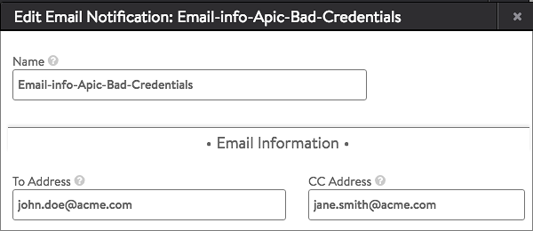
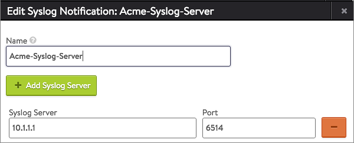
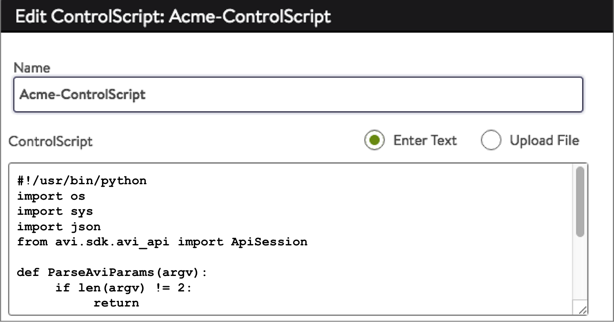

Avi Vantage defines a robust collection of events for which the default notification is an entry in the alert log. An administrator may wish to replace or augment the default behavior with one or more of the following additional actions:

* Send an email
* Send a Syslog event
* Generate an SNMP trap
* Execute a ControlScript for custom action 

This article steps through the UI screens required to configure a custom alert notification.  See the <a href="alerts-overview">Alerts Overview</a> for a broader explanation of the alert process.

### Step One: Alert Config

Navigate to the Operations &gt; Alerts &gt; Alert Config page.  This page shows a list of default alert configs, which are essentially the triggers that define when an alert should be generated.  The default system alert configs may be edited, but not deleted.

 

From this page a new alert config may be created, or an existing one may be edited. For the sake of illustration, assume the existing Apic-Bad-Credentials alert config is to be customized. For this example, default alert action (System-Alert-Level-High) will be changed.

 

### Step Two: Alert Action

As shown below, a blue-pencil edit icon appears at the extreme right of the Alert Config table.

 

Clicking the edit icon reveals the Edit Alert Configuration panel. Clicking on the down-arrow in the Alert Action selection box reveals additional existing alert actions as well as the option to Create Alert Action:

 

Give the new alert action a descriptive name, as shown below:

 

If you do not want Avi Vantage to make an entry in the alerts log when the event occurs, click the Only General External Alerts box.  No alerts will be stored on Vantage or shown locally in the UI via the bell icon.

Alert Level: Choose Low, Medium, or High. This is the word, color, and severity of the alert that is shown in the Vantage UI.

Next, flesh out the details for as many of the four action options as are desired.

For email, name the action and supply the To: and Cc: lists.  For Vantage to successfully send emails, it may require additional system level configuration in the Administration &gt; System &gt; Email section of the UI.

 

For syslog, choose a name. Then identify the syslog server(s). For each, specify the IP address or host name and select a port.

 

For SNMP, choose a name. Then define by IP address (or hostname) and community all the SNMP trap servers that pertain.

 

For ControlScript, either upload a text file with your Python code or enter it directly into the provided scrolling window.

The window size in the above screenshot is too small to show the entire ControlScript, which is as follows. It simply prints the parameters passed to the ControlScript.

<pre> #!/usr/bin/python
 import os
 import sys
 import json
 from avi.sdk.avi_api import ApiSession

 def ParseAviParams(argv):
      if len(argv) != 2:
           return
      alert_dict = json.loads(argv[1])
      print str(alert_dict)
 def DisableVirtualService(vs_name):
     # Get session on the basis of authentication token
     token=os.environ.get('API_TOKEN')
     user=os.environ.get('USER')
     tenant=os.environ.get('TENANT')
     with ApiSession("localhost", user, token=token, tenant=tenant) as session:
         # Get the virtualservice objct of name myVirtualService
         vs_obj = session.get_object_by_name('virtualservice', vs_name)
         # Update the object
         if vs_obj:
             vs_obj['enabled'] = False
         # Save the object
         session.put('virtualservice/%s' %vs_obj['uuid'], data=json.dumps(vs_obj))

 if __name__ == "__main__":
     ParseAviParams(sys.argv)
     DisableVirtualService('myVirtualService')</pre> 

### Parameters Passed to ControlScript

* Name: Name of the alert for which the ControlScript is invoked.
* Level: Level of the alert for which the ControlScript is invoked (High, Medium, Low).
* Object UUID: The Avi Vantage UUID of the object on which the alert is raised.
* Object Name: Name of the Vantage object on which the alert is raised.
* Threshold: The threshold value (if configured) for this alert. Can be a count or an absolute number.
* Event Details: For alerts based on system events, the list of all events on which the alert is raised. The contents of the event details vary based on different events.
* Metric Information: For metrics-based alerts, the list of all metrics on which the alert is raised
* Throttle Count: A count of the number of times an alert was throttled 

### Changing an Alert Action

To make a change to any of the four alert actions, click into the box. A blue-pencil edit icon will appear as shown below. Click Save after you're content with your alert actions.

 

### Step Three: Save the new alert action

Prior to clicking Save in the below window, you may wish to add a description to document your work.

 

### Step Four: Confirm the custom action is in place

Return to the Operations &gt; Alerts &gt; Alert Config page and expect to see your work reflected in the list of events and alert actions.

 
