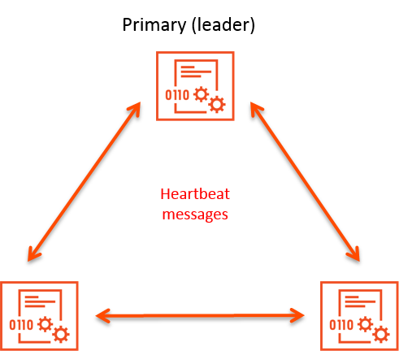

Avi Vantage can run with a single Avi Controller (single-node deployment) or with a 3-node Avi Controller cluster. In a deployment that uses a single Avi Controller, that Avi Controller performs all administrative functions as well as all analytics data gathering and processing.

Adding 2 additional nodes to create a 3-node cluster provides node-level redundancy for the Avi Controller and also maximizes performance for CPU-intensive analytics functions. Whereas the lone Avi Controller in a single-node deployment performs all administrative functions and analytics data collection and processing, these tasks are distributed in 3-node cluster.

In a 3-node Avi Controller cluster, one node is the primary (leader) node and performs the administrative functions. The other two nodes are followers (secondaries), and perform data collection for analytics, in addition to standing by as backups for the leader.

## Operation of Avi Controller HA

This section describes how high availability (HA) operates within an Avi Controller cluster.

### Quorum

Avi Controller-level HA requires a quorum of Avi Controller nodes to be up. In a 3-node Avi Controller cluster, quorum can be maintained if at least 2 of the 3 Avi Controller nodes are up. If one of the Avi Controllers fails, the remaining 2 nodes continue service and Vantage continues to operate. However, if 2 of the 3 nodes go down, the entire cluster goes down and Vantage stops working.

### Failover

Each Avi Controller node in a cluster periodically sends heartbeat messages to the other Avi Controller nodes in the cluster.

The heartbeat interval is 10 seconds. The maximum number of consecutive heartbeat messages that can be missed is 4. If one of the Avi Controllers does not hear from another Avi Controller for 40 seconds (4 missed heartbeats), the other Avi Controller is assumed to be down.

If only one node is down, quorum is maintained and the cluster can continue to operate.

* If a follower goes down but the (leader node remains up, access to virtual services continues without interruption. 

* If the primary (leader) node goes down, the member nodes form a new quorum and elect a cluster leader. The election process takes about 50-60 seconds and during this period, there is no impact on the data plane. The SEs will continue to operate in "headless mode" but the control plane service is not going to be available. During this period, Vantage users will not be able to create a VIP through LBaaS or use the Vantage web interface, API, or CLI. 

## Converting a Single-Node Deployment to a 3-node Cluster

To convert a single-node Avi Controller deployment into a 3-node deployment, use the following steps.

In this procedure, the Avi Controller node that is already deployed in the singe-node deployment is referred to as the **incumbent** Avi Controller.
<ol> 
 <li>Install 1 new Avi Controller nodes. During installation, configure <strong>only</strong> the following settings for each node: 
  <ul> 
   <li>Node management IP address</li> 
   <li>Gateway address</li> 
  </ul> </li> 
 <li>Connect the management interface of each new Avi Controller node to the same network as the incumbent Avi Controller. After the incumbent Avi Controller detects the 2 new Avi Controller nodes, the incumbent Avi Controller will become the primary (leader) Avi Controller for the 3-node cluster.</li> 
 <li>Use a web browser to navigate to the management IP address of the primary (leader) Avi Controller.</li> 
 <li>Navigate to Administrator &gt; Controller, and click Edit. The Edit Controller Configuration popup appears.</li> 
 <li>In the Controller Cluster IP field, enter the shared IP address for the Controller cluster.</li> 
 <li>In the Controller Node-2 and Controller Node-3 fields, enter the management IP addresses of the new Avi Controller nodes.</li> 
</ol> 

After these steps, the incumbent Avi Controller becomes the primary (leader) for the cluster and invites the other Avi Controllers to the cluster as members. Vantage then performs a warm reboot of the cluster. This process can take 2-3 minutes. The configuration of the primary (leader) Controller is synchronized to the new member nodes when the cluster comes online following the reboot.

## More Information

For more information about cluster HA, see the following links:

* <a href="/docs/latest/controller-cluster-ip">Cluster IP Address</a>
* <a href="/docs/latest/clustering-controllers-from-different-networks">Clustering Avi Controllers from Different Networks</a>
* <a href="/docs/latest/impact-of-a-controller-failure">Impact of Avi Controller Failure</a> 