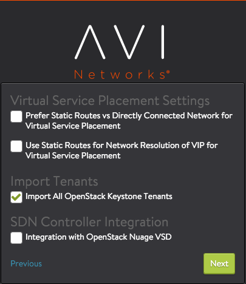

This guide describes how to integrate Avi Vantage into an OpenStack cloud. The instructions in this guide can be used for installing Avi Vantage 16.1.*x*.

Avi Vantage is a software-based solution that provides real-time analytics as well as elastic application delivery services. Vantage optimizes core web-site functions including SSL termination and load balancing. Vantage also provides access to network analytics, including end-to-end latency information for traffic between end-users and the load-balanced applications.

Vantage's unique controller-based architecture with integration into virtual infrastructure and cloud orchestrators enables true automated horizontal scaling where data plane capacity expands and contracts dynamically based on workload. When deployed into an OpenStack cloud, Avi Vantage performs as a fully distributed, virtualized system consisting of the Avi Controller and Avi Service Engines (SEs), each running as a separate virtual machine (VM).

* **Avi Controller:** VM that acts as a single point of control and management with OpenStack and is integrated with Nova, Keystone, Neutron, and Glance to allow seamless multi-tenancy support for scalable performance. Based on configuration, the Controller places new services on existing VMs if there is room, or spins up a new VM if needed. The Controller deploys an SE VM as needed when a tenant creates a virtual service or VIP for load balancing. Management access and analytics are provided through a web-based interface and REST-based API.
The Controller manages the life cycles of the SEs by creating, controlling, and eventually deleting them. The Controller stores and manages all policies related to services and management. The Controller also provides a central point of contact for other cloud infrastructures, and can manage resources in multiple infrastructures simultaneously. For example, the Controller can be configured to communicate with both an OpenStack controller and a VMware vCenter server, to manage resources in each type of cloud.

* **Avi Service Engine (SE):** VM that receives the end-user traffic and provides application delivery services, while also collecting real-time end-to-end metrics for traffic between end-users and applications. The Controller creates an SE VM, plumbs it into a network, and provisions it with a service policy. The service policy is required to deploy a Virtual Service (VS), which consists of IP address and TCP/UDP port number that together represent a load balancing service.

## OpenStack Integration

Vantage integrates with OpenStack infrastructure components to provide centralized automation, monitoring, and management of application discovery and delivery.

Avi Vantage integrates with the following OpenStack services:

* **Keystone:** Provides automatic creation of tenants, users, and roles. Also isolates the control path from the data path.
* **Glance:** Provides software image management.
* **Nova:** Provides automatic creation of application delivery service engines (Avi SEs), and performs real-time autoscaling by adding new SEs.
* **Neutron:** Provides automatic network connectivity of Avi SEs.

Here is how Avi Vantage integrates into an OpenStack cloud:

## Deployment Modes

Vantage can be deployed into an OpenStack cloud in one of the following modes. These modes differ depending on whether the Avi Controller and Service Engines (SEs) are placed in the same OpenStack tenants, and whether Neutron or Avi Vantage is used to perform traffic load balancing.

* **Single-tenant mode:** The Avi Controller and the SEs are deployed together in the same single tenant. The Avi Controller has administrator privileges within the tenant. Tenant users who have administrator privileges within the tenant can install and manage Vantage. (You must use this deployment mode if you do not have administrator privileges for the cloud.)

* **Avi-managed LBaaS mode:** The Avi Controller and SEs are installed in separate tenants. The Controller has administrator privileges for the cloud and can manage SEs that are in different tenants. A tenant administrator can log onto the Avi Controller to manage the infrastructure resources within her or his own tenant but cannot access the resources within other tenants. The tenant administrator can configure and manage load balancing services through the Avi Controller web interface or the through the Avi REST API.

* **OpenStack-managed LBaaS mode:** Similar to Avi-managed LBaaS mode, except the tenant administrator configures and manages load-balancing services are through OpenStack's Neutron service and Horizon dashboard. The Controller web interface or Avi API are not used. (This mode also requires installation of an LBaaS driver and SSL extension from Avi.)

Note: The Avi-managed LBaaS option is recommended for its ease of use and advanced feature accessibility.

The following table compares each deployment mode:
<table class="table"> 
 <tbody> 
  <tr> 
   <th width="60%"></th> 
   <th>Single-tenant Mode</th> 
   <th>Avi-managed LBaaS Mode</th> 
   <th>OpenStack-managed LBaaS Mode</th> 
  </tr> 
  <tr> 
   <td>Administrator privileges for cloud required</td> 
   <td>No</td> 
   <td>Yes</td> 
   <td>Yes</td> 
  </tr> 
  <tr> 
   <td>Managed by tenant user</td> 
   <td>No</td> 
   <td>Yes</td> 
   <td>Yes</td> 
  </tr> 
  <tr> 
   <td>Automated tenant creation</td> 
   <td>N/A</td> 
   <td>Yes</td> 
   <td>Yes</td> 
  </tr> 
  <tr> 
   <td>Advanced load-balancing features</td> 
   <td>Yes</td> 
   <td>Yes</td> 
   <td>Limited</td> 
  </tr> 
  <tr> 
   <td>Analytics service</td> 
   <td>Yes</td> 
   <td>Yes</td> 
   <td>Yes</td> 
  </tr> 
  <tr> 
   <td>Avi LBaaS driver install required</td> 
   <td>No</td> 
   <td>No</td> 
   <td>Yes</td> 
  </tr> 
  <tr> 
   <td>Avi extension for Horizon dashboard required</td> 
   <td>No</td> 
   <td>No</td> 
   <td>Yes (required for SSL offload and analytics)</td> 
  </tr> 
 </tbody> 
</table>

## Deployment Prerequisites

The physical and software requirements differ depending on the deployment mode.

### Virtual Machine Requirements

The following table lists the minimum requirements for the VMs on which the Avi Controller and SEs are installed.
<table class="table"> 
 <tbody> 
  <tr> 
   <th width="60%">Component</th> 
   <th>Memory</th> 
   <th>vCPUs</th> 
   <th>HD</th> 
  </tr> 
  <tr> 
   <td>Avi Controller</td> 
   <td>24 GB</td> 
   <td>8</td> 
   <td>64 GB</td> 
  </tr> 
  <tr> 
   <td>Service Engine</td> 
   <td>2 GB</td> 
   <td>2</td> 
   <td>10 GB</td> 
  </tr> 
 </tbody> 
</table>

Add 1GB for each additional vCPU.

If you allocate more than the minimum number of vCPUs required, make sure to also allocate at least the minimum required additional memory. Cloud administrators can create multiple flavors of the Avi Vantage Controller image with different resource allocations (for example, "avi_ctrl.small" with the minimum required resources, and "avi_se.medium" with more resources).

### Software Requirements

The following table lists the software requirements.
<table class="table"> 
 <tbody> 
  <tr> 
   <th>Software</th> 
   <th width="60%">Version</th> 
  </tr> 
  <tr> 
   <td>Avi Controller</td> 
   <td>16.1</td> 
  </tr> 
  <tr> 
   <td>OpenStack (and Neutron service)</td> 
   <td>One of the following: Havana, Icehouse, Juno, Kilo, or Liberty</td> 
  </tr> 
  <tr> 
   <td>Neutron extension for allowed-address-pair</td> 
   <td></td> 
  </tr> 
  <tr> 
   <td>Avi LBaaS driver</td> 
   <td>16.1</td> 
  </tr> 
  <tr> 
   <td>Avi SSL extension for OpenStack Horizon</td> 
   <td>16.1</td> 
  </tr> 
 </tbody> 
</table>

The Avi Vantage image is available as a Qcow2 or raw image of the Controller and SEs. The SE software is embedded in the Controller image and does require separate installation.

The Avi LBaaS driver is required only for OpenStack-managed LBaaS mode. The SSL extension for OpenStack Horizon is required only for OpenStack-managed LBaaS mode. (This driver adds tabs to Horizon for accessing the Controller.)

Note: Installation of Avi Vantage into Devstack is supported only if the DevStack/Nova-launched Virtual Machine (VMs) can run in Kernel-based Virtual Machine (KVM) mode, as opposed to Quick Emulator (QEMU) mode. Please see the <a href="http://docs.openstack.org/developer/devstack/guides/devstack-with-nested-kvm.html">DevStack KVM Guide</a> for information.

### Protocol Ports Used by Avi Vantage for Management Communication

In an OpenStack deployment, the Avi Controller and Avi Service Engines use the following ports for management. The firewall should allow traffic for these ports.
<table class="table"> 
 <tbody> 
  <tr> 
   <th>Traffic Source</th> 
   <th>Traffic Destination</th> 
   <th width="60%">Ports To Allow</th> 
  </tr> 
  <tr> 
   <td rowspan="3">Avi Controller</td> 
   <td>Avi Controller</td> 
   <td>TCP 22 (SSH)  TCP 8443  TCP 5054</td> 
  </tr> 
  <tr> 
   <td>Avi Service Engine</td> 
   <td>TCP 22</td> 
  </tr> 
  <tr> 
   <td>Mgmt Net</td> 
   <td><em>See section below the table.</em></td> 
  </tr> 
  <tr> 
   <td>Avi Service Engine</td> 
   <td rowspan="2">Avi Controller</td> 
   <td>TCP 22  TCP 8443  UDP 123</td> 
  </tr> 
  <tr> 
   <td>Mgmt Net</td> 
   <td>TCP 22  TCP 80 <em>(optional)</em>  TCP 443  TCP 5054 <em>(if using the optional <a href="/2016/02/26/cli-installing-the-cli-shell/">CLI shell</a> for remote management access)</em></td> 
  </tr> 
 </tbody> 
</table>

### Ports Used by Controller for Network Services

The Controller may send traffic to the following UDP ports as part of network operation:

* TCP 25 (SMTP)
* UDP 53 (DNS)
* UDP 123 (NTP)
* UDP 162 (SNMP traps)
* UDP 514 (Syslog)

The firewall also should allow traffic from the Controller to these ports.

## Importing User Accounts from Keystone

Using the Avi API, user roles can be exported from Keystone into the Avi Controller and directly mapped to role names in the Controller. The accounts do not need to be recreated on the Controller. Here is an example:
<pre>"openstack_configuration": 
{
    ....
    "role_mapping": [
       {"os_role": "admin",
        "avi_role": "Tenant-Admin"},
       {"os_role": "_member_",
        "avi_role": "Tenant-Admin"},
       {"os_role": "*",
        "avi_role": "Application-Operator"}
    ],
    ....
}
</pre>

The role_mapping parameter is an ordered list, where each item specifies how a Keystone role (os_role) maps to a role in the Controller (avi_role). A default mapping can be defined for any Keystone role by specifying the “ /* ” wildcard for the os_role field. In the above example, roles admin and _member_ from Keystone are mapped to the role Tenant-Admin in the Controller. Further, any other role from Keystone is mapped to role Application-Operator on the Controller.

In the following example, only users with role lbaas_project_admin are allowed to access the Controller:
<pre>"openstack_configuration": 
{
    ....
    "role_mapping": [
       {"os_role": "lbaas_project_admin",
        "avi_role": "Tenant-Admin"}
    ],
    ....
}
</pre>

## Deploying Single-tenant Mode

This section provides the steps for deploying Vantage into an OpenStack cloud in single-tenant mode.

In single-tenant mode, the Avi Controller and SEs are installed in the same tenant, and have member privileges for that tenant. The member privilege grants the Avi Controller full access to the tenant so that it can automatically spin-up and spin-down an SE. Each tenant is responsible for installing and operating Vantage.

### Deployment Process

Single-tenant installation requires the following procedure.

1. Add the Avi Controller qcow2 or raw image into the tenant from Glance.
1. Create a management network for the Avi Controller and SEs.
1. Create a security group.
1. Deploy an Avi Controller instance and assign a floating IP address to it.
1. Create a security group to allow Avi management traffic.
1. Use the setup wizard to perform initial configuration of the Controller.

Detailed steps are provided below.

### Upload Controller Image

1. Copy the Avi Vantage Controller image onto your hard drive.
1. Log into the OpenStack tenant account on the Horizon dashboard.
1. Navigate to Project > Images.
1. Click Create Image and fill out the form.

### Create Management Network

A management network is required for communication between the Avi Controller and the SEs. An existing network can be used but a dedicated management network is recommended.

1. On the Horizon Dashboard, navigate to Network > Networks.
1. Click Create Network and follow the wizard's instructions. For this example:

* Network name: avi-mgmt
* DHCP: Enabled
* Connect the network to your neutron router.a. Navigate to Network > Routers.b. On the Name column in the router list, click the router to add an interface to the network.c. Click the Interfaces tab, then click Add Interface.

### Create Security Group

A security group is required to allow the Controller and SEs to exchange management traffic. The group specifies the protocol ports for which traffic will be allowed.

* For ingress traffic, the group must allow <a href="#mgmt-ports">these</a> ports.
* For egress traffic, the group can allow all ports.

Note: The Controller automatically creates a security group for the SEs.

To create a security group (in this example, "Avi-mgmt-sg") to allow management traffic:

1. On the Horizon Dashboard, navigate to Project > Access & Security, and click Create Security Groups.
1. Add rules as shown in the following example, where 192.168.10.0/24 is the management network.

### Deploy Controller and Assign It a Floating IP

Deploy an Avi Controller instance:

* Flavor: Deploy m1.xlarge or bigger.
* Network: Use avi-mgmt to attach the Controller to the management network.
* Security group: Use avi-mgmt-sg to allow management traffic.
* Enable config-drive.

To assign a floating IP address to the Controller:

1. On the Horizon Dashboard, navigate to Project > Compute > Access & Security.
1. Assign the floating IP address:

* If no floating IP address is already available, click Allocate IP to Project.
* Otherwise, if a floating IP address is already available, associate it with the Avi Controller instance.

### Perform Initial Controller Setup

This section shows how to perform initial configuration of the Avi Controller using its deployment wizard. You can change or customize settings following initial deployment using the Avi Controller’s web interface.

Note: While the system is booting up, a blank web page or 503 status code may appear. In this case, wait for 5-10 minutes, then follow the instructions for the setup wizard.

1. Configure basic system settings:

* Administrator account
* DNS and NTP server information
 
* Set the infrastructure type to OpenStack:
* Enter OpenStack settings:

* Tenant user credentials (username, password)
* IP address of Keystone server
* Enable (check) the Keystone Auth option.

* In the Management Network window, select a tenant. In this deployment, it should be the same tenant into which the Avi Controller is deployed. Choose the management network created previously. 
* In the Keystone Role Mapping window, select a Vantage user role to use as the default user role:If a Vantage user who logs in with valid Keystone credentials, but with a role that does not have the same name as any of the user roles defined on the Controller, the default role is assigned to the user. To instead disallow access by any user who does not have a role that is defined on the Controller, leave the selection empty (None).
* In the Virtual Service Placement Settings window, select Import Tenants to import from tenants Keystone and click Next. Then, in the Support Multiple Tenants window, click No.

## Deploying Avi-managed LBaaS Mode

This section provides the steps for deploying Vantage into an OpenStack cloud in single-tenant mode. In single-tenant mode, the Avi Controller and SEs are installed in the same tenant, and have member privileges for that tenant.

Avi-managed LBaaS mode provides tenant users with the advantages of Avi Vantage, without the need for them to perform deployment or maintenance of Vantage. Instead, the cloud administrator deploys and manages Vantage. The Controller and SEs in the administrative tenant are shared by other tenants. Users of those tenants are able to secure and optimize their applications using the Vantage resources that reside in the administrative tenant.

Note: While using an existing tenant instead of creating a new one also is supported, creating a new tenant is recommended for easy maintenance.

### Deployment Process

Deployment of Avi-managed LBaaS mode requires the following procedure.

1. Create a tenant for the Controller and SE.
1. (Optional) Create multiple flavors of the Vantage image, with different resource allocations to fit different sizes of user tenant. (For example: "avi_ctrl.small" and "avi_se.medium".)
1. Upload the Avi Controller qcow2 or raw image into the tenant from Glance.
1. Create a management network for the Avi Controller and SEs.
1. Create a security group to allow Avi management traffic.
1. Deploy an Avi Controller instance and assign a floating IP address to it.
1. Create a security group to allow Avi management traffic.
1. Use the setup wizard to perform initial configuration of the Controller.

Detailed steps are provided below.

### Create a Tenant for the Controller and SEs

1. Log into the OpenStack Horizon dashboard with an account that has cloud administrator privileges.
1. Navigate to Identity > Projects.
1. Click New Project and follow the wizard's instructions.
1. Follow the instructions of the tenant creation wizard. For Avi Vantage deployment, use the following settings:a. Enter a project name (ex: "avi-tenant”).b. Click the Project Members tab.c. Add a user account to Project Members and assign the “admin” role to the account.d. Click the Quota tab and modify the maximum resources. These settings allow for three Avi Controllers (for redundancy), up to 1000 SEs and some other managerial instances if required.

### Create Multiple Flavors of Controller Image

Use these steps to create multiple flavors of Avi Vantage, avi_ctrl.small and avi_se.medium.

1. In the Horizon dashboard, navigate to Admin > System > Flavors and click Create Flavor.
1. Fill out the forms for flavor avi_ctrl.small. Assign minimal resources to this flavor.
1. Repeat for avi_se.medium but assign more resources to this flavor than to the avi_ctrl.small flavor.

### Upload Controller Image

1. Copy the Avi Vantage Controller qcow2 image onto your hard drive.
1. In the Horizon dashboard, navigate to Project > Images.
1. Click Create Image and fill out the form. Use at least these resource allocations:

* Minimum disk: 64GB
* Minimum memory: 12GB

### Create Management Network

A management network is required for communication between the Avi Controller and the SEs. An existing network can be used but a dedicated management network is recommended.

1. On the Horizon Dashboard, navigate to Network > Networks.
1. Click Create Network and follow the wizard's instructions. For this example:

* Network name: avi-mgmt
* DHCP: Enabled
* Connect the network to your neutron router.a. Navigate to Network > Routers.b. On the Name column in the router list, click the router to add an interface to the network.c. Click the Interfaces tab, then click Add Interface.

### Create Security Group

A security group is required to allow the Controller and SEs to exchange management traffic. The group specifies the protocol ports for which traffic will be allowed. For ingress traffic, the group must allow <a href="#mgmt-ports">these</a> ports.

For egress traffic, the group can allow all ports.

Note: The Controller automatically creates a security group for the SEs.

To create a security group (in this example, "Avi-mgmt-sg") to allow management traffic:

1. Navigate to Project > Access & Security, and click Create Security Groups.
1. Add rules as shown in the following example, where 192.168.10.0/24 is the management network.

### Deploy Controller and Assign it a Floating IP

Deploy an Avi Controller instance:

* Flavor: Deploy avi_ctrl.small or bigger.
* Network: use avi-mgmt to attach the Controller to the management network.
* Security group: use avi-mgmt-sg to allow management traffic.
* Enable config-drive.

To assign a floating IP address to the Controller:

1. On the Horizon Dashboard, navigate to Project > Compute > Access & Security.
1. Assign the floating IP address:

* If no floating IP address is already available, click Allocate IP to Project.
* Otherwise, if a floating IP address is already available, associate it with the Avi Controller instance.

### Perform Initial Controller Setup

This section shows how to perform initial configuration of the Avi Controller using its deployment wizard.

You can change or customize settings following initial deployment using the Avi Controller’s web interface.

1. Configure basic system settings:

* Administrator account
* DNS and NTP server information
 
* Set the infrastructure type to OpenStack:
* Enter OpenStack settings:

* Tenant user credentials (username, password)
* IP address of Keystone server
* Enable (check) the Keystone Auth option.

* In the Management Network window, select a tenant. In this deployment, it should be the same tenant into which the Avi Controller is deployed. Choose the management network created previously. 
* In the Virtual Service Placement Settings window, select Import Tenants to import from tenants Keystone and click Next. Then, in the Support Multiple Tenants window, click **Yes**.
* In the Keystone Role Mapping window, select a Vantage user role to use as the default user role:If a Vantage user who logs in with valid Keystone credentials, but with a role that does not have the same name as any of the user roles defined on the Controller, the default role is assigned to the user.To instead disallow access by any user who does not have a role that is defined on the Controller, leave the selection empty (None).
* In the Tenant Settings window, select the following settings:

* Per tenant IP route domain
* Service Engines are managed within the provider context, shared across tenants
* Tenant has Read Access to Service Engines

* Navigate to Infrastructure > Clouds and select Default-Cloud.
* Click the Service Engine Group tab.
* Click the edit icon on the right end of Default-Group.
* Ensure that Compactor is selected and Max Number of Service Engines is high enough to meet the needs of all tenants.

## Deploying OpenStack-managed LBaaS Mode

OpenStack-managed LBaaS mode includes the same deployment steps as Avi-managed LBaaS mode. In addition, installation of the Avi LBaaS driver and Avi extension for Horizon dashboard are required. The tenant administrator accesses and manages Vantage through the Horizon dashboard instead of the Avi Controller web interface.

### Deployment Process

Deployment of OpenStack-managed LBaaS mode requires the following procedure.

1. Deploy Avi-managed LBaaS mode.a. Create a tenant for the Controller and SE.b. (Optional) Create multiple flavors of the Vantage image, with different resource allocations to fit different sizes of user tenant ("avi_ctrl.small" and "avi_se.medium").c. Upload the Avi Controller qcow2 or raw image into the tenant from Glance.d. Create a management network for the Avi Controller and SEs.e. Deploy an Avi Controller instance and assign a floating IP address to it.f. Create a security group to allow Avi management traffic.g. Use the setup wizard to perform initial configuration of the Controller.
1. Install the Avi LBaaS driver.
1. Install the Avi extension for the Horizon dashboard.
1. Install a valid certificate on the Avi Controller.

Note: Replacing the Controller's self-signed certificate with a valid one allows access to the Avi Controller through the Horizon dashboard. Alternatively, the tenant user or administrator can log onto the Avi Controller's web interface directly, accept the self-signed certificate presented by the Controller. After this, the user or administrator can access the Controller through Horizon.

### Perform Avi-managed LBaaS Mode Depoyment

To begin, perform all the steps in Deploying Avi-managed LBaaS Mode (link). These steps also are required for OpenStack-managed LBaaS mode.

### Install Avi LBaaS Driver

Avi Networks provides a script for installing or upgrading the LBaaS plugin driver. The script makes the necessary OpenStack configuration changes automatically. Download the Avi LBaaS driver installation package (avi_openstack_package.tar.gz) from the Avi Networks portal website (<a href="https://portal.avinetworks.com">https://portal.avinetworks.com</a>).
**Note:** If preferred, the LBaaS driver can be installed alone without the virtual environment files that the script also installs. (For more information and instructions, see the README file in the **avi_openstack_package.tar.gz** package.)

**Note:** An account with root privileges for the Neutron API server is required. This account is different from the account used by the Controller to access the OpenStack infrastructure.

1. Copy the package onto the OpenStack Neutron API host.
1. Log into the Neutron API server.
1. On the OpenStack Neutron API server, back up neutron.conf.
1. Unzip and untar the driver package: <pre class="command-line language-bash" data-prompt=": >"><code>tar -xzf avi_openstack_package.tar.gz</code></pre>
1. Run the Avi LBaaS installation script.In the following example, 10.114.214.250 is the IP address for the Avi Controller cluster. The login credentials for the Controller are admin, avinetworks. Make sure to replace the IP address in the example with the cluster IP address.
**Note:** If installing only the driver without the virtual environment files, see the README file in the **avi_openstack_package.tar.gz** on the Avi Networks portal.
<pre>cd ./openstack_lbplugin
./install.sh --aname cisco_lbaas --aip 10.114.214.250 --auser admin --apass avinetworks
  --&gt; Install SeLinux module avi_lbaas? (y/n) n
  --&gt; Configure Neutron Server with Avi LBaaS provider cisco_lbaas; with driver avi (y/n) y
  08/28/2014 23:27:55 INFO: Neutron Avi LBaaS provider avi_adc configure...OK
  08/28/2014 23:27:56 INFO: Neutron Avi LBaaS driver avi setup...OK
  08/28/2014 23:28:01 INFO: neutron-server restart...OK
  08/28/2014 23:28:01 INFO: Neutron Avi LBaaS configuration setup...OK
</pre>

### Install Avi Extension for Horizon Dashboard

This part of the installation requires an account for access to the OpenStack Horizon server. The Git and pip utilities also are required.

1. Log into the OpenStack Horizon server, and locally clone the Avi SSL enhancement repository: <pre class="command-line language-bash" data-prompt=": >"><code>git clone https://github.com/avinetworks/avi-horizon-dashboard</code></pre>
1. Switch to the Icehouse, Juno, or Kilo branch: <pre class="command-line language-bash" data-prompt=": >"><code>cd avi-horizon-dashboard; git checkout icehouse</code></pre>
1. Create a pip package: <pre class="command-line language-bash" data-prompt=": >"><code>python setup.py sdist</code></pre>
1. This step creates the following pip package in the dist/ directory: avidashboard-0.2.1.dev39.tar.gz
1. Copy the pip package to the Horizon servers.
1. Install the pip package: <pre class="command-line language-bash" data-prompt=": >"><code>pip install ./avidashboard-0.2.1.dev39.tar.gz</code></pre>
1. Update the Horizon setting files to enable Avi SSL and Analytics tabs on the Horizon dashboard:

1. Modify the Horizon settings file to add the Avi dashboard. Usually, the Horizon settings file is located here: /usr/share/openstack_dashboard/openstack_dashboard/settings.py <pre class="command-line language-bash" data-prompt=": >" data-output="1-100"><code>import avidashboard.enabled # ADD THIS LINE</code></pre> <pre>
INSTALLED_APPS = list(INSTALLED_APPS)  # Make sure it's mutable
settings.update_dashboards([
  openstack_dashboard.enabled,
  openstack_dashboard.local.enabled,
  avidashboard.enabled,      # ADD THIS LINE TOO
], HORIZON_CONFIG, INSTALLED_APPS)

</pre>

1. Add the IP address of the Avi Controller to the Horizon local_settings file. Usually, this file is located here: /etc/openstack_dashboard/local_settings.py <pre>
AVI_CONTROLLER = {"RegionA": "regiona.avi-lbaas.example.net", 
                  "RegionB": "regionb.avi-lbaas.example.net", }

</pre>

1. *(Optional)* Enable the Vantage Analytics Tab by setting the following in your local settings file. (<a href="/2016/03/11/clickjacking-protection/">Click-jacking protection</a> must be **disabled** on the Controller.) <pre class="command-line language-bash" data-prompt=": >"><code>AVI_ANALYTICS_TAB_ENABLED = True</code></pre>

1. *(Optional)* Enable the full LBaaS panel to be the Vantage web interface by setting the following in your local settings file. (<a href="/2016/03/11/clickjacking-protection/">Click-jacking protection</a> must be **disabled** on the Controller.) <pre class="command-line language-bash" data-prompt=": >"><code>AVI_LBAAS_FULL_UI = True</code></pre> Note: In Juno's version of Horizon, there was a bug in _tab_group.html template file that caused the title of a tab to be shown in a tab group even when there was only one tab in the tab group. This is fixed in later versions. To get around this issue, replace the _tab_group.html file on the Horizon server with the <a href="https://github.com/openstack/horizon/blob/stable/kilo/horizon/templates/horizon/common/_tab_group.html">Kilo version</a>. The _tab_group.html file is located in one of the following directories:

* **Red Hat:** /usr/lib/python2.7/site-packages/horizon/templates/horizon/common/_tab_group.html
* **Ubuntu:** /usr/lib/python2.7/dist-packages/horizon/templates/horizon/common/_tab_group.html

1. Restart horizon. For example: <pre class="command-line language-bash" data-prompt=": >"><code>apache2ctl restart</code></pre> Important! Restarting Horizon is required to complete this procedure.

### New Horizon Tabs for Vantage

After the Avi extension for Horizon is installed, one or more of the following new tabs appear on the Load Balancers menu of the Horizon dashboard:

* **Certificates:** Allows management of SSL certificates. Through this tab, certificates can be uploaded to the Controller and associated with a VIP for SSL offload.
* **Analytics:** Provides detailed operational and performance information about virtual services and related traffic.
* **Full Controller LBaaS panel:** The full LBassThe extension enables access to the entire Controller web interface from within Horizon:

Note: The Analytics tab requires replacement of the Controller's self-signed certificate (see below). If the Controller's self-signed certificate is not replaced with a valid one, the Analytics tab does not appear.

### Install Valid Certificate on Avi Controller

This section gives steps for replacing the Controller's self-signed certificate with one signed by a Certificate Authority (CA). The Controller requires a CA-signed certificate to access the Avi Controller through the Horizon dashboard.

1. Log into the Avi Controller web interface.
1. Navigate to Templates > Security.
1. Click New on the SSL/TLS Certificates menu.
1. Click Import to import the new certificate and key.
1. After uploading the new certificate and key, configure the Avi Controller to use them:

1. Navigate to Administration > Settings > Access Settings.
1. Click the edit icon.
1. Select the imported certificate and click Save.