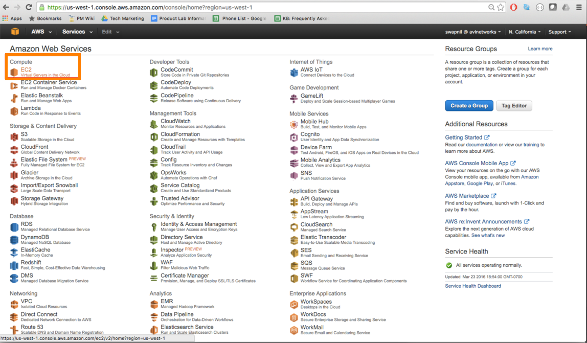
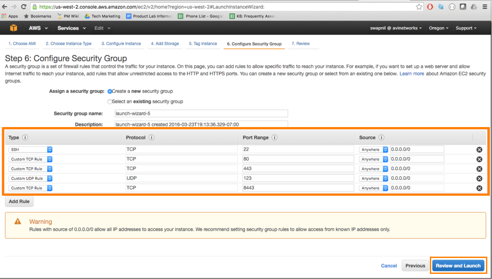
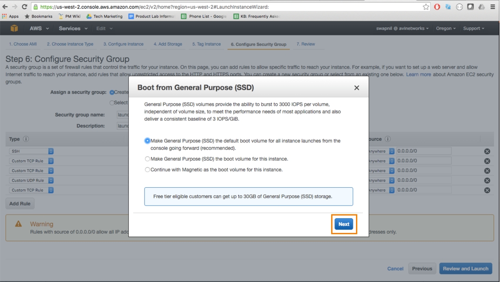
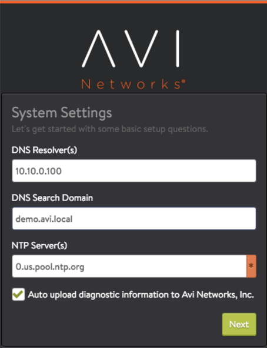

This guide describes how to install an Amazon Web Services (AWS) EC2 instance of Avi Vantage. The instructions in this guide can be used for installing Avi Vantage 16.1.
*x*.

## About Avi Vantage

Avi Vantage consists of the Avi Controller and multiple Avi Service Engines (SEs). The Avi Controller analyzes traffic and can request spin-up/spin-down of SEs to load balance traffic.

## Credential Method

When deploying Avi Vantage within Amazon Web Services (AWS), the installation wizard prompts for input of credential information. 
You are not required to enter AWS Secret and Access key credentials. The credentials can be entered in either of the following forms:

* **Identity and Access Management (IAM) roles:** A set of policies that define access to resources within AWS. The roles and the policies that define their access are defined in JSON files. This method does not require an AWS account key. Instead, the role and policy files must be downloaded from Avi Networks and installed using the AWS CLI. (Download links for the role and policy files, and the required AWS CLI syntax, are provided in .) After setting up the IAM roles, return to this article to install the Avi Vantage EC2 instance. Use this method if you don't want to enter AWS credentials. 
<a href="/docs/latest/iam-role-setup-for-installation-into-aws">this article</a>

* **AWS customer account key:** A unique authentication key associated with the AWS account. If using this method, continue reading. 

## Protocol Ports Used by Avi Vantage for Management Communication

In an AWS deployment, the Avi Controller and Avi Service Engines use the following ports for management. The firewall should allow traffic for these ports.
<table class="table table table-bordered table-hover">  
<tbody>       
<tr>    
<th>Traffic Source
</th>
<th>Traffic Destination
</th>
<th>Ports To Allow
</th>
</tr>
<tr>    
<td rowspan="3">Avi Controller</td>
<td>Avi Controller</td>
<td>TCP 22 (SSH)  TCP 8443  TCP 5054</td>
</tr>
<tr>   
<td>Avi Service Engine</td>
<td>TCP 22</td>
</tr>
<tr>   
<td>Mgmt Net</td>
<td><em>See section below the table.</em></td>
</tr>
<tr>    
<td>Avi Service Engine</td>
<td rowspan="2">Avi Controller</td>
<td>TCP 22  TCP 8443  UDP 123</td>
</tr>
<tr>   
<td>Mgmt Net</td>
<td>TCP 22  TCP 80 <em>(optional)</em>  TCP 443  TCP 5054 <em>(if using the optional <a href="/docs/latest/cli-installing-the-cli-shell/">CLI shell</a> for remote  management access)</em></td>
</tr>
</tbody>
</table>  

### Ports Used by Controller for Network Services

The Controller may send traffic to the following UDP ports as part of network operation:

* TCP 25 (SMTP)
* UDP 53 (DNS)
* UDP 123 (NTP)
* UDP 162 (SNMP traps)
* UDP 514 (Syslog) 

The firewall also should allow traffic from the Controller to these ports.

## Installation

To install Avi Vantage in AWS, deploy an EC2 instance of the Avi Controller, then run the Avi Controller setup wizard.

### Deploying an EC2 Avi Controller Instance

<ol class="md-ignore"> 
 <li>Access Amazon Web Services (AWS) using https://aws.amazon.com and log in using your AWS credentials.</li> 
 <li>Click on EC2 to go to the Virtual Machine deployment options. </li> 
 <li>Click on Launch Instance to start the EC2 deployment process. </li> 
 <li>Click on My AMIs in the left pane and select (checkmark) Shared with me. Filter the list to display AMIs that have  the Avi-Controller tag. The Avi Vantage AMI should be listed, with name “Avi-Controller-&lt;Version&gt;”. For  example, select AMI Avi-Controller-16.1-9018 AMI to deploy Avi Vantage Controller version 16.1 onto a virtual  machine (VM). </li> 
 <li>Choose instance type m4.xlarge from the Instance Type pull-down list, and click Next.Note: While this example  shows 4 CPUs and 16 MB memory, the recommendation for Avi Controller nodes is 8 CPUs and 24 MB memory.</li> 
 <li>Select the appropriate VPC from the Network pull-down list and select the management network from the Subnet  pull-down list. Also select the Enable termination protection option.Note: If installing with an <a href="/docs/latest/iam-role-setup-for-installation-into-aws">IAM role</a> instead of an AWS customer account key,  select role AviController-Refined-Role. (If a name other than AviController-Refined-Role was used when setting up  the role, select that role name instead.) </li> 
 <li>In the Size (G/B) field, enter 64 to allocate 64 GB to the Avi Controller instance, and click Next.</li> 
 <li>Enter a name for the Avi Controller instance. </li> 
 <li>Create a security group that allows <a href="/protocol-ports-used-by-vantage-for-management-communication/">traffic  through the firewall</a>, to allow management communication between the Avi Controller and the Avi Service Engines  (SEs).</li> 
 <li>(Optional) Select SSD as the storage type. (This enhances the responsiveness of the Avi Controller web interface.)  </li> 
 <li>Review your EC2 instance, and click Launch. Select a key pair for AMI authentication or  create a new key pair.  </li> 
 <li>The deployment status of the Avi Controller EC2 instance into AWS is displayed. When the instance is ready (status  "running"), you can access the instance using a private or public IP address.</li> 
</ol> 

### Setting Up the Avi Controller Instance

After deploying an EC2 instance of the Avi Controller, use a browser to navigate to the Avi Controller's management IP address to start the setup wizard.
<ol class="md-ignore"> 
 <li>Configure basic system settings: 
  <ul> 
   <li>Administrator account</li> 
   <li>DNS and NTP server information</li> 
  </ul> 
  
 
   
  
 
   
 
 
  
 </li> 
 <li>Select AWS as the infrastructure type: 
  
 
   
 
 
   
 
 
  
 </li> 
 <li>Enter AWS account settings: 
  <ul> 
   <li>Access key and secret key: needed by the Avi Controller to communicate with AWS API.</li> 
  </ul> 
 
 
  <ul> 
   <li>Use AWS IAM roles: can be selected if the Avi Controller VM in AWS was created using an <a href="/docs/latest/iam-role-setup-for-installation-into-aws">appropriate IAM role</a>. </li> 
  </ul> 
 
 
  <ul> 
   <li>Proxy IP and port: if using a custom proxy configuration between your corporate network and AWS.</li> 
  </ul> 
 
</li> 
 <li>Configure network settings.  </li> 
 <li>Configure tenancy settings.  </li> 
</ol> 

This completes the installation process. The Avi Controller is now ready for <a href="/docs/latest/architectural-overview/applications/virtual-services/create-virtual-service/">deploying virtual  services</a>.

