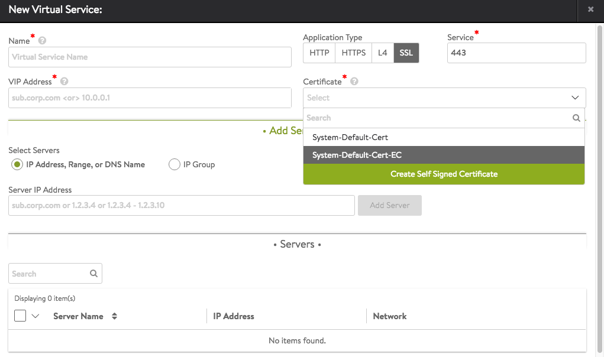
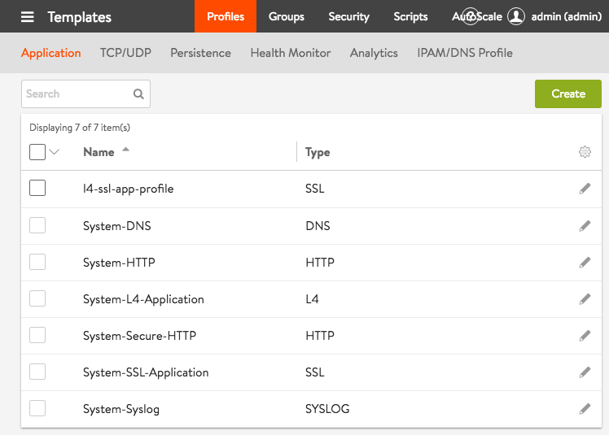
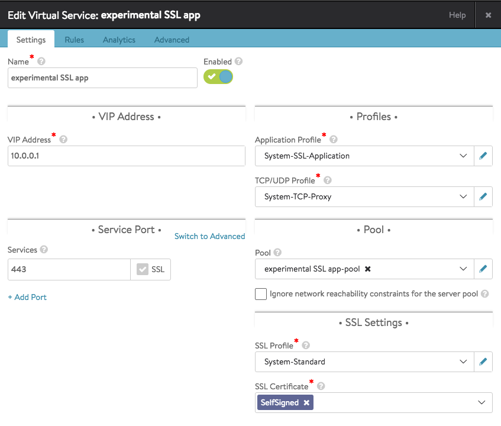
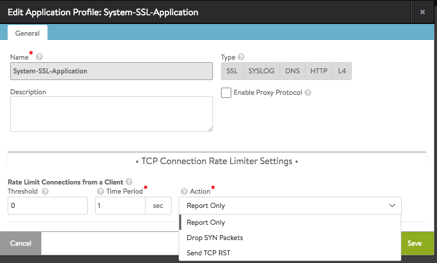

Avi Vantage release 16.2 and later versions support layer 4 SSL virtual services. All client-facing ports will be SSL-terminated. Unlike the HTTP application profile, there is no possibility to mix-and-match SSL and non-SSL ports on an SSL Profile app. For SSL termination of HTTP protocol, use <a href="/docs/configuration-guide/templates/profiles/application-profile/#http-profile">HTTP/HTTPs application profile</a>. Requests are forwarded to back-end servers in the clear.

To apply and tune this feature, use the following touch points within the UI:

* The SSL application type is selectable in either the Virtual Service Basic or Advanced Setup wizards. As shown in figure 1, click SSL for Application Type. Port 443 is the default, but can be changed. The required certificate can be self-signed or one of the other certs visible in the pulldown menu. 

### Figure 1. Basic Setup wizard showing selection of SSL application type.

* The default application profile, System-SSL-Application, appears under the Application tab of Templates. Vantage will automatically associate it with SSL type applications unless a change is made to the virtual service's settings.Refer to figure 2. 

### Figure 2. The System-SSL-Application application template is a standard component of each Avi Vantage release.

* Edit the virtual service's settings if the system-standard defaults for the application, TCP/UDP, and SSL profiles need to be changed. Refer to figure 3. 

### Figure 3. Vantage automatically associates an SSL type application with system-standard application, TCP/UDP, and SSL profiles.

* To enable the PROXY protocol for your layer 4 SSL VS, or to tune the TCP connection rate limiter settings, use the application profile editor, depicted in figure 4. Note that you have the option to enable either version 1 or version 2 of the PROXY protocol. 

### Figure 4. The System-SSL-Application application template can be edited by the user.

 

 
