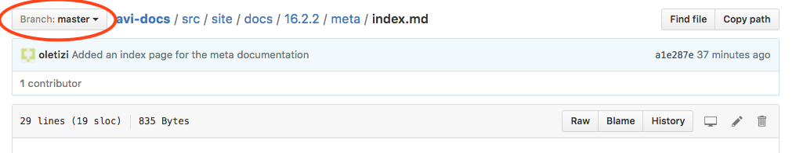
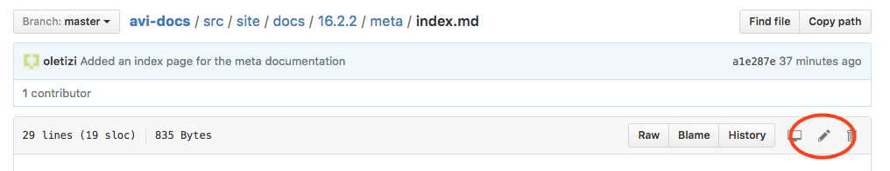

## Get Started

The docs below show how to get started with this documentation system.

* [Super-fast way to make a change to an existing documentation page &rsaquo;](#quick-edit)
* <a href="{{ site.meta.repo_site }}" target="_blank">Documentation system overview (scroll down to the readme)&nbsp;&rsaquo;</a>
* [for Windows &rsaquo;](getting-started/windows)
* [for Ubuntu &rsaquo;](getting-started/ubuntu)
* [for MacOS &rsaquo;](getting-started/macos)

## Authoring

* [Article CRUD Basics &rsaquo;](article-crud-basics)
* [Article Authoring Basics &rsaquo;](article-authoring-basics)
* [Article Style Guide &rsaquo;](article-style-guide)

## Editing

* [Documentation Editorial Guide &rsaquo;](editorial-guide)
* [Documentation Lifecycle Guide &rsaquo;](docs-lifecycle-guide)

## Quick Edit

The documentation is kept in a <a href="{{ site.meta.repo_site }}" target="_blank">GitHub repository</a>

> <a href="{{ site.meta.repo_site }}" target="_blank">{{ site.meta.repo_site }}</a> 

If you need to make a quick edit to a documentation page, you may edit directly via the GitHub web interface:

* Make sure you have "collaborator" access to the gitub repo. If you don't have collaborator access or you're not sure, contact the documentation administrator (&lt;{{ site.meta.admin_name }}&gt; {{ site.meta.admin_email }}) and ask to be added as a collaborator.
* Navigate to the page you want to edit on GitHub. For example, <a href="{{ site.meta.repo_site }}blob/master/src/site/docs/{{ site.meta.version }}/meta/index.md" target="_blank">this page (the one you're reading now) is here on GitHub:</a>

> <{{ site.meta.repo_site }}blob/master/src/site/docs{{ site.meta.version }}/meta/index.md>

* Make sure you are on the appropriate branch. Edits to the "master" branch will get published to the live document site immediately:
  <figure></figure>

* Click on the pencil icon:
  <figure></figure>

* Make your changes and save the document. Now you're done.

* If you made edits in the "master" branch, wait for 30 seconds or so and visit the page on the live documentation site to see your changes live.