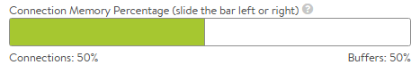

Avi Vantage can cache HTTP content, thereby enabling faster page load times for clients and reduced workloads for both servers and Vantage.

When a server sends a response (for example: logo.png), Vantage can add the object to its HTTP cache and serve the cached object to subsequent clients that request the same object. Caching thus can reduce the number of connections and requests sent to the server.

Enabling caching and compression allows Avi Vantage to compress text-based objects and store both the compressed and original uncompressed versions in the cache. Subsequent requests from clients that support compression will be served from the cache. This means Vantage will not need to compress every object every time, greatly reducing the compression workload.

See also:

* <a href="/docs/latest/http-cache-configuration-via-cli">Configure HTTP Cache via the CLI</a>
* <a href="/docs/latest/purge-an-object-from-http-cache">Purge an Object from HTTP Cache</a>
* <a href="/docs/latest/https-responses-not-served-from-cache">HTTPS Responses Not Served from HTTP Cache</a>

## Responses Eligible for Caching

When caching is enabled, Vantage caches HTTP objects for the following types of responses:

* HTTP
* GET, HEAD methods
* 200 status code

## Responses Not Cached

Vantage never caches HTTP objects for the following types of responses:

* HTTPS
* Put / Post / Delete methods
* Request Headers:

* Cache-Control: no-store
* Authorization
* Response Headers:

* Cache-Control: no-cache
* Expires header's date is already expired
* Warning, Set-Cookie, Vary: /*
* Cache-Control: private, no-store
* Both etag and Last-Modified headers do not exist and either:
* GET/HEAD method includes a Query
* No expires/max-age header exists
* Non-200 status codes

## Verify Object Served from Cache

To validate that an object is successfully served from the cache, navigate to the virtual service's logs page.  Apply the following filter:  cache_hit="true"  This will filter all requests that were successfully served from cache.  When using logs, be sure to enable Non-Significant Logs to show non-error traffic, and ensure the logging engine is capturing the Non-Significant logs for the duration of the test.  See the <a href="/docs/architectural-overview/applications/virtual-services/vs-logs/">Logs KB</a> for additional help.

## Cache Size

The size of a cache is indirectly determined based on the memory allocation for a Service Engine handling a virtual service that has caching enabled.  This is determined within the SE Group properties via the connection memory slider.  Memory allocated to buffers is used for TCP buffering (and hence accelerating), HTTP request and response buffering, and also for HTTP cache.

## Cache Configuration Options

HTTP caching is enabled within the Templates &gt; Profiles &gt; HTTP Application Profile.  Within the HTTP profile, navigate to the Caching tab and enable via the Enable Caching checkbox.

The following parameters all are optional:

* **X-Cache:** Vantage will add an HTTP header labeled X-Cache for any response sent to the client that was served from the cache. This header is informational only, and will indicate the object was served from an intermediary cache.
* **Age Header:** Vantage will add a header to the content served from cache that indicates to the client the number of seconds that the object has been in an intermediate cache. For example, if the originating server declared that the object should expire after 10 minutes and it has been in the Vantage cache for 5 minutes, then the client will know that it should only cache the object locally for 5 more minutes.
* **Date Header:** If a date header was not added by the server, then Vantage will add a date header to the object served from its HTTP cache. This header indicates to the client when the object was originally sent by the server to the HTTP cache in Vantage.
* **Cacheable Object Size:** The minimum and maximum size of an object to be cached, in bytes. Most objects smaller than 100 bytes are <a href="https://en.wikipedia.org/wiki/Web_beacon">web beacons</a> and should not be cached despite being image objects.  Large objects, such as streamed videos can be cached, though it may not be appropriate and may saturate the cache size quickly.
* **Cache Expire Time:** An intermediate cache must be able to guarantee that it is not serving stale content. If the server sends headers indicating how long the content can be cached (such as cache control), then Vantage will use those values. If the server does not send expiration timeouts and Vantage is unable to make a strong determination of freshness, then Vantage will store the object for no longer than the duration of time specified by the Cache Expire Time.
* **Heuristic Expire:** If a response object from the server does not include the Cache-Control header but does include an If-Modified-Since header, then Vantage will use this time to calculate the cache-control expiration, which will supersede the Cache Expire Time setting for this object.
* **Cache URI with Query Arguments:** This option allows caching of objects whose URI includes a query argument. Disabling this option prevents caching these objects. When enabled, the request must match the URI query to be considered a hit. Below are two examples of URIs that include queries. The first example may be a legitimate use case for caching a generic search, while the second may be a unique request posing a security liability to the cache.

* www.search.com/search.asp?search=caching
* www.foo.com/index.html?loginID=User
* **Cacheable Mime Types:** Statically defines a list of cacheable object types. This may be a String Group, such as System-Cacheable-Resource-Types, or a custom comma-separated list of Mime types that Vantage should cache. If no Mime Types are listed in this field, then Vantage will by default assume that any object is eligible for caching.
* **Non-Cacheable Mime Types:** Statically define a list of object types that are not cacheable. This creates an exclusion list that is the opposite of the cacheable list.  An object listed in both lists will not be cached.