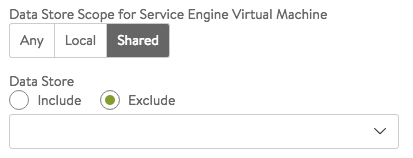

Service Engines are created within a group, which contains the definition of how the SEs should be sized, placed, and made highly available. Each <a href="/docs/latest/architectural-overview/infrastructure/#Clouds">cloud</a> will have at least one SE group.  The options within an SE group may vary based on the type of cloud within which they exist and its settings, such as<a href="/docs/16.2.2/orchestrator-access-modes"><em> no access</em></a> versus <a href="/docs/16.2.2/orchestrator-access-modes"><em>write access</em></a> mode.  SEs may only exist within one group.  Each group acts as an isolation domain.  SE resources within an SE group may be moved around to accommodate virtual services, but SE resources are never shared between SE groups.

Changes made to an SE group may be applied immediately, only applied to SEs created after the changes are made, or require existing SEs to first be <a href="/docs/16.2.2/disable-se">disabled</a> before the changes can take effect.

Multiple SE groups may exist within a cloud.  A newly created virtual service will be placed on the default SE group, though this can be changed via the VS &gt; Advanced page while creating a VS via the advanced wizard.  To move an existing virtual service from one SE group to another, the VS must first be disabled, moved, and then re-enabled.  SE groups provide data plane isolation, therefore moving a VS from one SE group to another is disruptive to existing connections through the virtual service.

### SE GROUP — BASIC SETTINGS TAB

To access the Service Engine group page, navigate to Infrastructure &gt; Clouds &gt; -cloudname- &gt; Service Engine Group. Start your definition of an SE group by giving it a name.

### REAL-TIME METRICS

At the top right of the Basic Settings tab you can turn on real-time metrics, which will cause SEs in the group to upload SE-related metrics to the Controller once every 5 seconds, as opposed to once per five minutes or longer. [<a href="/docs/16.2.2/metrics-retention-period">More info on metrics-upload intervals</a>.] After clicking the box, select the duration in minutes for real-time updating to last. A value of 0 is interpreted to mean "forever."

 

### HIGH AVAILABILITY &amp; PLACEMENT SETTINGS

The high availability mode of the SE group controls the behavior of the SE group in the event of an SE failure.  It also controls how load is scaled across SEs. Selecting a particular HA mode will change the settings and options that are exposed in the UI. These modes span a spectrum, from use of the fewest virtual machine resources on one end to providing the best high availability on the other.

* <a href="/legacy-ha/">Legacy Active Standby HA Mode</a>:  This mode is primarily intended to mimic a legacy appliance load balancer for easy migration to Avi Vantage.  Only two Service Engines may be created.  For every virtual service active on one, there is a standby on the other, configured and ready to take over in case of a failure of the active SE.  There is no Service Engine scale out in this HA mode.
* <a href="/docs/latest/elastic-ha-for-avi-service-engines/">Elastic N + M HA Mode</a>:  This default mode permits up to N active SEs to deliver virtual services, with the capacity equivalent of M SEs within the group ready to absorb SE(s) failure(s).
* <a href="/docs/latest/elastic-ha-for-avi-service-engines/">Elastic Active/Active HA Mode</a>:  This HA mode distributes virtual services across a minimum of two SEs. 

For additional considerations for SE high availability, including VS placement, see <a href="/docs/16.2.2/overview-of-vantage-high-availability">Overview of Vantage High Availability</a>. To compare the above HA modes to those defined prior to Vantage 16.2, see <a href="/docs/16.2.2/comparing-past-and-present-se-group-ha-modes">Comparing Past and Present SE Group HA Modes</a>.

**VS Placement across SEs**: When placement is *compact* (previously referred to as "Compactor"), Vantage prefers to spin up and fill up the minimum number of SEs; it tries to place virtual services on SEs which are already running. When placement is *distributed*, Vantage maximizes VS performance by avoiding placements on existing SEs. Instead, it places virtual services on newly spun-up SEs, up to Max Number of Service Engines. By default, placement is compact for elastic HA N+M mode and legacy HA active/standby mode. By default, it is distributed for elastic HA active/active mode.

**Virtual Services per Service Engine: **This parameter establishes the maximum number of virtual services the Controller cluster can place on any one of the SEs in the group.

**Per Application SE mode: **Select this option to deploy dedicated load balancers per application, i.e., per virtual service. In this mode, each SE is limited to a maximum of 2 virtual services. vCPUs in per-app SEs count towards licensing at 25% rate.

 

### SERVICE ENGINE CAPACITY AND LIMIT SETTINGS

* **Max Number of Service Engines**:  Defines the maximum SEs that may be created within an SE group. This number, combined with the virtual services per SE setting, dictate the maximum number of virtual services that can be created within an SE group. If this limit is reached, it is possible new virtual services may not be able to be deployed and will show a gray, un-deployed status. This setting can be useful to prevent Vantage from consuming too many virtual machines.
* **Memory per Service Engine**:  [Default = 2 GB, min = 1 GB] Enter the amount of RAM, in multiples of 1024 MB, to allocate to all new SEs. Changes to this field will only affect newly-created SEs. Allocating more memory to an SE will allow larger HTTP cache sizes, more concurrent TCP connections, better protection against certain DDoS attacks, and increased storage of un-indexed logs. This option is only applicable in write access mode deployments.
* **Memory Reserve**:  Reserving memory ensures an SE will not have contention issues with over-provisioned host hardware. Reserving memory makes that memory unavailable for use by another virtual machine, even when the virtual machine that reserved those resources is powered down. Avi strongly recommends reserving memory, as memory contention may randomly overwrite part of the SE memory, destabilizing the system. This option is applicable only for deployments in write access mode. For deployments in read access mode deployments or no access mode, memory reservation for the SE VM must be configured on the virtualization orchestrator.
* **vCPU per Service Engine**:  [Default = 2] Enter the number of virtual CPU cores to allocate to new SEs. Changes to this setting do not affect existing SEs. This option is only applicable in write access mode. Adding CPU capacity will help with computationally expensive tasks, such as SSL processing or HTTP compression.
* **CPU Reserve**:  Reserving CPU capacity with a virtualization orchestrator ensures a SE will not have issues with over-provisioned host hardware. Reserving CPU cores makes those cores unavailable for use by another virtual machine, even when the virtual machine that reserved those resources is powered down. This option is only applicable in write access mode deployments.
* **Disk per Service Engine:** [min = 10 GB] Specify an integral number of GB of disk to allocate to all new SEs.This option is only applicable in write access mode deployments. The value appearing in the window is either:  
    * 10 GB (the absolute minimum allowed), or
    * a value auto-calculated by the UI as follows: 5 GB + 2 *x* memory-per-SE, or
    * a number explicitly keyed in by the user (values less than 5 GB + 2 *x* memory-per-SE will be rejected) 
* **Connection Memory Percentage:** The percentage of memory reserved to maintain connection state. It comes at the expense of memory used for HTTP in-memory cache. Sliding the bar causes the percentage to range between its limits, 10% minimum and 90% maximum. 

### SE GROUP — ADVANCED TAB

The advanced tab in the Service Engine group popup supports configuration of optional functionality for SE groups. This tab only exists for clouds configured with write access mode. The appearance of some fields is contingent upon selections made.

* **Service Engine Name Prefix**:  Enter the prefix to use when naming the SEs within the SE group. This name will be seen both within Vantage, and as the name of the virtual machine within the virtualization orchestrator.
* **Service Engine Folder**:  SE virtual machines for this SE group will be grouped under this folder name within the virtualization orchestrator.
* **Delete Unused Service Engines After**:  Enter the number of minutes to wait before the Controller deletes an unused SE. Traffic patterns can change quickly, and a virtual service may therefore need to scale across additional SEs with little notice. Setting this field to a high value ensures that Vantage keeps unused SEs around in case of a sudden spike in traffic. A shorter value means the Controller may need to recreate a new SE to handle a burst of traffic, which may take a couple of minutes. 

### HOST &amp; DATA STORE SCOPE

* **Host Scope Service Engine**:  SEs may be deployed on any host that most closely matches the resources and reachability criteria for placement. This setting directs the placement of SEs.  
    * **Any**:  The default setting allows SEs to be deployed to any host that best fits the deployment criteria.
    * **Cluster**:  Excludes SEs from deploying within specified clusters of hosts. Checking the Include checkbox reverses the logic, ensuring SEs only deploy within specified clusters.
    * **Host**:  Excludes SEs from deploying on specified hosts. The Include checkbox reverses the logic, ensuring SEs only be deploy within specified hosts.
* **Data Store Scope for Service Engine Virtual Machine**:  Set the storage location for SEs. Storage is used to store the OVA (vmdk) file for VMware deployments.  
    * **Any**:  Vantage will determine the best option for data storage.
    * **Local**:  The SE will only use storage on the physical host.
    * **Shared**:  Vantage will prefer using the shared storage location. When this option is clicked, specific data stores may be identified for exclusion or inclusion. 

### ADVANCED HA &amp; PLACEMENT

* **Buffer Service Engines:** This is excess capacity provisioned for HA failover. In elastic HA N+M mode, this is capacity is expressed as M, an integer number of buffer service engines. It actually translates into a count of potential VS placements. To calculate that count, Vantage multiplies M by the maximum number of virtual services per SE. For example, if one requests 2 buffer SEs (M=2) and the max_VS_per_SE is 5, the count is 10. If max SEs/group hasn't been reached, Vantage will spin up additional SEs to maintain the ability to perform 10 placements. As illustrated at right, six virtual services have already been placed, and the current count of spare capacity is 14, more than enough to perform 10 placements. When SE2 fills up, spare capacity will be just right. An 11th placement on SE3 would reduce the count to 9 and require SE5 to be spun up.
* **Scale Per Virtual Service:** A pair of integers determine the minimum and maximum number of active SEs any virtual service within this group can scale out to. With native SE scaling, the greatest value one can enter as a maximum is 4; with BGP-based SE scaling, it is 32.
* **Service Engine Failure Detection: **This option refers to the time Vantage takes to conclude SE takeover should take place. Standard is approximately 9 seconds and aggressive 1.5 seconds.
* **Auto-Rebalance: **If this option is selected, virtual services are automatically migrated (scaled in or out) when CPU loads on SEs fall below the minimum threshold or exceed the maximum threshold. If this option is off, the result is limited to an alert. The frequency with which Vantage evaluates the need to rebalance can be set to some number of seconds.

* **CPU socket Affinity: **Selecting this option causes Vantage to allocate all cores for SE VMs on the same socket of a multi-socket CPU. The option is applicable only in vCenter environments. Appropriate physical resources need to be present in the ESX Host. If not, then SE creation will fail and manual intervention will be required.
* **Dedicated dispatcher CPU:** Selecting this option dedicates the core that handles packet receive/transmit from/to the data network to just the dispatching function. This option makes most sense in a group whose SEs have three or more vCPUs.
* **Override Management Network**:  If the SEs require a different network for management than the Controller, it must be specified here. The SEs will use their management route to establish communications with the Controllers.  See <a href="/docs/16.2.2/deploy-ses-in-different-data-centers-from-controllers">Deploy SEs in Different Datacenter from Controllers</a>. 

### SECURITY

* **HSM Group**:  Hardware security modules may be configured within the Templates &gt; Security &gt; HSM Groups.  An HSM is an external security appliance that is used for secure storage of SSL certificates and keys.  The HSM Group dictates how Service Engines can reach and authenticate with the HSM.  See <a href="/docs/16.2.2/physical-security-for-ssl-keys">Physical Security for SSL Keys</a>.  