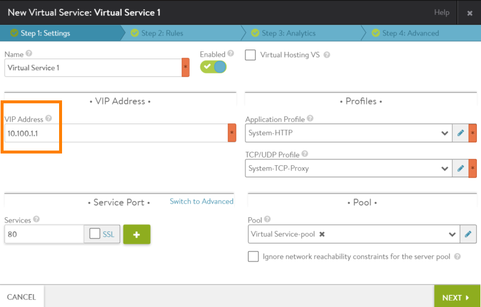

In some cases, a static route may be required on the next-hop router through which back-end servers are connected to their Avi Service Engine (SE).

A static route is required on the next-hop router from the Avi SE to the pool, in the following cases:

* The virtual service's VIP address or SNAT addresses are not in any of SE interface subnets.
* There is no HA requirement on the SE (because only a single SE is used).
* <a href="/legacy-ha/">Legacy HA</a> mode is enabled.

This article shows sample topologies that use static routing for server response traffic.

## Static Routing without HA

Provisioning load balancers without HA is in general not a recommended practice. However, there could be cases where such a configuration may be desirable. For example, if the SE group is provisioned with only one SE, then HA is not applicable since there is no device to failover to. If that SE fails, all the traffic will be blackholed.

Here is a sample topology without HA. The virtual service's VIP and SNAT IP addresses are not in any of the SE interface subnets. Thus, a static route is needed on the next-hop router from the back-end server back to the SE.

Static routes can be provisioned on the next-hop router to point to the interface IP of the Avi SE. However, it is recommended to configure a floating interface IP for the SE group, and to have the static route use the floating interface as the adjacency. This will allow smooth addition of a second Avi SE in the future if required, for HA purposes (using <a href="/legacy-ha/">legacy HA mode</a>).

Likewise, static routes or a default gateway also will need to be provisioned on the SE group, to enable reachability to servers and clients, which may not be Layer-2 adjacent. For information on provisioning a default gateway and static routes on an SE, <a href="/docs/configuration-guide/infrastructure/">click here</a>.

## Static Routing with HA

In legacy HA mode, the SE group belonging to the pool used by the virtual service contains two SEs. One of the SEs is active and has ownership of the virtual service's VIP and SNAT addresses, while the other SE waits in standby mode. IP addresses that are part of the individual virtual service's configuration (including the VIP and SNAT IPs) are enabled only on the active SE in the SE group.

The active SE responds to ARPs for the VIP and SNAT IP addresses that are in the same subnet as the SE. The active SE also carries traffic corresponding to all the virtual services. The standby SE remains idle unless the active SE becomes unavailable. In that case, the standby SE takes over the active role, and assumes ownership of the virtual service's IP addresses.

Note: Use of static routes for VIP and SNAT IP reachability in cluster HA configurations is not supported.

Here is an example of a one-armed topology with legacy HA:

In this example, neither the VIP nor the SNAT IP are part of the SE interface's subnet. For this reason, a floating interface IP (10.10.1.100) is configured. The floating interface IP must be in the same subnet as the attached interface subnet through which the VIP or SNAT-IP is reachable (10.10.1.0/24 subnet in the above topology).

A separate floating interface IP is required for each of the attached interface subnets through which VIP or SNAT IP traffic flows. On the next-hop router used by the server pool for return traffic back to the SE, static routes to the VIP and SNAT IP addresses are configured, with the next hop set to the floating interface IP.

Following failover, ownership of the VIP, SNAT IPs, and floating interface IP are taken over by the new active SE, as shown here:

The connecting router thus does not see any change, except for the gratuitous ARP update for the floating interface's IP address, which is now mapped to the interface MAC address the new active SE.

## Configuration

On the Avi Controller, the VIP and SNAT IP addresses are part of the individual virtual service's configuration.

The HA mode and floating IP address are configured within the SE group.

Note: The SE group for the non-HA topology contains a single SE. The SE group for the legacy HA topology contains two SEs.

### VIP Address

The VIP address is the IP address that DNS will return in responses to queries for the load-balanced application's domain name. This is the destination IP address of requests sent from the client browser to the application.

### SNAT IP Address

When the SE forwards a request to a back-end server, the SE uses the SNAT IP address as the source address of the client request. In deployments that handle VIP traffic differently depending on the application, the <a href="/docs/latest/source-nat-for-application-identification">source NAT</a> IP address provides a way to direct the traffic. The SNAT IP address also ensures that response traffic from the back-end servers goes back through the SE that forwarded the request.

### Floating Interface IP Address

On the next-hop router, static routes are set up to point to the VIP and SNAT-IP of the SE group. The static routes are configured with next hop set to the floating-interface IP of the attached subnet of the SE group.

Within the SE group configuration, legacy HA mode is selected and the floating IP address is specified.

### Using the CLI

The following commands set the HA mode in SE group 1 to legacy HA, and configure floating IP address 10.10.1.100 for the SE group:
<pre>: &gt; configure serviceenginegroup SE group 1
...

: ha_mode ha_mode_legacy_active_standby
: floating_intf_ip 10.10.1.100
: save
</pre>