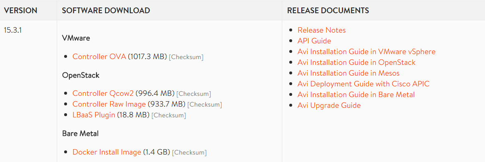

Avi Vantage software can be downloaded from the Avi Portal website, accessible at <a href="https://www.avinetworks.com/portal">www.avinetworks.com/portal</a>. Or you can click the Login button from within the main <a href="https://www.avinetworks.com">www.avinetworks.com</a> site. 

The portal requires an Avi Networks customer account, which may be obtained by sending an email here: <a href="mailto:tryavi@avinetworks.com">tryavi@avinetworks.com</a>

Once logged into the portal, download the latest version of the Controller from the Software tab. The Controller image includes an embedded Service Engine image. Documentation is included on this page for installation within the appropriate cloud environments.  

