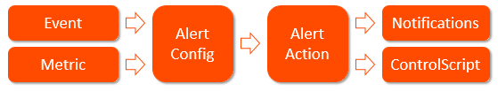
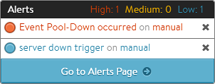
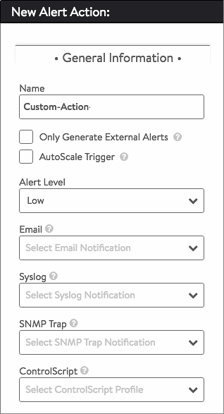

The *Operations &gt; Alerts &gt; Alert Actions* page displays the configured Alert Actions. An alert config defines the *conditions under which* action for the particular alert should be taken.  It also defines a corresponding alert action, which lists the specific action(s) needing to be taken.  Multiple alert configs can point to the same alert action. For example, the alert configs for all security and account alerts might reference the same alert action, one which forwards messages to a remote audit system. See also:

* <a href="/docs/16.2/alerts-overview">Alerts Overview</a>
* <a href="/docs/16.2/events-list">Events Overview</a>
* <a href="/docs/16.2/notifications-overview">Notifications Overview</a>
* <a href="/docs/16.2/example-custom-alert-notification">Example Custom Alert Notification </a> 

 

### Actions

Alert actions are used to notify administrators through one or more of four notification methods:

* Append an entry in the alert log
* Email
* Syslog
* SNMP traps 

They may also be used to effect automation through:

* Application autoscaling (e.g., SE scale-out/in, server pool autoscaling)
* Execution of a ControlScript 

An alert action may specify any combination of these actions.

 

### Create an Alert Action

* **Name:** User-friendly name
* **Only Generate External Alerts:** By default, Vantage appends an entry in the alert log, which is visible to Vantage administrators in the UI. Checking the Only General External Alerts box disables the default. Alerts may still be sent externally via any combination of the four methods listed (email, syslog, SNMP, ControlScript).
* **Autoscale Trigger**: Checking this box engages the Autoscale Manager.
* **Alert Level**:  High, medium, or low. This provides a way of classifying the alert to the remote system. For local notifications within the Vantage UI, the alerts show as a different color to denote their severity.
* **Email:** Send the alert as an email by selecting a previously created Email Notification.
* **Syslog:** Send the alert to a syslog server (or servers) by selecting a previously defined Syslog Notification.
* **SNMP Trap**: Send the alert as a trap an SNMP server (or servers) by selecting a previously defined SNMP Trap Notification.
* **ControlScript**: Launch a custom ControlScript, which is a Python script to be executed on the Controller. These scripts may make configuration changes to Vantage or send data externally to a remote system. For instance, a ControlScript could notify a security team via a REST API that a virtual service is under a severe denial of service attack. 