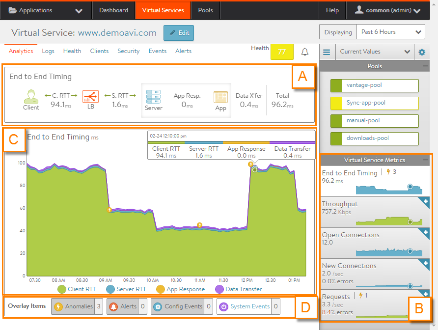
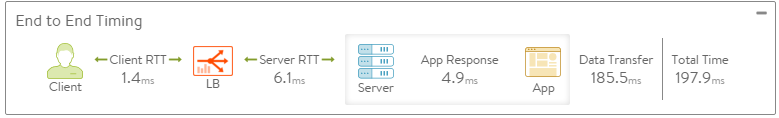

### About Virtual Service Analytics

The VS analytics tab presents information about the virtual service performance metrics.  All charts and metrics reflect the display time selected.

This article is broken down into the following sections, outlined in the graphic above.

* End-to-End Timing (A) 
* Metrics tiles (B) 
* Chart pane (C) 
* Overlay pane (D)    

### End-to-End Timing

The End to End Timing pane provides a high-level overview of the quality of the end-user experience and where any slowdowns may be occurring. The chart breaks down the time required to complete a single transaction, such an HTTP request.

You may find it helpful to compare the end-to-end time against other metrics, such as throughput, to see how increases in traffic impact the ability of the application to respond. For instance, if new connections double but the end-to-end time quadruples, you may need to consider adding additional servers. You can expand or collapse this pane by clicking the **+** or **–** icon beneath the health score, as shown.

From left to right, this pane displays the following timing information:

* **Client RTT:** Average network TCP latency between the client and Avi Vantage for all clients, both local (within the same datacenter) and remote (Internet). This metric indicates how long it takes to establish connections and return acknowledgements. Because this is TCP, this number will often be higher than an ICMP ping. 
* **Server RTT:** Round-trip latency for SE-to-server traffic. An abnormally high server RTT may indicate either that the network is saturated or more likely that a server’s TCP stack is overwhelmed and cannot quickly establish new connections. 
* **App Response:** The time the server took to respond. This includes the time the server took to generate content, potentially fetch backend database queries, and begin transferring the response back to Avi Vantage. This time is calculated by subtracting the server RTT from the time of the first byte of a response from the server. If the application consists of multiple tiers (such as web, applications, and database), then the App Response represents the combined time before the server in the pool began responding. This metric is only available for a layer 7 virtual service. 
* **Data Transfer:** Average time required for the server to transmit the requested file. This is calculated by measuring from the time the SE received the first byte of the server response until the client has received the last byte, which is measured as the when the last byte was sent from the SE plus one half of a client round trip time. This number may vary greatly depending on the size of objects requested and the latency of the server network. The larger the file, the more TCP round trip times are required due to ACKs, which are directly impacted by the client and server RTT. This metric is only used for a layer 7 virtual service. 
* **Total Time:** Total time from when a client sent a request until they received the response. This is the most important end-to-end timing number to watch, because it is the sum of the other four metrics. As long as the Total Time value is consistently low, the application is probably successfully serving traffic.  

 

### Metrics Tiles

The following metrics are available for virtual services:

* **End to End Timing:** Displays the same information shown in the End-to-End Timing Pane in a chart form, with color-coding to show the client RTT, server RTT, data transfer, and app response times. Clicking the radio button for these items toggles the chart display of that item on and off. For non-HTTP virtual services, only client RTT and server RTT are shown. 
* **Throughput:** Total bandwidth passing through the virtual service, in Mbps. Hovering the mouse cursor over this graph displays the throughput in Mbps for the selected time. Throughput shown is measured as bytes transferred between the client and Service Engine, which does not include data transferred between Service Engine and the servers. 
* **Open Connections:** Number of TCP client connections or UDP transactions that are currently in an open state. UDP transactions are counted even though they are technically connection-less. The number of open connections does not necessarily translate into the number of unique clients, as protocols such as HTTP 1.1 typically open six connections per client browser. If the Maximum Concurrent Connections setting has been set for a virtual service, a horizontal red bar superimposed over the chart pane will show the maximum number of connections allowed. 
* article for further description of this behavior. 
* **Requests:** Number of responses to requests per second, which breaks down successful requests versus errors (such as 4xx or 5xx errors). Within the chart pane you may toggle radio buttons to break down the errors by whether they are generated by the server or by Avi Vantage. For instance, if no servers are available in the pool, Avi Vantage will send out an HTTP 500 status code. The Client Logs section will provide more detail on specific errors.  This metric is only available for HTTP virtual services.  

 

### Chart Pane

The main chart pane in the middle of the Analytics tab displays a detailed historical chart of the selected metric tile for the current virtual service.

* Hovering the mouse over any point in the chart will display the results for that selected time in a popup window. 
* Clicking within the chart will freeze the popup at that point in time. This may be useful when the chart is scrolling as the display updates over time. 
* Clicking again will unfreeze the highlighted point in time.  

Many charts contain radio buttons in the top right that allow you to customize which data should be excluded from the chart. For example, if the End to End Timing chart is heavily skewed by one very large metric, then deselecting that metric by clearing the appropriate radio button will re-factor the chart based on the remaining metrics shown. This may change the value of the vertical Y-axis.

Some charts also contain overlay items, which will appear as color-coded icons along the bottom of the chart.

### Overlays Pane

The overlays pane allows you to overlay icons signifying important events within the timeline of the chart pane. This feature helps correlate anomalies, alerts, configuration changes, or system events with changes in traffic patterns.

Within the overlays pane:

* Each overlay type displays the number of entries for the selected time period. 
* Clicking an overlay button toggles that overlay's icons in the Chart pane. The button lists the number of instances (if any) of that event type within the selected time period. 
* Selecting an overlay button displays the icon for the selected event type along the bottom of the chart pane. Multiple overlay icon types may overlap. Clicking the overlay type's icon in the chart pane will bring up additional data below the Overlay Items bar. The following overlay types are available:  
    * **Anomalies:** Display anomalous traffic events, such as a spike in server response time, along with corresponding metrics collected during that time period. 
    * **Alerts:** Display alerts, which are filtered system-level events that have been deemed important enough to notify an administrator. 
    * **Config Events:** Display configuration events, which track configuration changes made to Avi Vantage by either an administrator or an automated process. 
    * **System Events:** Display system events, which are raw data points or metrics of interest. System events can be noisy, and are best used as alerts that filter and classify these raw events by severity.  

 

### Anomalies Overlay

The Anomalies overlay displays periods during which traffic behavior was considered abnormal based on recent historical moving averages. Changing the time interval will provide greater granularity and potentially show more anomalies. Clicking the anomalies overlay button  displays yellow Anomaly icons in the chart pane, which can scroll down to view additional information related to that anomaly. During times of anomalous traffic, Vantage records any metrics that have deviated from the norm, which may provide hints as to the root cause of the anomaly.

**Note:** An anomaly is defined as a metric that has a deviation of 4 sigma or greater across the moving average of the chart.

**Note:** Anomalies are not recorded or displayed if the statistics interval (set from the Displaying pull-down menu) is set to Real Time.

These metrics are defined as follows:

* **Timestamp:** Date and time when the anomaly was detected. This may either span the full duration of the anomaly, or merely be near the same time window. 
* **Type:** The specific metric deviating from the norm during the anomaly period. To be included, the metric deviation must be greater than 4 sigma. Numerous types of metrics, such as CPU utilization, bandwidth, or disk I/O may trigger anomalous events. 
* **Entity:** Name of the specific object that is reporting this metric. 
* **Entity Type:** Type of entity that caused the anomaly. This may be one of the following:  
    * **Virtual Machine** (server). These metrics require Avi Vantage to be deployed in read access mode or write access mode to the virtualization orchestrator (for example, vCenter or OpenStack). In the example above, CPU utilization of the two servers was learned by querying vCenter. 
    * **Virtual Service** 
    * **Service Engine** 
* **Time Series:** Thumbnail historical graph for the selected metric, including the most current value for the metric which will be data on the far right. Moving the mouse over the chart pane will show the value of the metric for the selected time. Use this to compare the normal, current, and anomaly time periods. 
* **Deviation**: Change or deviation from the moving average, either higher or lower. The time window for the moving average depends on the time series selected for the Analytics tab.  

 

### Alerts Overlay

The alerts overlay displays the results of any events that meet the filtering criteria defined via Operations > Alerts. Alerts notify administrators about important information or changes to a site that may require immediate attention.

Alerts may be transitory, as they will expire after a defined period of time. For instance, Vantage may generate an alert if a server is down and then allow that alert to expire after a specified time period once the server comes back online. The original event remains available for later troubleshooting purposes.

Clicking the alerts icon  in the overlay items bar displays any red alerts icons in the chart pane. Selecting one of these chart alerts will bring up additional information below the overlay items bar, which will show the following information:

* **Timestamp**: Date and time when the alert occurred. 
* **Resource Name**: Name of the object that is reporting the alert. 
* **Level**: Severity of the alert. You can use the priority level to determine whether additional notifications should occur, such as sending an email to administrators or sending a log to Syslog servers. The level may be one of the following:  
    * **High**: red 
    * **Medium**: yellow 
    * **Low**: blue 
* **Summary**: Brief description of the event. 
* **Actions**:  
    * **Dismiss:** Dismissing the alert removes it from the list and also removes the corresponding alert icon from the chart pane. Dismissing an alert here is the same as dismissing it via the bell icon at the top of the screen next to the health score, or dismissing it via the Alerts tab. 
    * **Edit:** Opens the alert filter configuration, which can be modified to make Vantage more or less sensitive to generating new alerts. 
* **Expand/Contract**: Clicking the plus (+) or minus sign (-) for an alert opens and closes a sub-table showing more detail about the alert. This will typically show the original events that triggered the alert.  

 

### Configuration Events Overlay

The configuration events overlay displays configuration events. Configuration events typically involve changing the Vantage configuration by adding, deleting, or modifying a resource such as a pool, virtual service, or SE, or an object related to the object being inspected. For example, if a virtual service's traffic drops off at precisely 10:00 a.m., and at that time an administrator made a change to the virtual service's security settings, there is a good chance the cause of the change in traffic can be attributed the configuration change.

Clicking the configuration events icon  in the overlay items bar displays any blue configuration event icons in the chart pane. Selecting one of these chart alerts will bring up additional information below the overlay items bar, which will show the following information:

* **Timestamp**: Date and time when the configuration change occurred. 
* **Event Type**: Always scoped to *Configuration* event types. 
* **Resource Name**: Name of the object that has been modified. 
* **Event Code**: Type of change:  
    * CONFIG_CREATE 
    * CONFIG_UPDATE 
    * CONFIG_DELETE 
* **Description**: Brief description of the event. 
* **Expand/Contract**: Clicking the plus (+) or minus sign (-) for a configuration event either expands or contracts a sub-table showing more detail about the event. When expanded, this shows a difference comparison of the previous configuration versus the new configuration, as follows:  
    * Green: shows additions. 
    * Red: shows deletions. 
    * Yellow: shows changes.  

 

### System Events Overlay

This overlay displays system events relevant to the current object, such as a server changing status from up to down or the health score of a virtual service changing from 50 to 100.

Clicking the system events icon  in the overlay items bar displays any purple system event icons in the chart pane. Select a system event icon in the chart pane to bring up more information below the overlay items bar.

* **Timestamp**: Date and time when the system even occurred. 
* **Event Type**: This will always be system. 
* **Resource Name**: Name of the object that triggered the event. 
* **Event Code**: High-level definition of the event, such as VS_Health_Change or VS_Up. 
* **Description**: Brief description of the system event. 
* **Expand/Contract**: Clicking the plus (+) or minus sign (-) for a System Event expands or contracts that system event to show more information.   