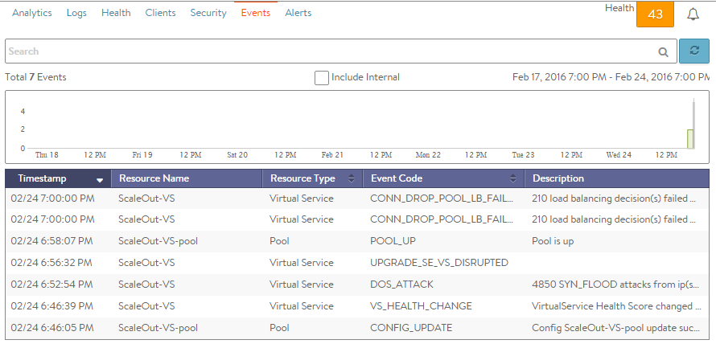

Events are recordings or logs, and are used for reactive troubleshooting, but may also be used to trigger alerts, which can be used for proactive actions.

## Virtual Service Events

The Events tab presents system-generated events over the time period selected for the virtual service. System events are applicable to the context in which they are viewed. For example, when viewing events for a virtual service, only events that are relevant to that virtual service are displayed.

The top of this tab displays the following items:

* **Search:** The Search field allows you to filter the events using whole words contained within the individual events. 
* **Refresh:** Clicking Refresh updates the events displayed for the currently-selected time. 
* **Number:** The total number of events being displayed. The date/time range of those events appear beneath the Search field on the left. 
* **Clear Selected:** If filters have been added to the Search field, clicking the Clear Selected (X) icon on the right side of the search bar will remove those filters. Each active search filter will also contain an X that you can click to remove the specific filter. 
* **Histogram:** The histogram shows the number of events over the period of time selected. The X-axis is time, while the Y-axis is the number of events during that bar’s period of time.  
    * Hovering the cursor over a histogram bar displays the number of entries represented by that bar, or period of time. 
    * Click and drag inside the histogram to refine the date/time period which further filters the events shown. When drilling in on the time in the histogram, a Zoom to selected link appears above the histogram. This expands the drilled in time to expand to the width of the histogram, and also changes the Displaying pull-down menu to Custom. To return to the previously selected time period, use the Displaying pull-down menu.  

The table at the bottom of the Events tab displays the events that matched the current time window and any potential filters. The following information appears for each event:

* **Timestamp:** Date and time the event occurred. Highlighting a section of the histogram allows further filtering of events within a smaller time window. 
* **Event Type:** This may be one of the following:  
    * **System:** System events are generated by Avi Vantage to indicate a potential issue or create an informational record, such as VS_Down. 
    * **Configuration:** Configuration events track changes to the Avi Vantage configuration. These changes may be made by an administrator (through the web interface, API, or CLI), or by automated policies. 
* **Resource Name:** Name of the object related to the event, such as the pool, virtual service, SE, or Controller. 
* **Event Code:** A short event definition, such as Config_Action or Server_Down. 
* **Description:** A complete event definition. For configuration events, the description will also show the username that made the change. 
* **Expand/Contract:** Clicking the plus (+) or minus sign (-) for an event log either expands or contracts that event log. Clicking the + and – icons in the table header expands and collapses all entries in this tab.  

For configuration events, expanding the event displays a difference comparison between the previous and new configurations.

* New fields will appear highlighted in green in the new configuration. 
* Removed fields will appear highlighted in red. 
* Changed fields will show highlighted in yellow.   