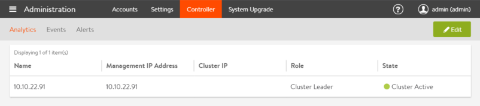

The Administration &gt; Controller page provides information about the Avi Controller (or Avi Controller cluster).

### Avi Controller Table

The Avi Controller table lists the Avi Controllers in the cluster. 

* If Vantage is deployed with a single Avi Controller node, only that Avi Controller is listed.
* If Vantage is deployed as a 3-node Controller cluster, each Controller node is listed. 

The following example is from a deployment that uses a single Controller:

The Controller table contains the following information:

* **Name:** Name or IP address of the Avi Controller. 
* **Management IP Address:** Management IP address of the individual Avi Controller node in the cluster. Each Avi Controller in the cluster will have its own management address. 
* **Cluster IP:** The shared management IP address for the cluster, owned by the current leader Avi Controller. 
* **Role:** Shows which Avi Controller is the primary, or leader of the cluster. 
* **State:** The Avi Controller status, such as "Cluster Active."   

## Controller Analytics

This tab configures the Avi Controller management addresses.

If this is a single-node cluster (consists of only this Avi Controller node), the only applicable field is Controller Node-1.

If deploying a 3-node cluster, all fields are applicable:

* **Controller Cluster IP:** The shared management IP address for the cluster.  
* **Management IP:**  
* **Controller Node-1:** Management IP address of node 1. This IP interface belongs only to this Avi Controller node and is not shared by the cluster. 
* **Controller Node-2:** Management IP address of node 2. This IP interface belongs only to this Avi Controller node and is not shared by the cluster. 
* **Controller Node-3:** Management IP address of node 3. This IP interface belongs only to this Avi Controller node and is not shared by the cluster.  

See the following for more information on Avi Controller cluster deployment and management:

* <a href="/docs/16.2/configure-controller-ha-cluster">Deploying an Avi Controller Cluster</a>
* <a href="/docs/16.2/overview-of-controller-cluster/">Avi Controller Cluster FAQ</a>
* <a href="/docs/16.2/controller-cluster-ip">Controller Cluster IP</a>
* <a href="/docs/16.2/changing-avi-controller-cluster-configuration">Changing Avi Controller Cluster Configuration</a> 