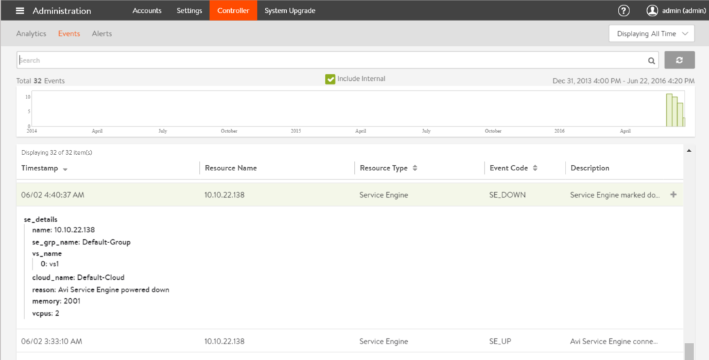

The Administration > Controller > Events page lists Avi Controller-related events. 

The following example shows details for an SE_DOWN event, indicating that an Avi Service Engine (SE) has gone down.

This page automatically filters the Vantage events log to display only those events related to Avi Controller operation. The same events are also included in the events log accessed by <a href="/docs/16.2/configuration-guide/operations/events/">Operations &gt; Events</a>. The same search options also are supported.
