## Introduction

This guide describes how to integrate Avi Vantage into an OpenShift cloud. The instructions in this guide can be used for installing Avi Vantage 16.2.3 and subsequent.

Avi Vantage is a software-based solution that provides real-time analytics as well as elastic application delivery services. Vantage optimizes core web-site functions, including SSL termination and load balancing. Vantage also provides access to network analytics, including end-to-end latency information for traffic between end-users and the load-balanced applications.

When deployed into an OpenShift cloud, Avi Vantage performs as a fully distributed, virtualized system consisting of the Avi Controller and Avi Service Engines (SEs), each running as a separate container on OpenShift slave nodes.

## DEPLOYMENT PREREQUISITES

### PHYSICAL NODE REQUIREMENTS

The main components of the Avi Vantage solution, Avi Controllers and Service Engines (SEs), run as containers on OpenShift slave nodes. For production deployment, a 3-instance Avi Controller cluster is recommended, with the each of the Avi Controller instances running in containers on separate physical nodes. After configuring the Avi Controller cluster for OpensShift cloud, it deploys one Avi SE container on each of the OpenShift nodes. The nodes on which an Avi Controller runs must meet at least the following minimum system requirements:

* 4 vCPUs
* 12 GB memory
* 64 GB disk space 

### SYSTEM TIME (NTP) REQUIREMENT

The system time on all nodes must be synchronized. Use of a Network Time Protocol (NTP) server is recommended.

### SOFTWARE INFRASTRUCTURE REQUIREMENTS

For deployment of SEs, the following system-level software is required:

* Each node host OS must be a Linux distribution running systemd.
* The Avi Controller uses password-less sudo SSH to access all the OpenShift nodes in the cluster and create SEs on those nodes. The SSH user must have password-less sudo access to all three OpenShift nodes hosting the Avi Vantage cluster. The SSH method requires a public-private key pair. You can import an existing private key onto the Avi Controller or generate a new key pair. In either case, the public key must be in the “/home/ssh_user/.ssh/authorized_keys” file, where ssh_user is the SSH username on all OpenShift nodes. The Avi Controller setup wizard automatically stores the private key on the Avi Controller node when you import or generate the key. 

## INSTALLING THE AVI CONTROLLER

To install the Avi Controller:
<ol> 
 <li>Copy the .tgz package onto the OpenShift slave node that will host the Avi Controller leader (for controller cluster two followers run on separate nodes):  <pre crayon="false" class="command-line language-bash" data-prompt=": >"><code>scp controller_docker.tgz username@remotehost.com:~/</code></pre> Note: Replace <em>username</em>@<em>remotehost.com</em> with your write-access username and password and the IP address or hostname for the host node.</li> 
 <li>Log onto the OpenShift node:  <pre crayon="false" class="command-line language-bash" data-prompt=": >"><code>ssh username@remotehost.com</code></pre></li> 
 <li>Load the Avi Controller image into the host's local Docker repository:  <pre crayon="false" class="command-line language-bash" data-prompt=": >"><code>sudo docker load &lt; controller_docker.tgz</code></pre></li> 
 <li>As a best practice, clean up any data that may be lingering from a previous run:  <pre crayon="false" class="command-line language-bash" data-prompt=": >"><code>sudo rm -rf /var/lib/controller/*</code></pre></li> 
 <li>Use the vi editor to create a new file for spawning the Avi Controller service:  <pre crayon="false" class="command-line language-bash" data-prompt=": >"><code>sudo vi /etc/systemd/system/avicontroller.service</code></pre></li> 
 <li>Copy the following lines into the file:</li> 
</ol> 

 

<pre><code class="language-yaml">[Unit]
Description=AviController
After=docker.service
Requires=docker.service

[Service]
Restart=always
RestartSec=0
TimeoutStartSec=0
TimeoutStopSec=120
StartLimitInterval=0
ExecStartPre=-/usr/bin/docker kill avicontroller
ExecStartPre=-/usr/bin/docker rm avicontroller
ExecStartPre=/usr/bin/bash -c "/usr/bin/docker run --name=avicontroller --privileged=true -p 5098:5098 -p 9080:9080 -p 9443:9443 -p 8443:8443 -p 5054:5054 -p 161:161 -p 8053:53/udp -d -t -e NUM_CPU=8 -e NUM_MEMG=24 -e DISK_GB=80 -e HTTP_PORT=9080 -e HTTPS_PORT=9443 -e MANAGEMENT_IP=$$HOST_MANAGEMENT_IP -v /:/hostroot -v /var/lib/controller:/vol -v /var/run/fleet.sock:/var/run/fleet.sock -v /var/run/docker.sock:/var/run/docker.sock avinetworks/controller:$$TAG"
ExecStart=/usr/bin/docker logs -f avicontroller
ExecStop=/usr/bin/docker stop avicontroller

[Install]
WantedBy=multi-user.target</code></pre> 

1. Edit the following values in the file:

* **NUM_CPU:** Sets the number of CPU cores/threads used by the Controller (8 in this example).
* **NUM_MEMG:** Sets the memory allocation (24 GB in this example).
* **DISK_GB:** Sets the disk allocation (80 GB in this example).
* **MANAGEMENT_IP**: Replace $$HOST_MANAGEMENT_IP with the management IP of current OpenShift Node
* **$$TAG**: Replace with tag value of the Avi Vantage image in the Docker repository. For example, “16.3-5079-20160814.122257”. 

2. Save and close the file.

## STARTING THE AVI CONTROLLER SERVICE

To start the Avi Controller, enter the following command on the node on which you created the Avi Controller:

<pre class="command-line language-bash" data-prompt=": >"><code>sudo systemctl enable avicontroller &amp;&amp; sudo systemctl start avicontroller</code></pre> 

Initial startup and full system initialization takes around 10 minutes.

## ACCESSING THE AVI CONTROLLER WEB INTERFACE

To access the Avi Controller web interface, navigate to the following URL:

https://opensthift-node-ip:9443

Where openshift-node-ip is the management IP of the OpenShift node on which the Controller is installed.

## SETTING UP THE AVI CONTROLLER

This section shows how to perform initial configuration of the Avi Controller using its deployment wizard. You will configure the following settings.

Access Avi Controller UI from browser and follow below five steps:

<figure class="thumbnail wp-caption aligncenter"> <a href="img/Fig1.png">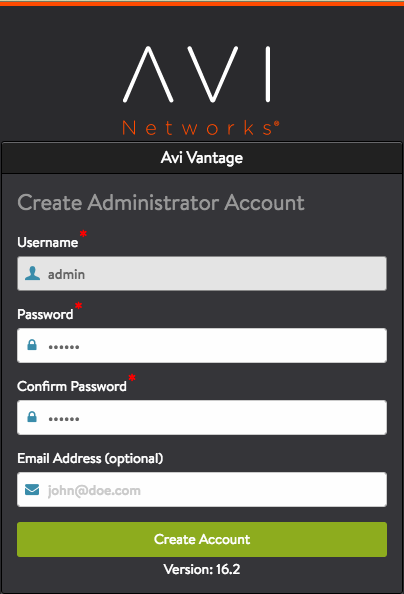</a>  
<figcapture> Step 1. Set a password for the admin user. 
</figcapture>
</figure> 

 

<figure class="thumbnail wp-caption aligncenter"> 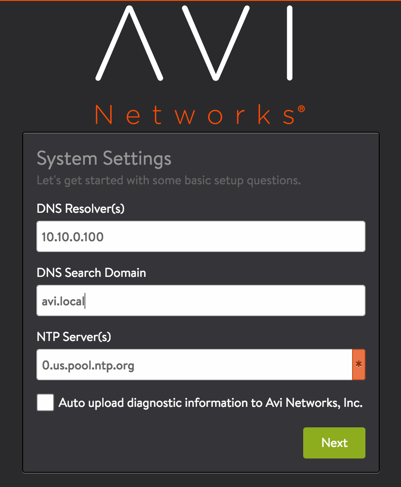  
<figcapture> Step 2. Set DNS and NTP server information. 
</figcapture>
</figure> 

 

<figure class="thumbnail wp-caption aligncenter"> <a href="img/Fig3.png">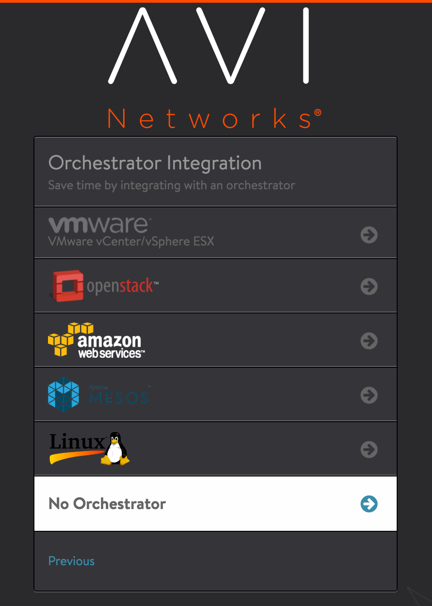</a>  
<figcapture> Step 3. Select No Orchestrator as infrastructure type. 
</figcapture>
</figure> 

 

<figure class="thumbnail wp-caption aligncenter"> <a href="img/Fig4.png">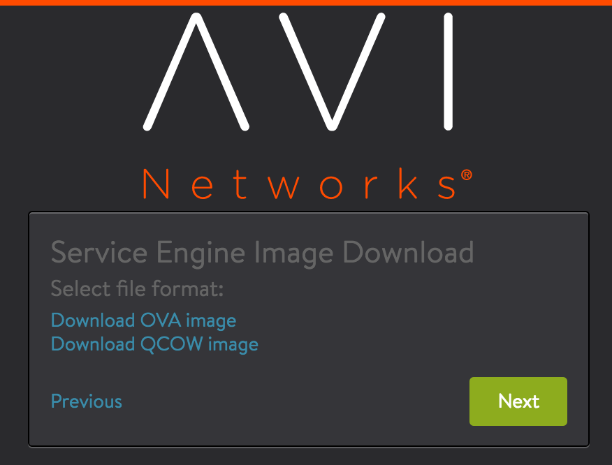</a>  
<figcapture> Step 4. Click Next. 
</figcapture>
</figure> 

 

<figure class="thumbnail wp-caption aligncenter"> <a href="img/Fig5.png">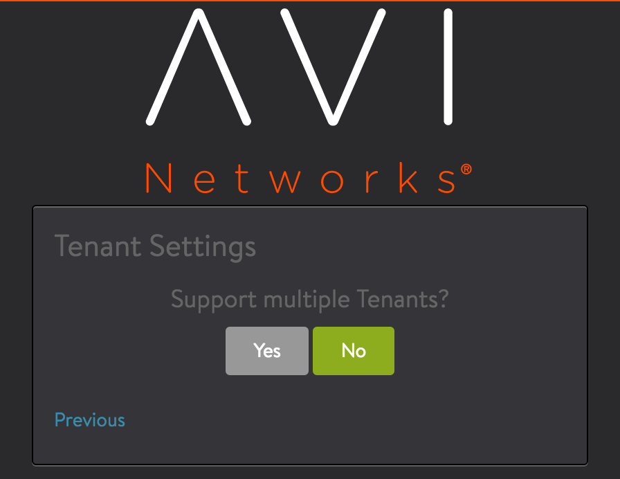</a>  
<figcapture> Step 5. Respond ‘No’ to the multiple tenants question. 
</figcapture>
</figure> 

 

# CONFIGURE NETWORKS

Configure EastWest networks and subnet for virtual services handling east-west traffic and NorthSouth subnet for virtual services handling client / north-south traffic as follows:

<figure class="thumbnail wp-caption alignleft"> <a href="img/Fig6.png">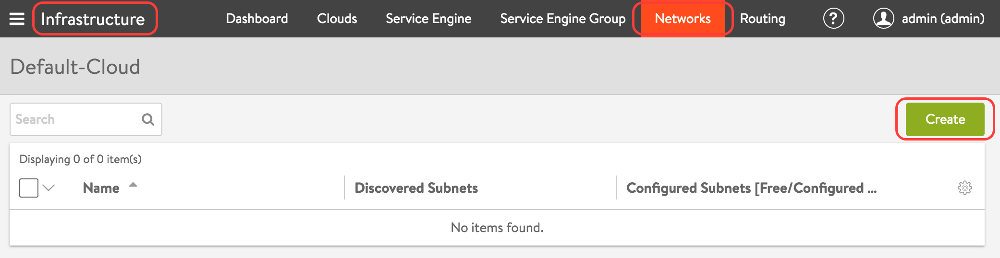</a>  
<figcapture> Step 6. Navigate to Infrastructure &gt; Networks and click Create. 
</figcapture>
</figure> 

 

 

 

 

 

 

 

 

<figure class="thumbnail wp-caption alignnone"> <a href="img/Fig7-1.png">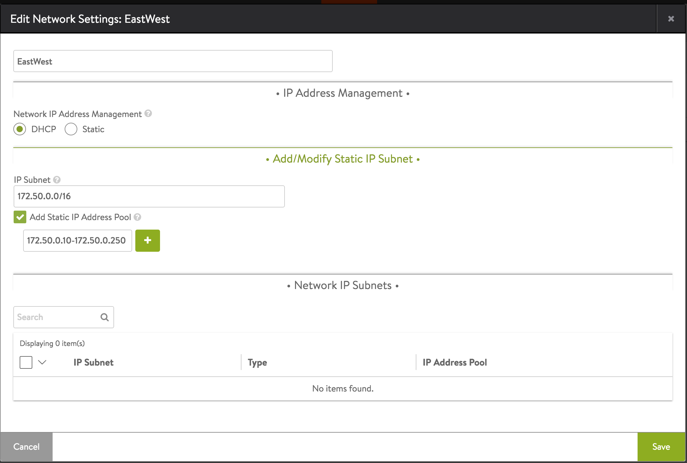</a>  
<figcapture> Step 7. Create EastWest network and add subnet with static IP range for IPs to be used by east-west virtual services. 
</figcapture>
</figure> 

Above example uses 172.50.0.0/16 subnet assuming kube-proxy is enabled. To use the service subnet (172.30.0.0/16) for east-west traffic, <a href="/docs/16.2/replace-kube-proxy-in-openshift-environment-with-avi-vantage">disable kube-proxy</a>.

<figure class="thumbnail wp-caption alignnone"> <a href="img/Fig8.png">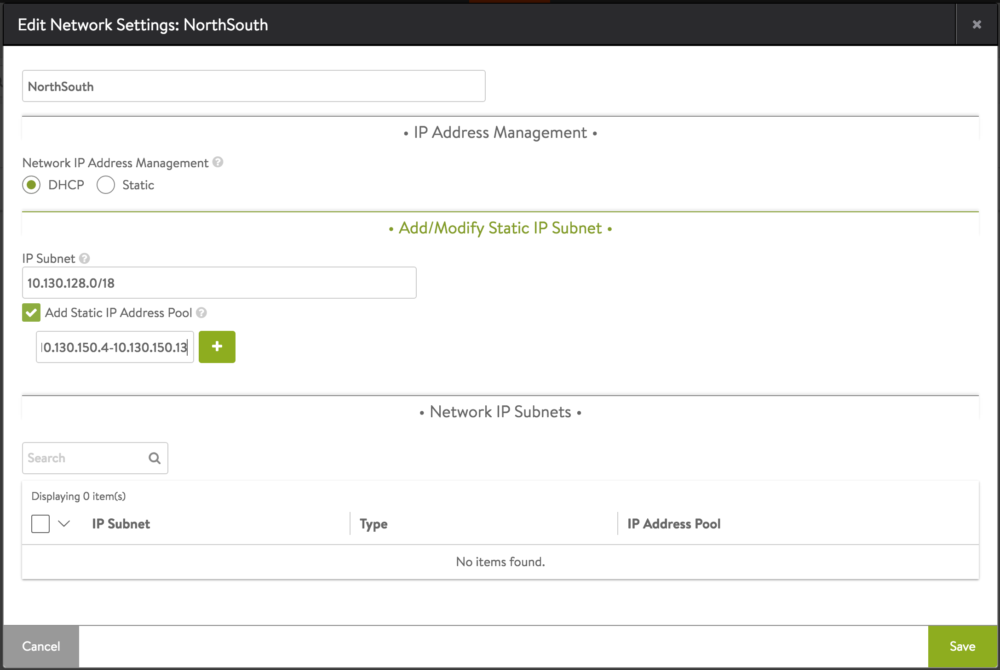</a>  
<figcapture> Step 8. Create NorthSouth network and add subnet with static IP range for IPs to be used by north-south virtual services. 
</figcapture>
</figure> 

## CONFIGURE IPAM/DNS PROFILE

The Avi Controller can provide internal IPAM and DNS services for VIP allocation and service discovery. Configure the IPAM/DNS profile as follows:

<figure class="thumbnail wp-caption alignnone"> <a href="img/Fig9.png">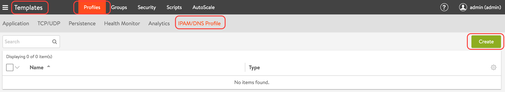</a>  
<figcapture> Step 9. Navigate to Templates &gt; Profile &gt; IPAM/DNS Profile and click Create. 
</figcapture>
</figure> 

 

Create the EastWest profile:

<figure class="thumbnail wp-caption alignleft"> <a href="img/Fig10.png">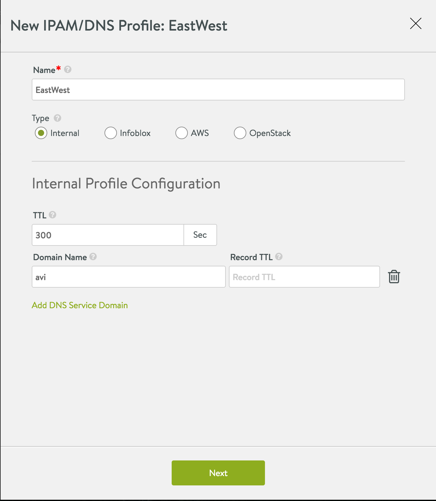</a>  
<figcapture> Step 10. Select Type: Internal. Click on Add DNS Service Domain and enter desired service domain name. Click Next. 
</figcapture>
</figure> 
<figure class="thumbnail wp-caption alignright"> <a href="img/Fig11.png">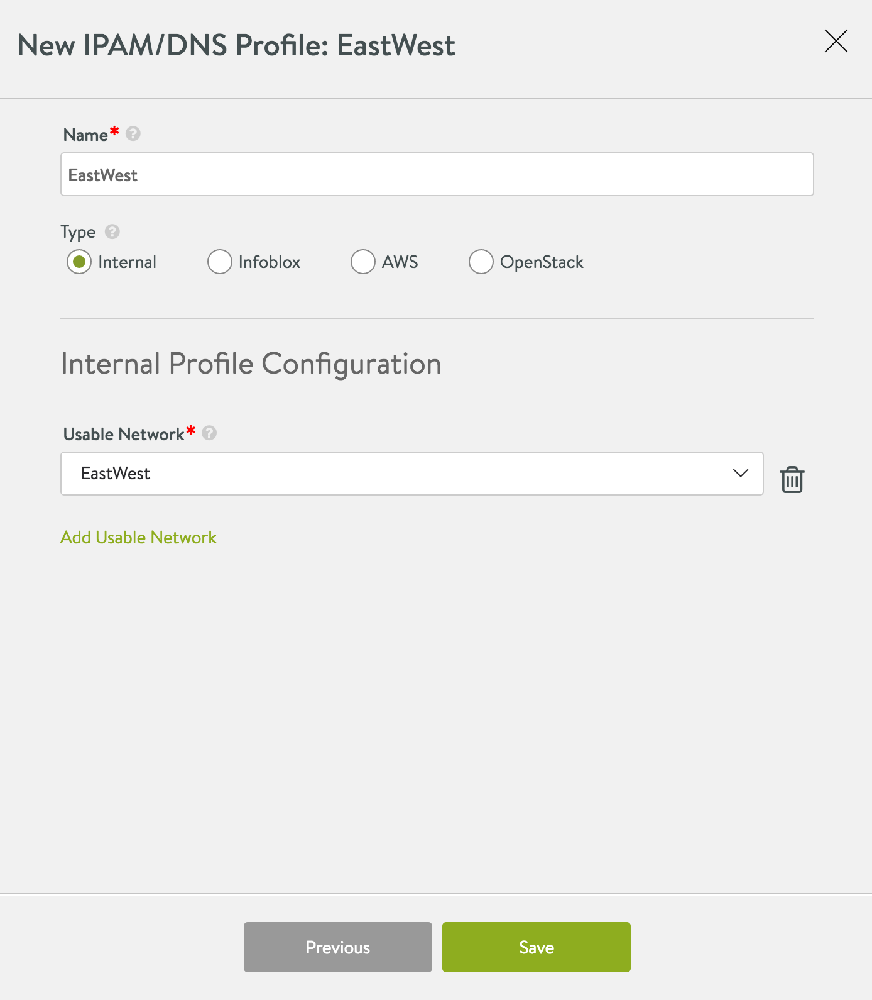</a>  
<figcapture> Step 11. Select Useable Network as EastWest network configured in previous section. 
</figcapture>
</figure> 

 

 

 

 

 

 

 

 

 

 

 

 

 

 

 

 

 

Create the NorthSouth profile:

<figure class="thumbnail wp-caption alignleft"> <a href="img/Fig12-1.png">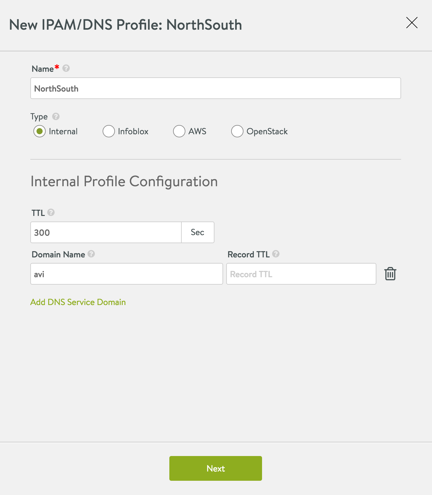</a>  
<figcapture> Step 12. Select Type: Internal. Click on Add DNS Service Domain and enter desired service domain name. Click Next. 
</figcapture>
</figure> 
<figure class="thumbnail wp-caption alignright"> <a href="img/Fig13-2.png">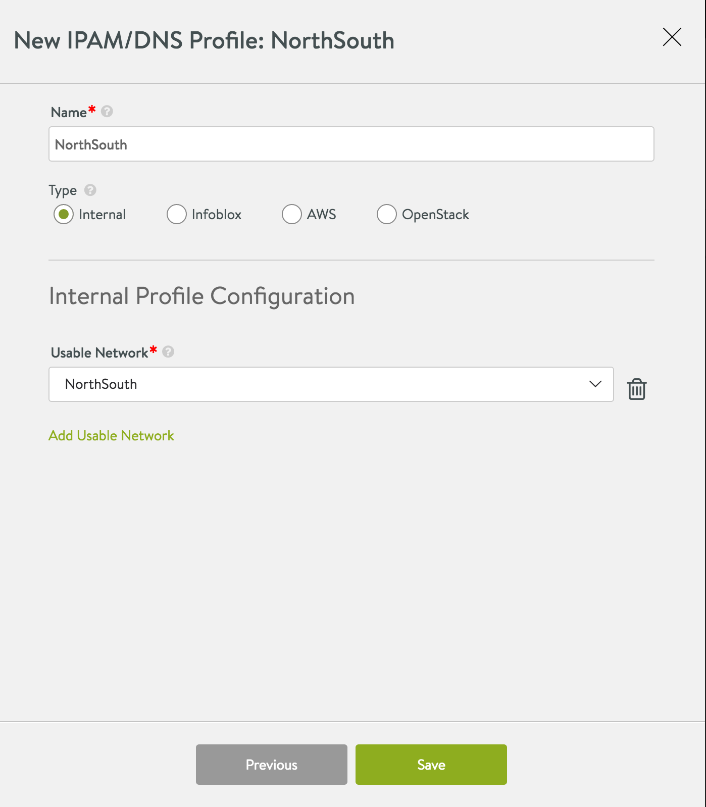</a>  
<figcapture> Step 13. Select Useable network as NorthSouth network configured in previous section 
</figcapture>
</figure> 

 

 

 

 

 

 

 

 

 

 

 

 

 

 

 

 

## CONFIGURE SSH USER

The Avi Controller needs to be configured with the same private key which is used to install OpenShift. This is required to enable controller to SSH to OpenShift nodes and deploy Servie Engines.

* SSH to Master node. 

<pre class="command-line language-bash" data-prompt=": >"><code>ssh username@os_master_ip</code></pre> 
* Run below command and copy the contents of key file (id_rsa) 

<pre class="command-line language-bash" data-prompt=": >"><code>cat ~/.ssh/id_rsa</code></pre> 
* On Avi Controller, navigate to Administration &gt; Settings &gt; SSH Key Settings and click Create.
* Enter the SSH username.
* Select Import Private Key.
* As shown below, paste the key copied in step above. <a href="img/Fig16-1.png">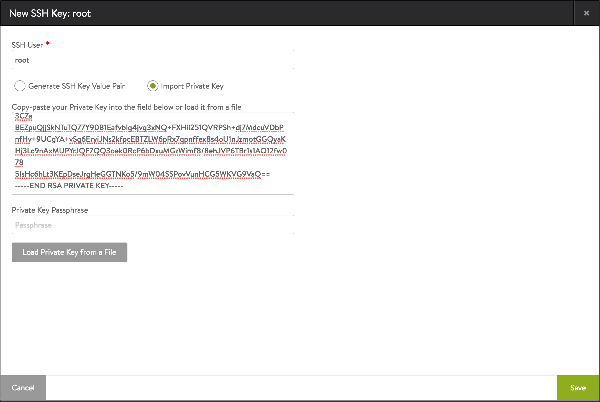</a>
* Click Save. 

## CONFIGURE CERTIFICATES

* Use SCP to copy OpenShift certificate files form the master node 

<pre class="command-line language-bash" data-prompt=": >"><code>scp username@os_master_ip:/etc/origin/master/admin.crt
scp username@os_master_ip:/etc/origin/master/admin.key
scp username@os_master_ip:/etc/origin/master/ca.crt .</code></pre> 
* On Avi Controller, navigate to Templates &gt; Security &gt; SSL/TLS Certificates. <a href="img/Fig17-2.png">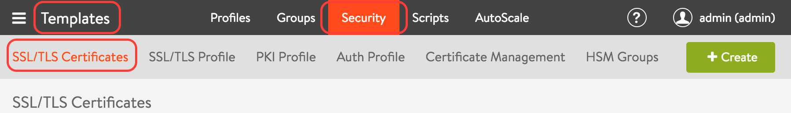</a>
* Click Create and select Root/Intermediate CA.  
    * Name the cert and upload ca.crt file.
    * Click Validate. 
<a href="img/Fig18-1.png">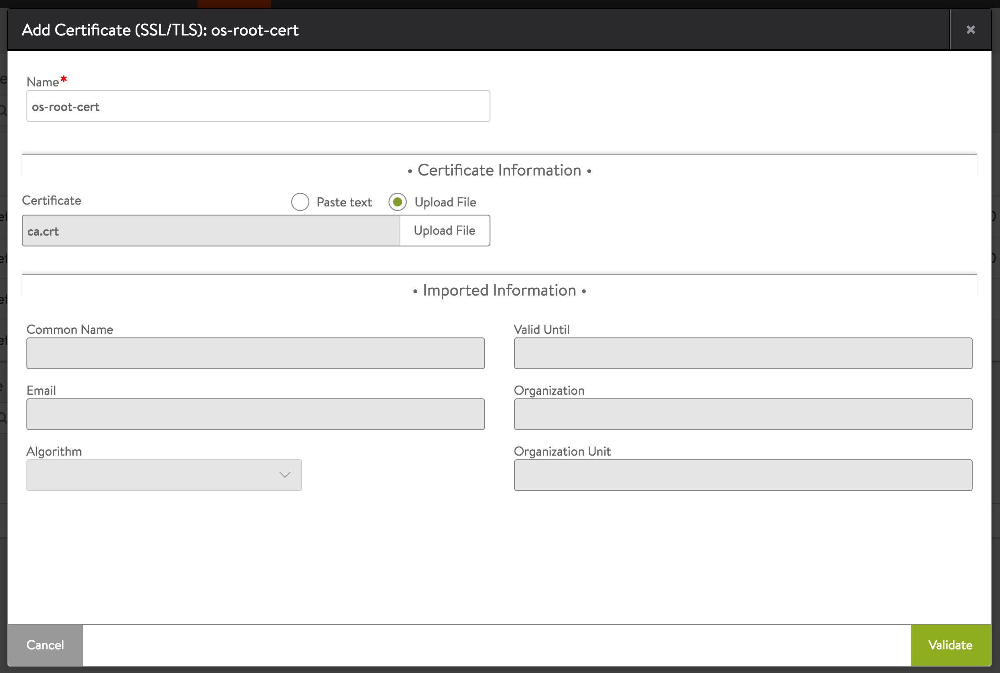</a>
    * Click Import to save.
* Click Create and select Application Certificate.  
    * Name the certificate
    * Select Import under Type
    * Under ‘Key (PEM) or PKCS12’ upload admin.key
    * Under ‘Certificate’ upload admin.crt
    * Click Validate. <a href="img/Fig19.png">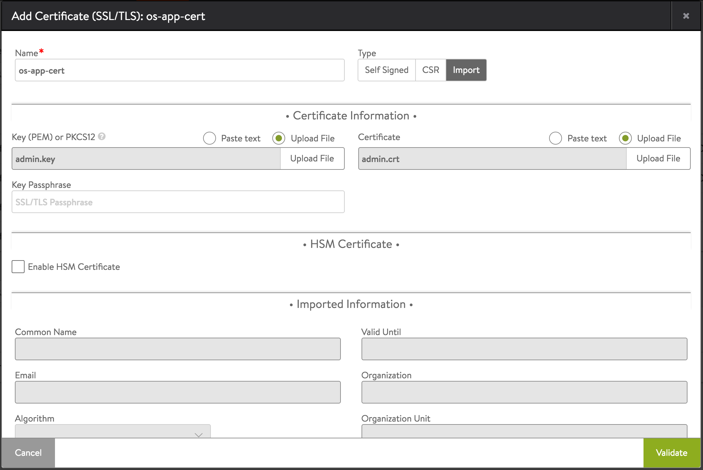</a>
    * Click Import to save. 

## CONFIGURE OPENSHIFT CLOUD

This section describes the configuration of OpenShift cloud. Here we are assuming that kube-proxy is disabled on OpenShift nodes and the user is using Avi’s internal DNS/IPAM.

* Navigate to Infrastructure &gt; Clouds.
* Edit Default-Cloud.                                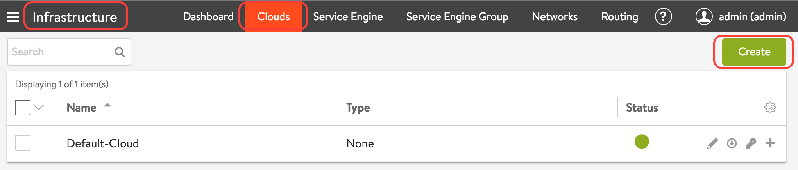 
* Select OpenShift as infrastructure type and click Next.                           <a href="img/Fig15.png">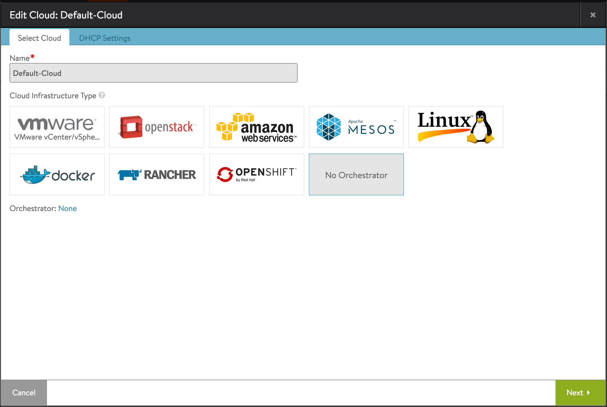</a> 
* Make sure ‘Enable Event Subscription’ is selected.
* Select ‘Client TLS Key and Certificate’ and ‘CA TLS Key and Certificate’ from dropdown.
* Enter the OpenShift Master URL in format shown below.<a href="img/Screen-Shot-2016-08-25-at-2.03.59-PM.png">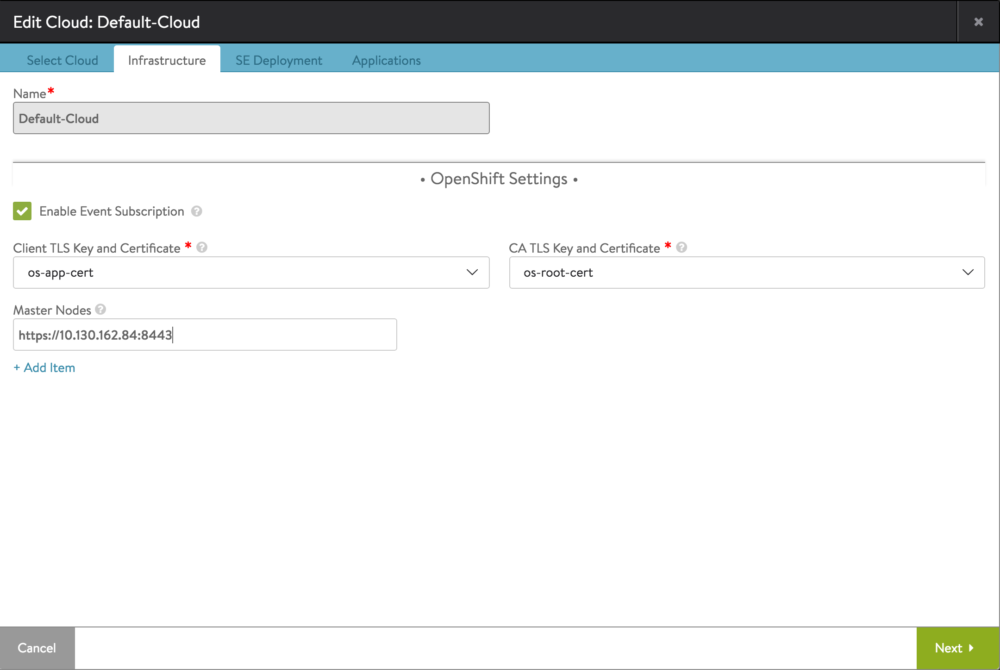</a>
* Click Next
* Select SSH user configured previously and click Next. <a href="img/Fig21.png">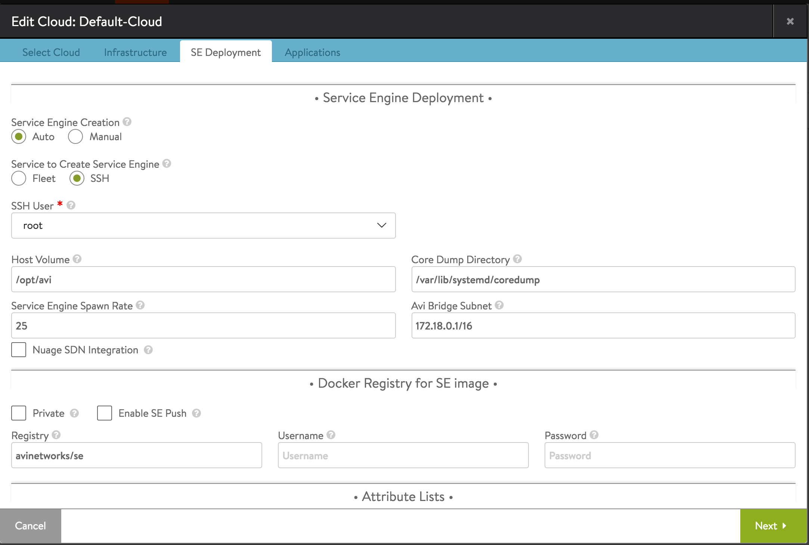</a>
* Set ‘Proxy Service Placement Subnet’ same as EastWest subnet configured earlier.
* Uncheck ‘Use Cluster IP of service as VIP for East/West’ checkbox if it is checked (this is assuming kube-proxy is enabled. To configure this option with kube-proxy disabled click <a href="/docs/16.2/replace-kube-proxy-in-openshift-environment-with-avi-vantage">here</a>).
* Set IPAM Profile from dropdown as shown. 
<a href="img/Screen-Shot-2016-08-26-at-9.32.40-PM.png">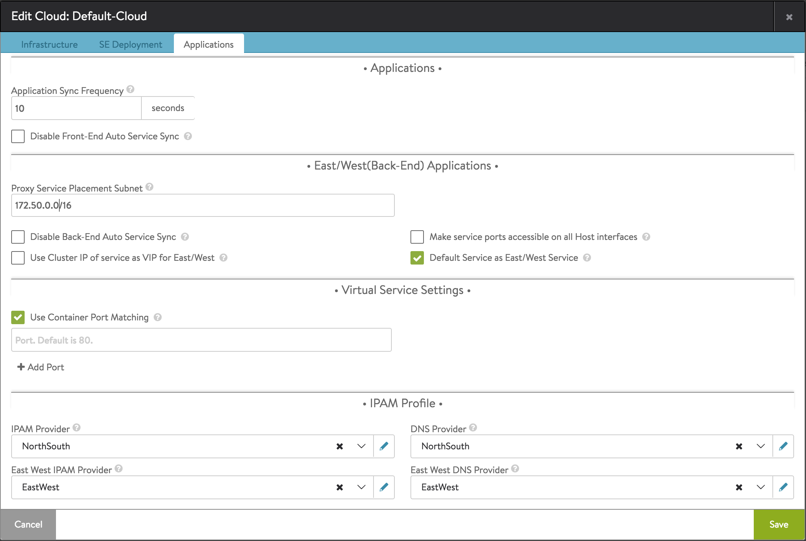</a>
* Click Save. 

The cloud status will show green (placement ready).<a href="img/Screen-Shot-2016-08-25-at-2.14.50-PM.png">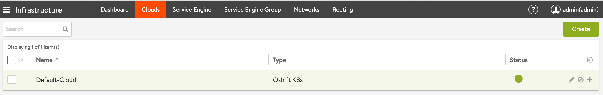</a>

It will take around 5 min for the Avi Controller to download the SE docker image and start the containers.

<a href="img/Screen-Shot-2016-08-25-at-2.17.04-PM.png">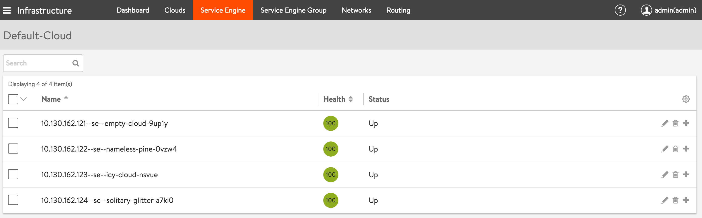</a>
