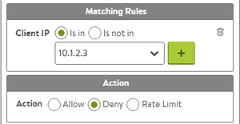

A client's IP address may need to be prevented from accessing an application for any number of reasons. Likewise, blocking a client's access can accomplished in numerous ways. While this article focuses on IP addresses, a client also could be identified based on other identifiers such as a username, session cookie, or SSL client certificate.

## Blocking a Client IP

Navigate to virtual service Edit > Rules tab > Network Security tab > New Rule.  

A network security policy can be used to deny a single IP address or multiple addresses. For large IP lists, consider creating a blacklist (Templates > Groups > IP Group). This object can contain very large lists of IP addresses or network ranges. An IP group also may be leveraged across multiple virtual-service network security policies. This simplifies adding or removing IP addresses, which can be performed for many applications by changing a single IP group.

### DataScript

For finer control, DataScripts may be used to evaluate additional criteria before discarding a client connection.

<pre><code class="language-lua">if avi.vs.client_ip() == "10.1.2.3" then
  avi.close_conn()
end</code></pre>  