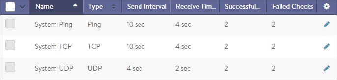
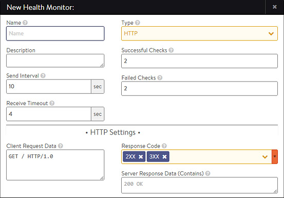

Avi Vantage must validate whether servers are working correctly and are able to accommodate additional workloads before load balancing a client to a particular server. Health monitors perform this function by either actively sending a synthetic transaction to a server or by passively monitoring client experience with the server. Vantage sends active health monitors on a periodic basis that originate from the Service Engines assigned to the application’s virtual service.

The health monitors are attached to the pool for the virtual service. When scaling out a virtual service across multiple Service Engines, servers will receive active health queries from each Service Engine.

A pool that is not attached to a virtual service is considered to be in an unused state and will therefore not send health monitors to its servers. A pool may have both multiple actively concurrent health monitors (such as Ping, TCP, and HTTP), as well as a passive monitor. All active health monitors must be successful for the server to be marked up.

Only active health monitors may be edited. The passive monitor has no settings.

* Health Monitors Tab 
* Create/Edit a Health Monitor 
* Passive Health Monitor  

### Health Monitor Settings

Select Templates > Profiles > Health Monitor to open the Health Monitor tab. This tab includes the following functions:

* **Search:** Search across the list of objects. 
* **Create:** Opens the New Health Monitor Profile popup. 
* **Edit:** Opens the Edit Health Monitor Profile popup. 
* **Delete:** A Profile may only be deleted if it is not currently assigned to a Virtual Service. An error message will indicate the Virtual Service referencing the Profile. The default system Profiles can be edited, but not deleted.  

The table on this tab provides the following information for each Health Monitor Profile:

* **Health Monitor:** Name of the Health Monitor. 
* **Type:** Type of Health Monitor, which can be one of the following:  
    * **DNS:** Validate the health of responses from DNS servers. 
    * **External:** Use a custom script to validate the health of a diverse array of applications. 
    * **HTTP:** Validate the health of HTTP web servers. 
    * **HTTPS:** Validate the health of HTTPS web servers when the connection between Avi Vantage and the server is SSL/TLS encrypted. 
    * **Ping:** An ICMP ping can be used to monitor any server that responds to pings. This is a lightweight monitor, but it does not validate application health. 
    * **TCP:** Validate TCP applications via simple TCP request/response data. 
    * **UDP:** Validate UDP applications via simple UDP request/response data. 
* **Send Interval:** Frequency at which the Health Monitor initiates a server check, in seconds. 
* **Receive Timeout:** Maximum amount of time before the server must return a valid response to the Health Monitor, in seconds. 
* **Successful Checks:** Number of consecutive health checks that must succeed before Avi Vantage marks a down server as being back up. 
* **Failed Checks:** Number of consecutive health checks that must fail before Avi Vantage marks an up server as being down.  

### Active Health Monitor

Active Health Monitors send proactive queries to servers, synthetically mimicking a client. Send and receive timeout intervals may be defined, which statically determines the server response as successful or failed. Active Health Monitors originate from the Service Engines assigned to the application’s Virtual Service. Each SE must be able to send monitors to the servers, which ensures there are no routing or intermediate networking issues that might prevent access to a server from all active Service Engines.

The Health Monitors are attached to the Pool for the Virtual Service. A Pool that is not attached to a Virtual Service will not send health monitors.

The New Health Monitor and Edit Health Monitor popups share the same interface.

To create or edit a Health Monitor enter the following information:

* **Name:** Enter a unique name for the Health Monitor. 
* **Send Interval:** Determines how frequently the Health Monitor initiates an active check of a server, in seconds. The minimum frequency is 2 seconds, and the maximum is 3600. 
* **Receive Timeout:** Maximum amount of time before the server must return a valid response to the Health Monitor, in seconds. The minimum value is 1 second, and the maximum is the shorter of either 300 seconds or the Send Interval value minus 1 second. If the status of a server continually flips between up and down, this may indicate that the Receive Timeout is too aggressive for the server. 
* **Successful Checks:** Number of consecutive health checks that must succeed before Avi Vantage marks a down server as up. The minimum is 1, and the maximum is 50. 
* **Failed Checks:** Number of consecutive health checks that must fail before Avi Vantage marks an up server as down. The minimum is 1, and the maximum is 50. 
* **Type:** Select the type of Health Monitor and entering the appropriate options:  
    * DNS Monitor 
    * External Monitor 
    * HTTP Monitor 
    * HTTPS Monitor 
    * Ping Monitor 
    * TCP Monitor 
    * UDP Monitor  

### DNS Monitor

A DNS Monitor queries Name Servers for an A record and matches the resolved response against an expected IP address.

* **Request Name:** Resource record to be queried, such as www.avinetworks.com. 
* **Response Matches:**  
    * **Any Thing:** Any DNS answer from the server will be successful, even an empty answer. 
    * **Any Type:** The DNS response must contain at least one non-empty answer. 
    * **Query Type:** The response must have at least one answer of which the resource record type matches the query type. 
* **Response Code:**  
    * **Anything:** Ignore the Response Code and any other errors. 
    * **No Error:** DNS response has no error as the Response Code. 
* **Response String:** IP address in the dotted-decimal notation to match in the resource record sections of the DNS response. The DNS response must contain this IP address to be considered successful.  

### External Monitor

This Monitor type allows scripts to be written to provide highly customized and granular health checks. The scripts may be Linux shell, Python, or Perl, which can be used to execute wget, netcat, curl, snmpget, or dig. External Monitors have constrained access to resources, such as CPU and memory, so as to not affect normal functioning of Avi Vantage. As with any custom scripting, thoroughly validate the long term stability of the implemented script. Errors generated from the script will be included in the output of the Operations > Events log.

* **Script Code:** Upload the script via copy/paste or uploading the file. 
* **Script Parameters:** Enter any optional arguments to apply. These strings are passed in as arguments to the script, such as $1 = server IP, $2 = server port. 
* **Script Variables:** Custom environment variables may be fed into the script to allow for simplified reusability. For example, a script that authenticates to the server may have a variable set to USER=test.  

Sharepoint example script:

<pre><code class="language-lua">#!/bin/bash
#curl http://$IP:$PORT/Shared%20Documents/10m.dat -I -L --ntlm -u $USER:$PASS -I -L &gt; /run/hmuser/$HM_NAME.out 2&gt;/dev/null
curl http://$IP:$PORT/Shared%20Documents/10m.dat -I -L --ntlm -u $USER:$PASS -I -L  | grep "200 OK"</code></pre>  

Sharepoint script variables:

<pre><code class="language-lua">USER='foo\administrator' PASS=foo123</code></pre>  

### HTTP Monitor

This Monitor type sends a request to a web server and validates either the HTTP response code or the HTML response data.

* **Client Request Data:** Send an HTTP request to the web server. Avi Vantage does not validate the request syntax, as different servers may support unique request syntax. A basic HTTP request might look like GET /index.html HTTP/1.0.  
    * Any method may be used, though GET, POST and HEAD are the most common for monitoring. If no method is specified Avi Vantage will use GET. 
    * The Path may include the URI and Query, such as <code>/index.htm?user=test</code>. If no Path is specified, Avi Vantage will use <code>/</code>. 
    * The HTTP version can be 1.0 or 1.1. If no version is specified, Avi Vantage will use 1.0. When using 1.1, web servers expect a Host header to be included with the request, such as GET / index.htm HTTP/1.1 Host: www.avinetworks.com. 
* **Response Code:** A successful HTTP monitor requires either the Response Code, the Server Response Data, or both fields to be populated. The Response Code expects the server to return a response code within the specified range. For a GET request, a server should usually return a 200, 301 or 302. For a HEAD request, the server will typically return a 304. A response code by itself does not validate the server’s response content, just the status. 
* **Server Response Data:** Enter a snippet of content from the server’s HTTP response by copying and pasting text from either the source HTML or the web page of the server. Avi Vantage inspects raw HTML data and not rendered web pages. For example, Avi Vantage does not follow HTTP redirects and will compare the redirect response with the defined Server Response string, while a browser will show the redirected page. The Server Response content is matched against the first 2KB of data returned from the server, including both headers and content/body. The Server Response Data can also be used to search for a specific response code, such as 200 OK.  
    
    When both Response Code and Server Response Data are populated, both must be true for the health check to pass.
    
* **Health Monitor Port:** Specify a port that should be used for the health check. When this setting is blank, the default port configured for the server will be used. When it is specified, clients may be directed to a different port than what is monitored. For instance, a server at HTTP port 80 may have two health monitors attached, one for HTTP default port, and a second for HTTPS specifically on port 443. If both health monitors pass, the server can receive traffic on HTTP port 80. This ensures clients can input items in their shopping cart and later purchase those items over SSL on 443.  

### HTTPS Monitor

This Monitor type can be used to validate the health of HTTPS encrypted web servers. Use this monitor when Avi Vantage is either passing SSL encrypted traffic directly from clients to servers, or Avi Vantage is providing SSL encryption between itself and the servers. This monitor is the same as the HTTP Monitor.

* **Client Request Data:** Send an HTTP request to the web server. Avi Vantage does not validate the request, as different servers may support unique request syntax. A basic HTTP request might look like GET /index.html HTTP/1.0.  
    * Any method may be used, though GET, POST and HEAD are the most common for monitoring. If no method is defined, Vantage will use GET. 
    * The path may include the URI and query, such as <code>/index.htm?user=test</code>. If no path is specified, Vantage will use <code>/</code>. 
    * The HTTP version can be 1.0 or 1.1. If no version is specified, Vantage will use 1.0. When using 1.1, web servers may expect a Host header to be included with the request, such as GET / index.htm HTTP/1.1 Host: www.site.com. 
* **Response Code:** A successful HTTP monitor requires either the Response Code, the Server Response Data, or both fields to be populated. The Response Code expects the server to return a response code within the specified range. For a GET request, a server should usually return a 200, 301 or 302. For a HEAD request, the server will typically return a 304. A response code by itself does not validate the server’s response content, just the status. 
* **Server Response Data:** Enter a snippet of content from the server’s HTTP response by copying and pasting text from either the source HTML or the web page of the server. Avi Vantage inspects raw HTML data and not rendered web pages. For example, Avi Vantage does not follow HTTP redirects and will compare the redirect response with the defined Server Response string, while a browser will show the redirected page. The Server Response content is matched against the first 2KB of data returned from the server, including both headers and content/body. The Server Response Data can also be used to search for a specific response code, such as 200 OK.When both Response Code and Server Response Data are populated, both must be true for the health check to pass. 
* **Health Monitor Port:** Specify a port that should be used for the health check. When this setting is blank, the default port configured for the server will be used. When it is specified, clients may be directed to a different port than what is monitored. For instance, a server at HTTP port 80 may have two health monitors attached, one for HTTP default port, and a second for HTTPS specifically on port 443. If both health monitors pass, the server can receive traffic on HTTP port 80. This ensures clients can input items in their shopping cart and later purchase those items over SSL on 443.  

### Ping Monitor

Avi Vantage will send an ICMP ping to the server. This Monitor type is generally very fast and lightweight for both Avi Vantage and the server; however, it’s not uncommon for ping to drop a packet and fail. It is important to ensure the Failed Checks field is set to at least 2. This Monitor type does not test the health of the application, so it generally works best when applied in conjunction with an application specific monitor for the Pool.

### TCP Monitor

For any TCP application, this Monitor will wait for the TCP connection establishment, send the request string, and then wait for the server to respond with the expected content. If no client request and server response are configured, the health check will pass once a TCP connection is successfully established.

* **Client Request Data:** Enter an appropriate send string applicable for the server application. This request will be sent to the server immediately after completing the TCP three-way handshake. 
* **Server Response Data:** Enter the expected response from the server. Avi Vantage checks to see if the Server Response data is contained within the first 2KB of data returned from the server. 
* **Health Monitor Port:** Specify a port that should be used for the health check. When this setting is blank, the default port configured for the server will be used. When it is specified, clients may be directed to a different port than what is monitored.  

### UDP Monitor

Send the request data to the server, then match the server’s response against the expected response data.

* **Client Request Data:** Enter an appropriate send string applicable for the server application. 
* **Server Response Data:** Enter the expected response from the server. Avi Vantage checks to see if the Server Response data is contained within the first 2KB of data returned from the server. 
* **Health Monitor Port:** Specify a port that should be used for the health check. When this setting is blank, the default port configured for the server will be used. When it is specified, clients may be directed to a different port than what is monitored.  

### Passive Health Monitor

While active Health Monitors provide a binary good/bad analysis of server health, passive Health Monitors provide a more subtle check by attempting to understand and react to the client-to-server interaction. An active Health Monitor sends a periodic check to the servers that mimics an end user transaction with a synthetic request, then statically validates the response against an expected string. Passive Health Monitors do not send a check to the servers. Instead, Avi Vantage monitors end user interaction with the servers. If a server is quickly responding with valid responses (such as HTTP 200), then all is well; however, if the server is sending back errors (such as TCP resets or HTTP 5xx errors), the server is assumed to have errors. Errors are defined by the Analytics Profile attached to the Virtual Service. The Analytics profile also defines the threshold for response time before a server is considered responding slowly.

With active Health Monitors, Avi Vantage will mark a server down after the specified number of consecutive failures and will no longer send new connections or requests until that server is able to correctly pass the periodic active health Monitors.

With passive Health Monitors, server failures will not cause Avi Vantage to mark that server as down. Rather, the passive Health Monitor will reduce the number of connections or requests sent to the server relative to the other servers in the Pool by about 75%. Further failures may increase this percentage. After a server is satisfactorily handling the reduced load, it will once again be sent normal volumes of traffic.
> <strong>Note:</strong> Best practice is to enable both a passive and an active health monitor to each pool.
  