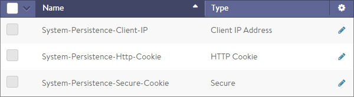
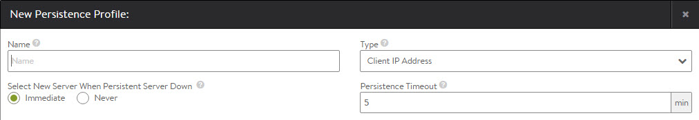

A persistence profile governs the settings that will force a client to stay connected to the same server for a specified duration of time. By default, load balancing may send a client to a different server every time the client connects with a virtual service. This guarantees the client will reconnect to the same server every time when they connect to a virtual service, disconnect, and then reconnect to the same virtual service. Enabling a persistence profile ensures the client will reconnect to the same server every time, or at least for a desired duration of time. Persistent connections are critical for most servers that maintain client session information locally.

Persistence is an optional profile that is attached to a pool.

### Persistence Profile Settings

Select Templates > Profiles > Persistence to open the Persistence Profiles tab.

* **Search:** Search across the list of objects. 
* **Create:** Opens the New Persistence Profile popup. 
* **Edit:** Opens the Edit Persistence Profile popup. 
* **Delete:** A profile may only be deleted if it is not currently assigned to a virtual service. An error message will indicate the virtual service referencing the profile. The default system profiles can be edited, but not deleted.  

The table on this tab provides the following information for each persistence profile:

* **Persistence Name:** Name of the profile. 
* **Type:** Full descriptions of each type of persistence are described in the next section. The types of persistence can be one of the following:  
    * Client IP Address 
    * HTTP Cookie 
    * App Cookie 
    * HTTP Custom Header 
    * TLS  

### Create Persistence Profile

The New Persistence Profile and Edit Persistence Profile popups share the same interface.

To create or edit a Persistence Profile:

* **Name:** Enter a unique name for the Persistence Profile in the Name field. 
* **Type:** Select the persistence type using the Type pull-down menu. The available options are:  
    * **Client IP Address:** Avi Vantage will record the client’s source IP address in a table for the duration of the Persistence Timeout for this profile. While the IP remains in the table, any new connection by the user will be sent to the same server. The Client IP Address persistence table is stored in memory on the Service Engine, and is automatically mirrored to the Controller and all other Service Engines that support this virtual service.  
        * **Persistence Timeout:** Enter the number of minutes to preserve the client’s IP address in the Persistence Timeout field. Entering 0 disables persistence and allows new connections to be load balanced to a new server immediately. The timeout begins counting down when all connections from the same source IP address to the virtual service are closed. This field is applicable to Client IP persistence only.
    * **HTTP Cookie:** Applicable to virtual services with an attached HTTP application profile. Avi Vantage inserts a cookie into outgoing HTTP responses and reads the cookie on incoming requests. The cookie is session based, meaning that the cookie persistence remains valid as long as the client keeps their browser open. Closing the browser removes the cookie stored by the client browser, thereby tearing down both the connections and the persistence. Cookies uniquely identify each client, which is useful if multiple users are accessing the virtual service from the same IP address. Clients store the persistence information, so it does not consume memory on the Service Engine. The cookie is transparent to clients and will be named AVI_COOKIE by default.  
        * **HTTP Cookie Name:** By default, the cookie name is AVI_COOKIE unless this field is populated with an alternate name.
    * **Custom HTTP Header:** This method allows an HTTP header to be specified for persistence. The Service Engine will inspect the value of the defined header, and will match the value against a statically assigned header field for each server in the pool. If there is a match, the client will be persisted. The server's header field is configured in the Pool's edit server page, where new servers are added.  
        * **Header Name:** Specify the HTTP header whose value will be used for the persistence lookup.
    * **App Cookie:** Rather than have Avi insert a new cookie for persistence, Avi will use an existing cookie that has been inserted by the server. If the cookie does not exist, Avi will look for a URI query of the same name and will persist on that value. Typically this persistence will be performed on a ASP or Java session ID. 
    * **TLS:** Applicable to virtual services that are terminating SSL or TLS. This method embeds user persistence information within the ticket field of a TLS session. Clients negotiating with older SSL v3 will use a variation that inserts the persistence information into the SSL Session ID. Avi Vantage does not allow clients to renegotiate the session, which is more secure and also ensures that Avi Vantage can maintain the persistence as it controls if and when the Session ID is renegotiated and recreated. 
* **Select New Server When Persistent Server Down:** Determine how this profile will handle a condition when the Health Monitor marks a server as down while Avi Vantage is still persisting clients to it.  
    * **Immediate:** Avi Vantage will immediately select a new server to replace the one that has gone down and switch the persistence entry to the new server. 
    * **Never:** No replacement server will be selected. Persistent entries will be required to expire normally based upon the persistence type.   