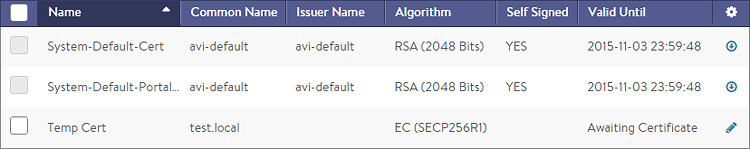
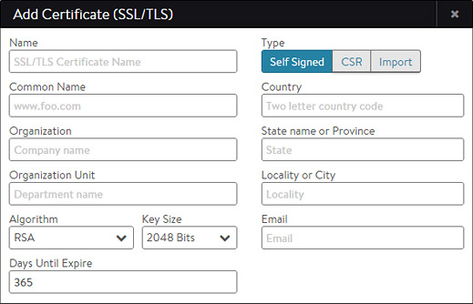
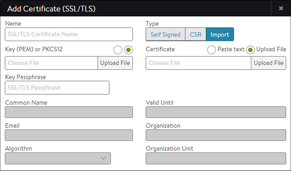
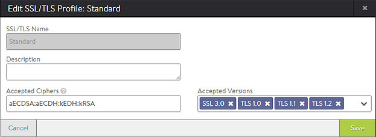
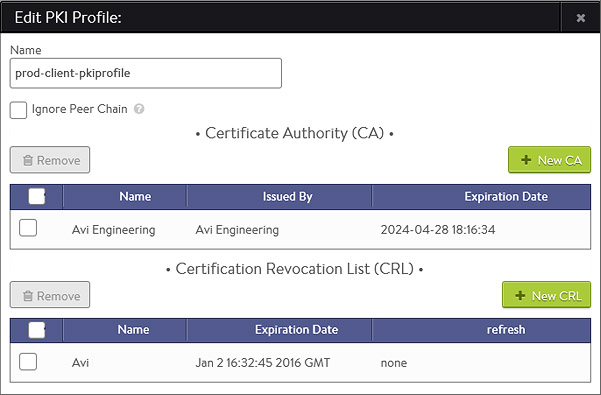
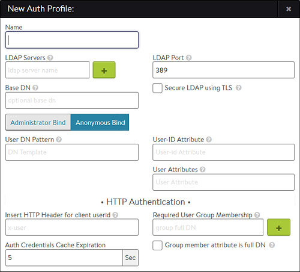

### SSL Certificates

Avi Vantage supports terminating client SSL and TLS connections at the virtual service. This requires Vantage to send a certificate to clients that authenticates the site and establishes secure communications. A virtual service that handles secure connections will require both of the following:

* **SSL/TLS profile** - determines the supported ciphers and versions. 
* **SSL certificate** - presented to clients connecting to the site. SSL certificates may also be used to present to administrators connecting to the Vantage web interface or API, and also for the Avi Service Engine (SE) to present to servers when SE-to-server encryption is required.  

The SSL/TLS Certificates page allows import, export, and generation of new SSL certificates or certificate requests. Newly-created certificates may be either self-signed by Avi Vantage or created as a Certificate Signing Request (CSR) that must be sent to a trusted Certificate Authority (CA), who then generates a trusted certificate.

Creating a self-signed certificate generates both the certificate and a corresponding private key.

Imported existing certificates are not valid until a matching key has been supplied.

Avi Vantage supports PEM and PKCS12 formats for certificates.

### SSL/TLS Certificates Page

Select Templates > SSL/TLS Certificates to open the SSL/TLS Certificates page. This tab includes the following functions:

* **Search:** Search across the list of objects. 
* **Create:** Opens the Create Certificate popup. 
* **Edit:** Opens the Edit Certificate popup. Only incomplete certificates that do not have a corresponding key are able to be edited. 
* **Export:** The down arrow icon exports a certificate and corresponding private key. 
* **Delete:** A certificate may only be deleted if it is not currently assigned to a virtual service. An error message will indicate the virtual service referencing the certificate.  

The table on this tab contains the following information for each certificate:

* **Name:** User-friendly name of the certificate. Mouse over the name of the cert will display any intermediate cert that has been automatically associated with the cert. 
* **Status**: The known status of the certificate.  This is green for good, or yellow, orange, or red if the cert is expiring soon or has already expired, and gray if the cert is incomplete. 
* **Common Name:** Fully qualified name of the site to which the certificate applies. This entry must match the hostname the client will enter in their browser in order for the site to be considered trusted. 
* **Issuer Name:** Name of the Certificate Authority. 
* **Algorithm:** This will be either EC (Elliptic Curve) or RSA. 
* **Self Signed:** Whether the certificate is self-signed by Vantage or signed by a Certificate Authority. 
* **Valid Until:** Date and time when the certificate expires.  

### Create Certificate

Click New in the SSL/TLS Certificates page to open the Add Certificate (SSL/TLS) popup.

To create a new certificate:

* **Name:** Enter a unique, user-friendly name for the certificate in the Name field. 
* **Common Name:** Enter the fully qualified name of the site, such as www.avinetworks.com. This entry must match the hostname the client entered in the browser in order for the site to be considered trusted. 
* **Type:** Select the type of certificate to create:  
    * **Self Signed:** Quickly create a test certificate that is signed by Vantage. Client browsers will display an error that the certificate is not trusted. If the HTTP application profile has HTTP Strict Transport Security (HSTS) enabled, clients will not be able to access a site with a self signed certificate.
    * **CSR:** Create a valid certificate by first creating the certificate request. This request must be sent to a certificate authority, which will send back a valid certificate that must be imported back into Vantage.
    * **Import:** Import a completed certificate that was either received from a certificate authority or exported from another server.
* Input all of the required information required for the type of certificate you are creating:  
    * Self-Signed Certificates
    * CSR Certificates
    * Importing Certificates 

### Self-Signed Certificates

Avi Vantage can generated self-signed certificates. Client browsers do not trust these certificates and will warn the user that the Virtual Service's certificate is not part of a trust chain. Self-signed certificates are good for testing or environments where administrators control the clients and can safely bypass the browser's security alerts. Public websites should never use self-signed certificates.

If you selected **Self-Signed** as the certificate Type in the Add Certificate popup, then:

* Enter the following information:  
    * **Organization:** Company or entity registering the certificate, such as Avi Networks, Inc. (optional). 
    * **Organization Unit:** Group within the organization that is responsible for the certificate, such as Development (optional). 
    * **Country:** Country in which the organization is located (optional). 
    * **State:** State in which the organization is located (optional). 
    * **Locality:** City of the organization (optional). 
    * **Email:** The email contact for the certificate (optional). 
    * **Algorithm:** Select either EC (Elliptic Curve) or RSA. RSA is older and considered less secure than EC, but is more compatible with a broader array of older browsers. EC is newer, less computationally expensive, and generally more secure; however, it is not yet accepted by all clients. Avi Vantage allows a Virtual Service to be configured with two certificates at a time, one each of RSA and EC. This allows Avi Vantage to negotiate the optimal algorithm with the client. If the client supports EC, then Avi Vantage will prefer this algorithm, which gives the added benefit of natively supporting Perfect Forward Secrecy for better security.    
        
        Key Size: Select the level of encryption to be used for handshakes, as follows:
        
        * 2048 Bit is recommended for RSA certificates. 
        * SECP256R1 is recommended for EC certificates. 
        
        Higher values may provide better encryption but increase the CPU resources required by both Avi Vantage and the client.
        
* Finish entering the required information in the Add Certificate popup.  

### CSR Certificates

The Certificate Signing Request (CSR) is the first of three steps involved in creating a valid SSL/TLS certificate. The Request contains the same parameters as a Self-Signed Certificate; however, Avi Vantage does not sign the completed certificate. Rather, it must be signed by a Certificate Authority that is trusted by client browsers.

If you selected CSR as the certificate Type in the Add Certificate popup, then:

* Enter the following information:  
    * **Organization:** Company or entity registering the certificate, such as Avi Networks 
    * **Organization Unit:** Group within the organization that is responsible for the certificate, such as Development. 
    * **Country:** Country in which the organization is located. 
    * **State:** State in which the organization is located. 
    * **Locality:** City of the organization. 
    * **Email:** The email contact for the certificate. 
    * **Algorithm:** Select either EC (Elliptic Curve) or RSA. RSA is older and considered less secure than EC, but is more compatible with a broader array of older browsers. EC is newer, less computationally expensive, and generally more secure; however, it is not yet accepted by all clients. Avi Vantage allows a Virtual Service to be configured with two certificates at a time, one each of RSA and EC. This allows Avi Vantage to negotiate the optimal algorithm with the client. If the client supports EC, then Avi Vantage will preference this algorithm, which gives the added benefit of natively supporting Perfect Forward Secrecy for better security. 
    * **Key Size:** Select the level of encryption to be used for handshakes, as follows:   
        * 2048 Bit is recommended for RSA certificates. 
        * SECP256R1 is recommended for EC certificates. 
        
        Higher values provide better encryption but increase the CPU resources required by both Avi Vantage and the client.
        
* Finish entering the required information in the Add Certificate popup, and then click Generate to save and generate the CSR. 
* Forward the completed CSR to any trusted Certificate Authority (CA), such as Thawte or Verisign, by selecting the Certificate Signing Request at the bottom left of the Add Certificate popup and then either copying and pasting it directly to the CA's website or saving it to a file for later use. 
* Once the CA issues the completed certificate, you may either pate or upload it into the Certificate field at the bottom right of the Add Certificate popup. > <strong>Note:</strong> It can take several days for the CA to return the finished certificate. Meanwhile, you can close the Add Certificate popup to return to the SSL/TLS Certificates page. The new certificate will appear in the table with the notation Awaiting Certificate Valid Until column. When you receive the completed certificate, click the edit icon for the certificate to open the Edit Certificate, and then paste the certificate and click Save to finish generating the CSR certificate. Avi Vantage will automatically generate a key from the completed certificate.
  

### Import Certificates

You may directly import an existing PEM or PKCS12 SSL/TLS certificate into Avi Vantage (such as from another server or load balancer). A certificate will have a corresponding private key, which must also be imported.

> Note: Avi Vantage automatically generates the key for self-signed or CSR certificates.
 

If you selected Import as the certificate type in the Add Certificate popup, then:

* **Key:** Add the private key via one of the two methods below. Switch between the two methods via the green radio buttons.  
    * **Upload File:** Click the Upload File button, select the PEM or PKCS12 file, then click the green Validate button to parse the file. If the upload is successful, the Key field will be populated. 
    * **Paste:** Copy and paste a PEM key into the Key field. Be careful to not introduce extra characters in the text, which can occur when using some email clients or rich text editors. If you copy and paste the key and certificate together as one file, click the Validate button to parse the text and populate the Certificate field.   
        
        PKCS12 is a binary format, which cannot be copied/pasted or use this method.
        
        > <strong>Note:</strong> PKCS12 files contain both the certificate and key, which may or may not be true for PEM files. Both the Certificate and Key fields will populate if the same PEM file contains both components.

* **Certificate:** Add the cert in the Certificate field if this is not already populated from the previous step. You may do this by copying/pasting or file upload, as described above. 
* **Key Passphrase:** If desired, you may add and validate a Key Passphrase to encrypt the private key. 
* **Import:** Select Import to finish adding the new certificate and key. The key will be embedded with the certificate and treated as one object within the Avi Vantage UI.  

### Certificate Authority

Certificates require a trusted chain of authority to be considered valid. If the certificate used is directly generated by a certificate authority that is known to all client browsers, no cert chain is required. However, if there are multiple levels required, an intermediate certificate may be necessary. Clients will often traverse the path indicated by the certificate to validate on their own if no chain cert is presented by a site, but this adds additional DNS lookups and time for the initial site load. The ideal scenario is to present the chain certs along with the site cert.

If a chain certificate, or rather a certificate for a certificate authority, is uploaded via the certificate > import in the certificates page, it will be added to the Certificate Authority section. Vantage will automatically build the cert chain if it detects a next link in the chain exists.

To validate a certificate has been attached to a chain cert, mouse over the certificate’s name in the SSL Certificates table at the top of the page.

Vantage supports multiple chain paths. For instance, an RSA cert and an EC cert are both named www.avinetworks.com. Each may share the same CA issuer, or they may be chained to different issuers.

### SSL Profile

Avi Vantage supports the ability to terminate SSL connections between the client and the Virtual Service, and to enable encryption between Avi Vantage and the back-end servers. The SSL/TLS Profile contains the list of accepted SSL versions and the prioritized list of SSL ciphers. Both an SSL/TLS Profile and an SSL Certificate must be assigned to the Virtual Service when configuring it to terminate client SSL/TLS connections. If you will also be encrypting traffic between Avi Vantage and the servers, an SSL/TLS Profile must be assigned to the Pool. When creating a new Virtual Service via the Basic mode, the default system SSL/TLS profile is automatically used.

SSL termination may be done on any service port; however, browsers will assume the default port of 443. The best practice is to configure a Virtual Service to accept both HTTP and HTTPS by creating a service on port 80, selecting the + icon to add an additional service port, and then setting the new service port to 443 with SSL enabled. A redirect from HTTP to HTTPS is generally preferable, which can be done via a Policy or by using the System-HTTP-Secure application profile.

Each SSL/TLS profile contains default groupings of supported SSL ciphers and versions that may be used with RSA or an Elliptic Curve certificate, or both. Ensure that any new SSL/TLS profile you create includes ciphers that are appropriate for the certificate type that will be used. The default SSL/TLS profiles included with Vantage provide a broad range of security; for example, the Standard Profile will work for typical deployments.

Creating a new SSL/TLS profile or using an existing Profile entails various trade-offs between security, compatibility, and computational expense. For example, increasing the list of accepted ciphers and SSL versions increases the compatibility with clients while also potentially lowering security.

### SSL Profile Settings

Select Templates > Profiles > SSL/TLS to open the SSL/TLS Profiles tab. This tab includes the following functions:

* **Search:** Search across the list of objects. 
* **Create:** Opens the New SSL/TLS Profile popup. 
* **Edit:** Opens the Edit SSL/TLS Profile popup. 
* **Delete:** An SSL/TLS profile may only be deleted if it is not currently assigned to a virtual service. An error message will indicate the virtual service referencing the profile. The default system profiles can be modified, but not deleted.  

The table on this tab provides the following information for each SSL/TLS profile:

* **Name:** Name of the profile. 
* **Accepted Ciphers:** List of ciphers accepted by the profile, including the prioritized order. 
* **Accepted Versions:** SSL and TLS versions accepted by the profile.  

### Create an SSL Profile

To create or edit an SSL profile:

* **Name:** Enter a unique name for the SSL/TLS Profile in the Name field. 
* **Accepted Ciphers:** Enter the list of accepted ciphers in the Accepted Ciphers field. Each cipher entered must conform to the cipher suite names listed at <a href="http://www.openssl.org/docs/apps/ciphers.html">OpenSSL</a>. Separate each cipher with a colon. For example, AES:3DES means that this Profile will accept the AES and 3DES ciphers. When negotiating ciphers with the client, Avi Vantage will preference ciphers in the order listed. You may use an SSL/TLS profile with both an RSA and an Elliptic Curve certificate. These two types of certificates can use different types of ciphers, so it is important to incorporate ciphers for both types. Selecting only the most secure ciphers may incur higher CPU load on Vantage and may also reduce compatibility with older browsers. 
* The **Accepted Versions** pull-down menu allows you to select one or more SSL/TLS versions to add to this profile. Chronologically, TLS v1.0 is the oldest supported, and TLS v1.2 is the newest. SSL v3.0 is no longer support as of Avi Vantage v15.2. In general with SSL, older versions have many known vulnerabilities while newer versions have many undiscovered vulnerabilities. As with any security, Avi recommends diligence to understand the dynamic nature of security and to ensure that Avi Vantage is always up to date. Some SSL ciphers are dependent on specific versions of SSL or TLS supported. See <a href="http://www.openssl.org/docs/apps/ciphers.html" target="_blank">OpenSSL</a> for more information about this subject.  

### PKI Profile

The Public Key Infrastructure (PKI) profile allows configuration of Certificate Revocation List (CRLs), and the process for updating the lists. The PKI profile may be used to validate clients and server certificates.

* **Client Certificate Validation:** Vantage supports the ability to validate client access to an HTTPS site via client SSL certificates. Clients will present their certificate when accessing a virtual service, which will be matched against a CRL. If the certificate is valid and the clients are not on the list of revoked certificates, they will be allowed access to the HTTPS site.  
    
    Client certificate validation is enabled via the HTTP profile’s Authentication tab. The HTTP profile will reference the PKI profile for specifics on the Certificate Authority (CA) and the CRL. A PKI profile may be referenced by multiple HTTP profiles.
    
* **Server Certificate Validation:** Similar to validating a client certificate, Vantage can validate the certificate presented by a server, such as when an HTTPS health monitor is sent to a server. Server certificate validation uses the same PKI profile to validate the certificate presented.  
    
    Server certificate validation can be configured by enabling SSL within the desired pool, then specifying the PKI Profile.
    
### PKI Profile Settings

Select Templates > Security > PKI Profile to open the PKI tab. This tab includes the following functions:

* **Search:** Search across the list of objects. 
* **Create:** Opens the New PKI Profile popup. 
* **Edit:** Opens the Edit PKI Profile popup. 
* **Delete:** A PKI profile may only be deleted if it is not currently assigned to an HTTP profile. An error message will indicate the HTTP profile referencing the PKI profile.  

The table on this tab provides the following information for each PKI Profile:

* **Name:** Name of the Profile. 
* **Certificate Authority:** Denotes if a CA has been attached to the PKI Profile. 
* **Certificate Revocation List:** Revocation lists (CRLs) that have been attached to the PKI Profile.  

### Create a PKI Profile

To create or edit a PKI Profile:

* **Name:** Enter a unique name for the PKI profile. 
* **Ignore Peer Chain:** When set to true, the certificate validation will ignore any intermediate certificates that might be presented. The presented certificate is only checked against the final root certificate for revocation.When this option is disabled (default), the certificate must present a full chain which is traversed and validated, starting from the client or server presented cert to the terminal root cert. Each intermediate cert must be validated and matched against a CA cert included in the PKI profile. 
* **Certificate Authority:** Add a new certificate from a trusted Certificate Authority. If more than one CA are included in the PKI profile, then a client's certificate needs only to match to one of them to be valid. A client's certificate must match the CA as the root of the chain. If the presented cert has an intermediate chain, then each link in the chain must be included here. See Ignore Peer Chain to ignore intermediate validation checking. 
* **Client Revocation List:** The CRL allows invalidation of certificates, or more specifically the certificate's serial number. The revocation list may be updated by manually uploading a new CRL, or by periodically downloading from a CRL server. If a client or server certificate is found to be in the CRL, the SSL handshake will fail, with a resulting log created to provide further information about the handshake.  
    * **Server URL:** Specify a server from which to download CRL updates. Access to this server will be done from the Controller IP addresses, which means they will require firewall access to this destination. The server may be an IP address, or an FQDN along with an HTTP path, such as www.avinetworks.com/crl.
    * **Refresh Time:** After the elapsed period of time, Avi will automatically download an updated version of the CRL. If no time is specified, Avi will download a new CRL at the current CRL's lifetime expiration.
    * **Upload CRL File:** Manually upload a CRL. Subsequent CRL updates can be done by manually uploading newer lists, or configuring the Server URL and Refresh Time to automate the process. 

### Authentication Profile

The Authentication profile ("auth profile") allows for configuration of clients into a Virtual Service via HTTP basic authentication. As of version 15.1, Vantage supports remote authentication via LDAP.

The authentication profile is enabled via the HTTP basic authentication setting of a virtual service's Advanced properties tab.

Avi also supports client authentication via SSL client certificates, which is configured the HTTP Profile's Authentication section.

### Auth Profile Settings

Select Templates > Security > Auth Profile to open the Auth tab. This tab includes the following functions:

* **Search:** Search across the list of objects.
* **Create:** Opens the Create/Edit window.
* **Edit:** Opens the Create/Edit window.
* **Delete:** An Auth profile may only be deleted if it is not currently assigned to a virtual service or in use by Vantage for administrative authentication.    

The table on this tab provides the following information for each auth profile:

* **Name:** Name of the profile.
* **Type:** The Type will be LDAP. 

### Create an Authentication Profile

To create or edit an authentication profile:

* **Name:** Enter a unique name. 
* **LDAP Servers:** Configure one or more LDAP servers by adding their IP addresses. 
* **LDAP Port:** The service port to use when communicating with the LDAP servers. This is typically 389 for LDAP or 636 for LDAPS (SSL). 
* **Secure LDAP using TLS:** Enable startTLS for secure communications with the LDAP servers. This may require a service port change. 
* **Base DN:** LDAP Directory Base Distinguished Name. Used as default for settings where DN is required but was not populated like User or Group Search DN. 
* **Anonymous Bind:** Minimal LDAP settings that are required to verify User authentication credentials by binding to LDAP server. This option is useful when you do not have access to administrator account on the LDAP server.  
    * **User DN Pattern:** LDAP user DN pattern is used to bind an LDAP user after replacing the user token with real username. The pattern should match the user record path in the LDAP server. For example, cn=,ou=People,dc=myorg,dc=com is a pattern where we expect to find all user records under ou "People". When searching LDAP for a specific user, we replace the token with username. 
    * **User Token:** An LDAP token is replaced with real user name in the user DN pattern. For example, in User DN Pattern is configured as "cn=-user-,ou=People,dc=myorg,dc=com", the token value should be -user-. 
    * **User ID Attribute:** LDAP user ID attribute is the login attribute that uniquely identifies a single user record. The value of this attribute should match the username used at the login prompt. 
    * **User Attributes:** LDAP user attributes to fetch on a successful user bind. These attributes are only for debugging. 
* **Administrator Bind:** LDAP administrator credentials configured under LDAP Directory Settings below are used to bind Avi as an admin when querying LDAP for Users or Groups.  
    * **Admin Bind DN:** Full DN of LDAP administrator. Admin bind DN is used to bind to an LDAP server. Administrators should have sufficient privileges to search for users under user search DN or groups under group search DN. 
    * **Admin Bind Password:** Administrator password. Password expiration or change is not handled. The password is hidden from rest API and CLI. 
    * **User Search DN:** LDAP user search DN is the root of search for a given user in the LDAP directory. Only user records present in this LDAP directory sub-tree are allowed for authentication. Base DN value is used if this value is not configured. 
    * **Group Search DN:** LDAP group search DN is the root of search for a given group in the LDAP directory. Only matching groups present in this LDAP directory sub-tree will be checked for user membership. Base DN value is used if this value is not configured. 
    * **User Search Scope:** LDAP user search scope defines how deep to search for the user starting from user search DN. The options are search at base, search one-level below or search the entire sub-tree. The default option is to search one-level deep under user search DN. 
    * **Group Search Scope:** LDAP group search scope defines how deep to search for the group starting from the group search DN. The default value is the entire subtree. 
    * **User ID Attribute:** LDAP user ID attribute is the login attribute that uniquely identifies a single user record. The value of this attribute should match the username used at the login prompt. 
    * **Group Member Attribute:** LDAP group attribute that identifies each of the group members. For example, member and memberUid are commonly used attributes. 
    * **User Attributes:** LDAP user attributes to fetch on a successful user bind. These attributes are only for debugging. 
* **Insert HTTP Header for Client UserID:** Insert an HTTP header into the client request before it is sent to the destination server. This field is used to name the header. The value will be the client's User ID. This same UserID value will also be used to populate the User ID field in the Virtual Service's logs. 
* **Required User Group Membership:** User should be a member of these groups. Each group is identified by the DN, for example,'cn=testgroup,ou=groups,dc=LDAP,dc=example,dc=com' 
* **Auth Credentials Cache Expiration:** The max allowed length of time a client's authentication is cached. 
* **Group Member Attribute Is Full DN:** Group member entries contain full DNs instead of just User ID attribute values.   