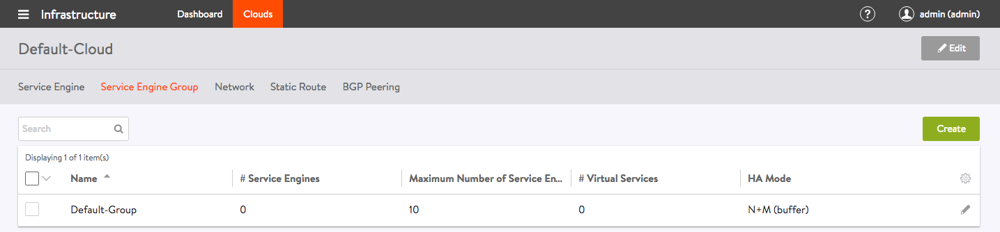
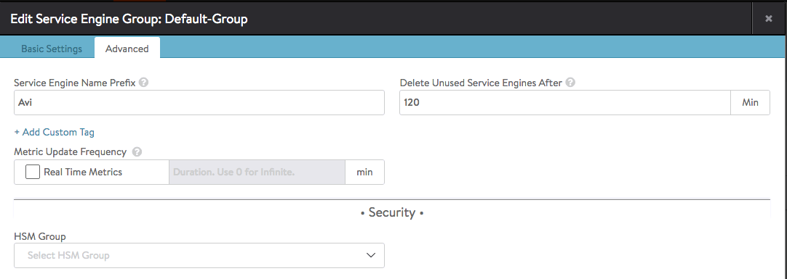
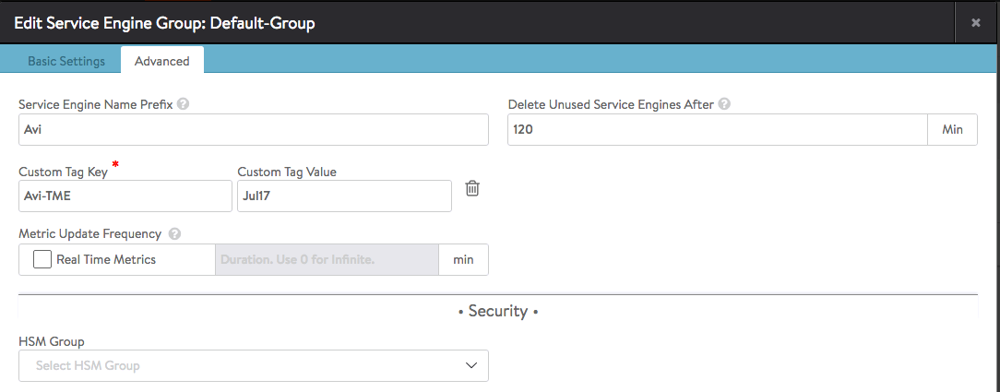

Starting in Avi Vantage v16.2, a user may optionally pass AWS a single key-value pair to better control the instantiation of SEs in EC2.The key string and its corresponding value are passed to EC2 with every request to instantiate a new SE.

In accordance with <a href="http://docs.aws.amazon.com/awsaccountbilling/latest/aboutv2/allocation-tag-restrictions.html">Amazon Web Services' documentation</a>, key names are 128 Unicode characters maximum, values 256 Unicode characters maximum. Choose from among alphanumeric characters (<code>[a-z], [A-Z], [0-9]</code>, and whitespace) plus the following special characters: <code>+ - = . _ : /</code>

### Configuring a Tag in Avi Vantage UI

<ol> 
 <li class="p1">Browse to Infrastructure &gt; Clouds &gt; [AWS_Cloud_Name] &gt; Service Engine Group.<a href="img/FIRST.png">    </a></li> 
 <li class="p1">Edit "Service Engine Group" &gt; Advanced. Click the Add Custom Tag hyperlink.  <a href="img/SECOND.png">  </a></li> 
 <li class="p1"> 
Key in a custom tag key and a custom tag value. Then click Save at lower right.  
 </li> 
</ol> 