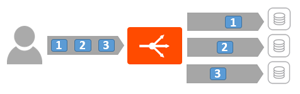

### Overview

Connection multiplexing, configured via the *Templates &gt; Profiles &gt; HTTP application profile*, controls the behavior of HTTP 1.0 and 1.1 request switching and server TCP connection reuse. This allows Avi Vantage to reduce the number of open connections maintained by servers and better distribute requests across idle servers, thus reducing server overloading and improving performance for end-users. The exact reduction of connections to servers will depend on:

* How long lived the client connections are
* The HTTP version
* How frequently request/responses utilizing the connection 
<table class=" table table-bordered table-hover">  
<tbody>   
<tr>   
<td></td>
<td></td>
</tr>
<tr>   
<td>Without multiplexing:  Request distribution from traffic originating from one client connection</td>
<td>With multiplexing:  Request distribution from traffic originating from one client connection</td>
</tr>
</tbody>
</table> 

 

When an SE receives multiple connections from a single client, or from multiple clients, requests are eligible for load balancing across any server.  This ensures a server that is slow to respond to a particular request may be bypassed when the next client request is received by Vantage.  With load balancing algorithms such as round robin, they would skip a server's connection for the next request if that connection is currently busy with a request/response.  So a server processing a complicated and slow database query may receive less requests than other servers processing faster requests.

It is important to understand that "connection" refers to a TCP connection, whereas "request" refers to an HTTP request and subsequent response. HTTP 1.0 and 1.1 allow only a single request/response to go over an open TCP connection at a time. Many browsers attempt to mitigate this bottleneck by opening around six concurrent TCP connections to the destination web site.

HTTP/2 uses a different connection methodology and does not utilize or require the connection multiplex feature.

 

### Impact on Other Features

Multiplexing often distorts the expected view of an administrator's world.  For instance, viewing connection counts from clients and to servers is typically very different.  Static load balancing algorithms such as round robin or least connections may exhibit different behavior.

* **Preserve Source IP**:  Multiplexing explicitly decouples the client connection from the equation when sending traffic to destination servers.  When Preserve Source IP is enabled in conjunction with using the Service Engine as a default gateway of the servers, HTTP traffic cannot be multiplexed.
* **NTLM**:  NTLM authentication is generally incompatible with multiplexing. Applications that rely on NTLM, such as SharePoint or StoreFront should be configured with connection multiplexing disabled.  See the <a href="/docs/16.2/issues-with-ntlm-authentication">Issues with NTLM Authentication KB </a>for more help on this.
* **Persistence**:  Persistence has a significant role to play in the behavior of multiplexing, described below. 

### Multiplex Plus Persistence

Multiplexing behavior changes when server persistence is enabled:

* **Multiplex enabled, Persistence disabled:** Client connections and their requests are decoupled from the server side of the Service Engine. Requests are load-balanced across the servers in the pool using either new or pre-existing connections to those servers. The connections to the servers may be shared by requests from any clients.
* **Multiplex enabled, Persistence enabled:** Client connections and their requests are sent to a single server. These requests may share connections with other clients who are persisted to the same server. Load balancing of HTTP requests is not performed.
* **Multiplex disabled, Persistence enabled:** Vantage opens a new TCP connection to the server for each connection received from the client. Connections are not shared with other clients. All requests received through all connections from the same client are sent to one server. HTTP client browsers may open many concurrent connections, and the number of client connections will be the same as the number of server connections.
* **Multiplex disabled, Persistence disabled:** Connections between the client and server are one-to-one. Requests remain on the same connection they began on. Multiple connections from the same client may be distributed among the available servers. 