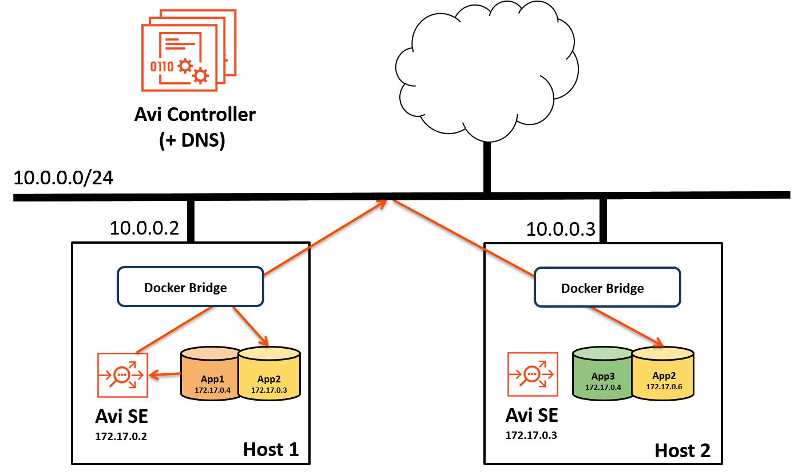
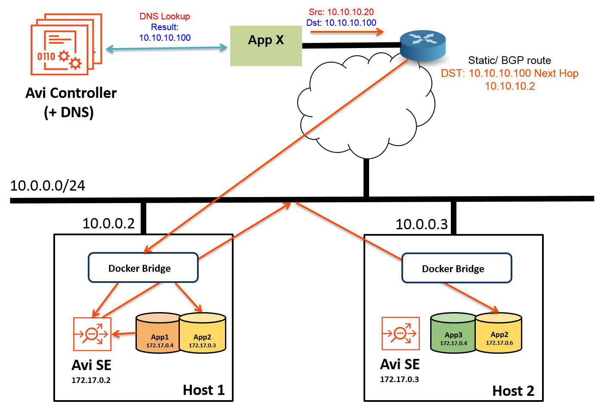
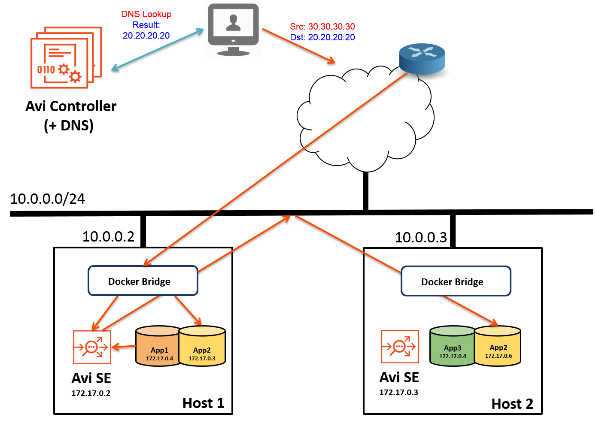

This article provides steps for creating and testing virtual services in a Marathon-managed Mesos cloud, using Marathon labels.

The following deployment scenarios are provided:

* **<a href="#eastwest">East-west:</a>** VIP and client are both in the same Mesos cluster.
* **<a href="#northsouthinside">North-south with inside VIP:</a>** VIP is in the Mesos host network but client is outside the network.
* **<a href="#northsouthoutside">North-south with outside VIP:</a>** VIP and client are both outside the Mesos host network. 

Following these examples, further examples for <a href="#custwithlabels">additional customization</a> are provided.

### Deployment Process

For each deployment scenario, the process is the same:
<ol> 
 <li>Create a Docker image file for the application.</li> 
 <li>Start the application.</li> 
 <li>Generate traffic.</li> 
</ol> 

The details for each deployment differ slightly, mainly in regard to network address information.

### Labels

In Mesos deployments, the Avi Controller uses configuration information from Marathon labels.

* **FE-Proxy** - Used to indicate a front-end or a north-south service accessible from within or outside the cluster. Each service requires a virtual IP (VIP) address.
* **avi_proxy** - Used for service configuration. The avi_proxy label has 2 sub-objects: virtualservice and pool. These objects use the same JSON schema as the <a href="/docs/16.2/api-guide/">Avi REST API</a>. 

### Configure Virtual Services Through Marathon Only

**Important!** In a Mesos cloud, the only legitimate way to create, modify, or delete a virtual service is by creating, modifying, or deleting the corresponding Marathon applications and the avi_proxy label. The avi_proxy label is a Marathon label containing a string with JSON objects for a pool and virtual service.

To modify a virtual service, modify the Marathon application and the avi_proxy application label corresponding to that application. The Mesos cloud connector process on the Avi Controller automatically creates, modifies, and deletes virtual services in Vantage that correspond to applications in Marathon. The Mesos cloud connector process extracts the configuration for the virtual service using application labels in Marathon.

Creating, modifying, or deleting virtual services directly using the Avi Controller web interface, CLI, or REST API is unsupported and may have unintended consequences. For example, the cloud connector process may override configuration changes made through the Avi Controller web interface.

Following the main deployment examples, this article provides <a href="#custwithlabels">additional examples</a> of configuring Vantage through Marathon with labels.

## East-West Application

These steps create an east-west application. Here is an example of the topology for this type of application: 
Note: Deployment of an east-west application is the simplest and does not require use of labels. 
<ol> 
 <li>Create a Docker image file such as the following for the application:</li> 
</ol> 

<pre class="command-line language-bash" data-user="aviuser" data-host="avihost" data-output="1-100" white-space="pre"><code>
{
  "id": "webapp-ew1",
  "cpus": 0.5,
  "mem": 64.0,
  "instances": 2,
  "container": {
    "type": "DOCKER",
    "docker": {
      "image": "avinetworks/server",
      "network": "BRIDGE",
      "portMappings": [
        { "containerPort": 80, "hostPort": 0, "servicePort": 0, "protocol": "tcp" }
      ]
    }
  },
  "healthChecks": [
    {
      "protocol": "HTTP",
      "portIndex": 0,
      "path": "/",
      "gracePeriodSeconds": 5,
      "intervalSeconds": 20,
      "maxConsecutiveFailures": 3
    }
  ]
}</code></pre> 
<ol start="2"> 
 <li>Start the application to create a virtual service for it in Vantage: <pre crayon="false" class="command-line language-bash" data-prompt=": >"><code>curl -H "Content-Type: application/json" -X POST -d@Docker.json http://marathon-ip-or-hostname:8080/v2/apps</code></pre> The H and X options are required. The H option inserts a Content­Type header for the Avi SE application. The X option changes the HTML method of the request from GET (the default) to POST. Replace marathon-ip-or-hostname with the IP address or hostname of Marathon.</li> 
</ol> <ol start="3"> 
 <li>Start a client container on the VM: <pre crayon="false" class="command-line language-bash" data-prompt=": >"><code>sudo docker run -d avinetworks/server 3e24a968f0a2476cd947034f24b105142130f3820138b933e7acdf828b4d1538</code></pre></li> 
 <li>Connect to the client container that you just started: <pre crayon="false" class="command-line language-bash" data-prompt=": >"><code>sudo docker exec -it 3e24a968f0a2 bash</code></pre></li> 
</ol> <ol start="5"> 
 <ol start="5"> 
  <li>To generate traffic to the application, open an SSH connection to another VM that is located in the same network as the host, and enter the following command: <pre crayon="false" class="command-line language-bash" data-user="aviuser" data-host="avihost"><code>ab -n 100 http://20.20.20.20/100kb.txt</code></pre> </li> 
 </ol> 
</ol> 

This command sends 100 requests for the specified file to the application VIP (20.20.20.20 in this example).

## North-South Application with Inside VIP

Use these steps if the VIP is in the same Mesos cluster as the application but the client is outside the cluster. Here is an example of the topology for this type of application: 
<ol> 
 <li>Create a Docker image file such as the following for the application. In the file, edit the IP address of the virtual service (10.10.10.100 in this example) to match the address of the VIP.</li> 
</ol> 

<pre class="command-line language-bash" data-user="aviuser" data-host="avihost" data-output="1-100" white-space="pre"><code>
{
  "id": "webapp­-ns1",
  "cpus": 0.5,
  "mem": 64.0,
  "instances": 2,
  "container": {
    "type": "DOCKER",
    "docker": {
      "image": "avinetworks/server",
      "network": "BRIDGE",
      "portMappings": [
        { "containerPort": 80, "hostPort": 0, "servicePort": 0, "protocol": "tcp" }
      ]
    }
  },
  "labels": {
    "FE-Proxy": "yes",
    "avi_proxy": "{\"virtualservice\": {\"ip_address\": {\"addr\": \"10.10.10.100\", \"type\": \"V4\"}}}"
  },
  "healthChecks": [
    {
      "protocol": "HTTP",
      "portIndex": 0,
      "path": "/",
      "gracePeriodSeconds": 5,
      "intervalSeconds": 20,
      "maxConsecutiveFailures": 3
    }
  ]
}</code></pre> 
<ol start="2"> 
 <li>Start the application to create a virtual service for it in Vantage: <pre crayon="false" class="command-line language-bash" data-prompt=": >"><code>curl -H "Content-Type: application/json" -X POST -d@Docker.json http://marathon-ip-or-hostname:8080/v2/apps</code></pre> The H and X options are required. The H option inserts a Content­Type header for the Avi SE application. The X option changes the HTML method of the request from GET (the default) to POST. Replace marathon-ip-or-hostname with the IP address or hostname of Marathon.</li> 
</ol> <ol start="3"> 
 <li>To generate traffic to the application, open an SSH connection to another VM that is located in the same network as the host, and enter the following command: <pre crayon="false" class="command-line language-bash" data-user="aviuser" data-host="avihost"><code>ab -n 100 http://10.10.10.100/100kb.txt</code></pre> 
This command sends 100 requests for the specified file to the application VIP (10.10.10.100 in this example).
</li> 
</ol>  

## North-South Application with Outside VIP

Use these steps if neither the VIP nor the client is in the same Mesos cluster as the application. Here is an example of the topology for this type of application. The VIP in this example is 20.20.20.20. 
<ol> 
 <li>Create a Docker image file such as the following for the application. In the file, edit the IP address of the virtual service (20.20.20.20 in this example) to match the address of the VIP.</li> 
</ol> 

<pre class="command-line language-bash" data-user="aviuser" data-host="avihost" data-output="1-100" white-space="pre"><code>
{
  "id": 
  "webapp-ns2",
  "cpus": 0.5,
  "mem": 64.0,
  "instances": 2,
  "container": {
    "type": "DOCKER",
    "docker": {
      "image": "avinetworks/server",
      "network": "BRIDGE",
      "portMappings": [
          { "containerPort": 80, "hostPort": 0, "servicePort": 0, "protocol": "tcp" }
      ]
    }
  },
  "labels": {
    "FE-Proxy": "yes",
    "avi_proxy": "{\"virtualservice\": {\"ip_address\": {\"addr\": \"20.20.20.20\", \"type\": \"V4\"}}}"
  },
  "healthChecks": [
    {
      "protocol": "HTTP",
      "portIndex": 0,
      "path": "/",
      "gracePeriodSeconds": 5,
      "intervalSeconds": 20,
      "maxConsecutiveFailures": 3
    }
  ]
}</code></pre> 
<ol start="2"> 
 <li>Start the application to create a virtual service for it in Vantage: <pre crayon="false" class="command-line language-bash" data-prompt=": >"><code>curl -H "Content-Type: application/json" -X POST -d@Docker.json http://marathon-ip-or-hostname:8080/v2/apps</code></pre> The H and X options are required. The H option inserts a Content­Type header for the Avi SE application. The X option changes the HTML method of the request from GET (the default) to POST. Replace marathon-ip-or-hostname with the IP address or hostname of Marathon.</li> 
</ol> <ol start="3"> 
 <li>To generate traffic to the application, open an SSH connection to another VM that is located in the same network as the host, and enter the following command: <pre crayon="false" class="command-line language-bash" data-user="aviuser" data-host="avihost"><code>ab -n 100 http://20.20.20.20/100kb.txt</code></pre> 
This command sends 100 requests for the specified file to the application VIP (20.20.20.20 in this example).
</li> 
</ol>  

## Customizing the Configuration with Labels

This section provides additional examples for changing Avi Vantage settings using labels.

### Enabling Real-Time Metrics and Full Client Logs

The following example enables analytics and client logs:

<pre class="command-line language-bash" data-output="1-100"><code>
"avi_proxy": "{\"virtualservice\": {\"analytics_policy\": {\"metrics_realtime_update\": {\"duration\": 0, \"enabled\":true}, \"client_insights\": \"NO_INSIGHTS\", \"full_client_logs\": {\"enabled\":true}}}}”

</code></pre>  

### Changing the Load-balancing Algorithm

Avi Vantage uses the fastest response load-balancing algorithm by default. In Mesos deployments, the algorithm can be changed through Marathon using the “avi_proxy” label. The following example changes the load-balancing algorithm to round robin:

<pre class="command-line language-bash" data-output="1-100"><code>
"avi_proxy": "{\"pool\": {\"lb_algorithm\": \"LB_ALGORITHM_ROUND_ROBIN\"}}"

</code></pre> 

The value of lb_algorithm can be one of the following:

* Fastest Response: LB_ALGORITHM_FASTEST_RESPONSE
* Round Robin: LB_ALGORITHM_ROUND_ROBIN
* Fewest Servers: LB_ALGORITHM_FEWEST_SERVERS
* Least Connection: LB_ALGORITHM_LEAST_CONNECTIONS
* Least Load: LB_ALGORITHM_LEAST_LOAD
* Consistent Hash: LB_ALGORITHM_CONSISTENT_HASH  

### Creating an SSL Service with an SSL Profile and Certificate

This example uses the "avi_proxy" label to enable SSL for a north-south application. In this example, Vantage's default system certificate (System-Default-Cert) and SSL/TLS profile (System-Standard) are used.

<pre class="command-line language-bash" data-output="1-100"><code>
"avi_proxy": "{\"virtualservice\": {\"ip_address\": {\"addr\": \"10.90.101.150\", \"type\": \"V4\"}, \"services\": [{\"port\": 443, \"enable_ssl\": true}], \"ssl_key_and_certificate_refs\": \"/api/sslkeyandcertificate/?name=System-Default-Cert\", \"ssl_profile_ref\": \"/api/sslprofile/?name=System-Standard\"}}"

</code></pre> 

### Adding Custom Health Monitors To a Pool

This example adds two health monitors, custom health monitor User-HM and system-defined health monitor System-TCP, to a virtual service's pool. 

<pre class="command-line language-bash" data-output="1-100"><code>
"avi_proxy": "{\"pool\": {\"health_monitor_refs\": [\"/api/healthmonitor?name=User-HM\", \"/api/healthmonitor?name=System-TCP\"]}}"

</code></pre> 

### Enabling BGP RHI Support for Scaling a Virtual Service

This example enables route health injection (RHI) on a virtual service. 

<pre class="command-line language-bash" data-output="1-100"><code>
"avi_proxy": "{\"virtualservice\": {\"enable_rhi\": true, \"ip_address\": {\"addr\": \"10.250.1.100\", \"type\": \"V4\"}, \"services\": [{\"port\": 80}]}}"
</code></pre> 

(For more information about using BGP RHI for virtual service scaling, <a href="/docs/16.2/bgp-support-for-virtual-services">click here</a>.)

