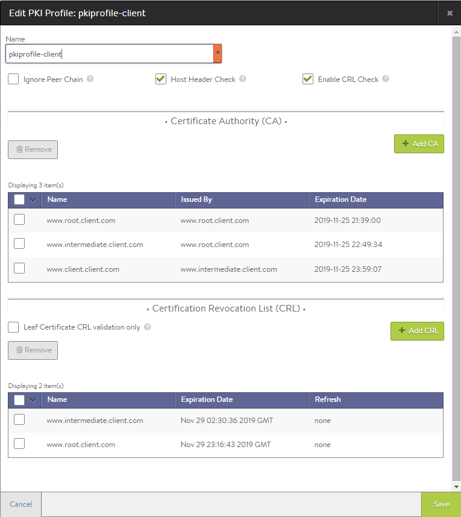

Vantage supports use of Certificate Revocation Lists (CRLs). A CRL is a file issued by a certificate authority (CA) that lists certificates that were issued by the CA but have been revoked. When a client sends a request for an SSL connection to a virtual service, Vantage can check the CAs and CRL(s) in the virtual service's PKI profile to verify whether the client certificate is still valid.

The PKI profile has an option for full-chain CRL checking: Enable CRL Check

* **Full-chain CRL checking disabled:** By default, if client certificate validation is enabled in the HTTP profile used by the virtual service, the PKI profile used by the virtual service must contain at least one CRL, a CRL issued by the CA that signed the client's certificate.  
    
    For a client to pass certificate validation, the CRL in the profile must be from the same CA that signed the certificate presented by the client, and the certificate must not be listed in the CRL as revoked.
    
* **Full-chain CRL checking enabled:** For more rigorous certificate validation, CRL checking can enabled in the PKI profile. In this case, Vantage requires the PKI profile to contain a CRL for ***every*** intermediate certificate within the chain of trust for the client.  
    
    For a client to pass certificate validation, the profile must contain a CRL from each intermediate CA in the chain of trust, and the certificate cannot be listed in any of the CRLs as revoked. If the profile is missing a CRL for any of the intermediate CAs, or the certificate is listed as revoked in any of those CRLs, the client's request for an SSL session to the virtual service is denied.
    
    > Note: Another option in the PKI profile (<a href="/docs/16.2/configuration-guide/templates/security/">Ignore Peer Chain</a>) controls how Vantage assembles the chain of trust for a client, specifically whether the intermediate certificates presented by the client are allowed to be used. If full-chain CRL checking is enabled, the PKI profile must contain CRLs from the signing CAs for every certificate that is used to build a given client's chain of trust, whether the intermediate certificates are from the client or from the PKI profile.
 

Here is an example of a PKI profile with CRL checking enabled. This profile also contains the intermediate and root certificates that form the chain of trust for the server certificate. The profile also contains the CRLs from the issuing authorities for the server and intermediate certificates. The www.root.client.com CRL is used to verify whether certificate www.intermediate.client.com is valid. Likewise, the www.intermediate.client.com CRL is used to verify whether the "client" (leaf) certificate www.client.client.com is valid.

## Enabling Full-chain CRL Checking

<ol> 
 <li> 
Navigate to Applications &gt; Templates.
 </li> 
 <li> 
Select Security, and click on PKI Profile.
 </li> 
 <li> 
Click on the edit icon next to the PKI profile, or click New to create a new one.
 </li> 
 <li> 
Check (select) Enable CRL Check.
 </li> 
 <li> 
If creating a new profile enter a name and add the key, certificate, and CRL files. Make sure the profile contains a CRL for each intermediate CA in the chain of trust.
 </li> 
 <li> 
Click Save.
 </li> 
</ol> 