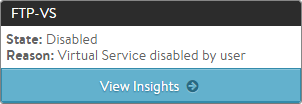

A virtual service may be manually disabled by an administrator or an automated script.  While disabled, the virtual service is unattached from the Service Engines that were hosting it. Likewise:

* Existing connections are immediately terminated. 
* The pool is placed in a grey ('unused') state and is eligible to be used by another virtual service. 
* No health monitors are sent to the pool's servers while the virtual service is disabled.  

If a virtual IP needs to be disabled, each virtual service must first be disabled. Once all virtual services using the VIP have been disabled, Avi SEs will no longer respond to ARPs or network requests for the VIP.

### Web Interface

To disable a virtual service from the Controller's web interface, navigate to the edit wizard for the virtual service, and click the Enabled button in the Settings tab. The button will change from green to red when the virtual service is disabled. Click save to commit the change.

### CLI

To enable a virtual service from the CLI:

<pre>: &gt; configure virtualservice Test-VS enabled
: &gt; save</pre> 

To disable a virtual service from the CLI:

<pre>: &gt; configure virtualservice Test-VS no enabled
: &gt; save</pre> 

 

