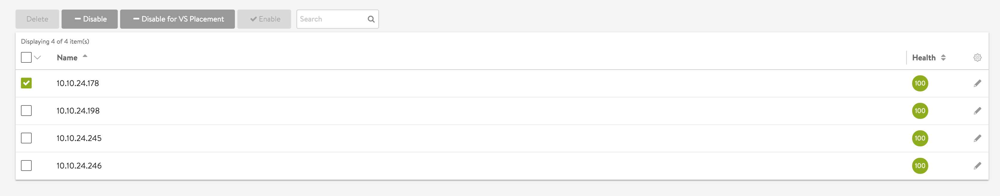
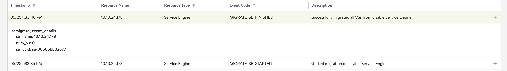

Disable Service Engine (SE) feature provides ability for users to stop placement of VSs on certain SEs and to migrate multiple Virtual Services (VS) from an existing SE. This can be useful during maintenance or decommissioning of an SE. Currently, <a href="/docs/16.2/configuration-guide/applications/vs-scaling/">VS migration</a> lets user migrate a VS from one SE to another SE. Underneath, disable SE functionality relies on VS migration to achieve migration of all VSs from SE. 

One can disable an SE using either CLI or UI.

### State Details

A new field is being added to SE object enable_state in order to reflect the state of a SE. It can take the following values:

* SE_STATE_ENABLED: default state of a SE
* SE_STATE_DISABLED_FOR_PLACEMENT: In this state SE continues to serve traffic for VS’s placed on it. However, new VS’s will not be provisioned on it. Migration of VS is not initiated in this state.
* SE_STATE_DISABLED: In addition to no new VSs  being placed on this SE, SE starts migrating VSs to other SEs in its SE group in this state. Following events are generated to reflect the status of migration:  
    * MIGRATE_SE_STARTED: This event is generated when system initiates migration of VSs on the disabled SE. SE goes to OPER_DISABLING state.
    * MIGRATE_SE_RESTARTED: If there is an error encountered while migration, system would try to reinitiate migration.
    * MIGRATE_SE_FINISHED: This event indicates all VSs have been migrated successfully without any failures and SE is not serving any VS. SE goes to OPER_DISABLED state.
    * MIGRATE_SE_FAILED: This state indicates system failed to migrate at least one VS. The VSs which encountered failure during migration would continue to serve the traffic and would require manual intervention to completely take those VSs out of that SE. SE goes to OPER_ERROR_DISABLED state. 

SE continues to be in DISABLED state even after the migration process is completed. Disabled SEs are still connected to the controller and do get counted towards the limit on the number of SE's in a SE group.

 

 
