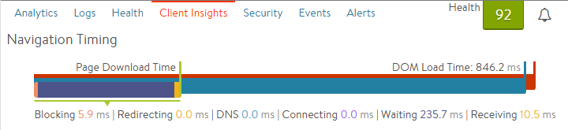

## About Navigation Timing

Avi Vantage can understand a client's interaction with HTTP applications, including from the client's perspective. Vantage's navigation timing functionality finds out from the client how long it took to receive the DNS reply to the URL query for the requested site, how long it took to download the various objects for the site, and how long it took for DOM and page rendering. The Virtual Service > Client page may show Navigation Timing data in addition to other metrics such as client browser, location, and operating system. By default, when you create a new virtual service, the navigation timing is not shown.

To enable navigation timing, edit the virtual service and navigate to the Analytics tab, then set the Type field to Active. Navigation Timing is relevant only to virtual services that have an HTTP application profile.

The data is generated by the SE inserting an <a href="http://www.w3.org/TR/navigation-timing/">industry standard</a> JavaScript query into a small number of server responses sent back to clients. Client browsers transparently return additional information about their experience loading the web page. Avi Vantage uses this information to populate the Navigation Timing and Top URL Timing metrics fields. This is also referred to as RUM, or Real User Monitoring.

## Requirements for Navigation Timing

Navigation timing requires the following conditions to be met:

* Virtual service should be HTTP or HTTPS (with Avi Vantage terminating the SSL connection).
* Virtual service should be accessed by a real browser.
* Browser must be able to run Javascript. (JavaScript must not be disabled.)
* Data is captured only for "good" HTML requests:  
    * Requests that end in response code 200
    * Response content-type set to text/html
    * Response body containing tags and
* For cacheable pages, navigation timing is not collectable by Avi Vantage when a cached page is reused by the browser.
* Most common browsers support basic navigation timing, although some older versions of browsers and mobile browsers may not support it. 

## Sample Selection Process

The selection process for sampling follows the following order of steps. If any of these return "no", Avi Vantage skips the request/response for collecting navigation timing.

* Check if 200 OK.
* Check if this is the main request, and not a sub-request.
* Check if more than 1 second (default) has passed since last RUM JS was inserted into a response:  
    * By default, at most 1 request per second is captured.
    * This property may be changed in the CLI via: **se_properties** > **se_bootup_properties** > **se_rum_sampling_nav_interval**
    * Since this value is a "boot up" property, the SE must be restarted.
* Check if fewer than 1% (default) of requests are captured:  
    * If 100 requests are received, only one entry will be eligible to be captured.
    * This property may be changed in the CLI via: **se_properties** > **se_bootup_properties** > **se_rum_sampling_nav_percent**
    * Since this value is a "boot up" property, the SE must be restarted.
* Client Insights for the virtual service are set to Active.  
    * Check whether content-type is set to text/html.
    * Check whether the URL is listed in the Client Insights exclusion list.
    * Check whether the IP or port are listed in the Client Insights exclusion list. 