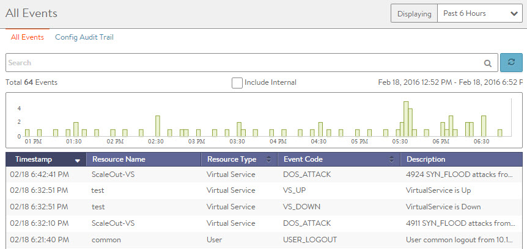

Events are used throughout Avi Vantage to provide a history of relevant changes that have occurred. Events are a permanent record, and can be used to generate alerts which can take action on the event. In the UI, events may be viewed within the context of specific objects, such as a virtual service, a pool, or a server. In contrast, viewing events from the Operations menu provides an unfiltered view of all events across the system or the tenant. For Vantage system debugging, this should be the first place to go for information.

For the full list of events monitored by Vantage, see the <a href="/docs/16.2/events-list">Event List</a>.

In addition to logging significant incidents within Vantage, events may be used to trigger alerts to provide external notification and potentially scaling application capacity or otherwise altering the Vantage configuration. For a deeper definition, see the <a href="/docs/16.2/alerts-overview">Alerts Overview</a> page.

### All Events

Select Operations &gt; Events to open the All Events page, which shows all events for the entire Avi Vantage system. Events pages elsewhere within Avi Vantage will be filtered by the context of the section in which they exist, such as only showing events relevant to the virtual service being viewed.

The top of this page displays the following items:

* **Search**: The Search field allows you to filter the audit trail using whole words contained within the individual events.
* **Refresh**: Clicking the button updates the audit trail events displayed for the selected timeframe.
* **Number**: Total number of entries being displayed. The date-time range of those events appears on the right, on the same line.
* **Clear Selected**: If filters have been added to the Search field, the Clear Selected X icon on the right side of the search bar will remove those filters. Each active search filter will also contain an X that can be clicked to remove a specific filter.
* **Histogram**:The Histogram shows the number of events over the period of time selected. The X-axis is time, while the Y-axis is the number of events during that bar's period of time.  
    * Hovering the cursor over a Histogram bar displays the number of entries represented by that bar during a period of time.
    * Click and drag inside the histogram to refine the date/time period which further filters the events shown. When drilling in on the time in the Histogram, a Zoom to Selected link appears above the Histogram. This expands the drilled in time to expand to the width of the Histogram, and also changes the Displaying time pull-down menu to Custom. To return to the previously selected time period, use the Display menu to select a new time period. Zooming is limited to durations of 2 minutes and greater.
* **Include Internal**: By default, a number of events are not shown as they tend to be noisy and less relevant for general purposes. Avi Support personnel may ask to enable this option when helping to troubleshoot more esoteric issues. 

### Config Audit Trail

Select Operations &gt; Events &gt; Config Audit to open the Config Audit Trail page, which presents an audit trail of user activity events as well as changes to the system configuration over the period of time selected. This is a filtered view of All Events, showing only events related to configuration changes.

The table at the bottom of the Config Audit Trail tab displays the events matching the current time window and any potential filters. The following information appears for each event:

* **Timestamp**: Date and time the event occurred. Highlighting a section of the Histogram allows further filtering of events within a smaller time window.
* **Event Type**: This page is scoped to only show configuration event types. Configuration events track changes to the Avi Vantage configuration. These changes may be made by an administrator (through the CLI, API, or GUI), or by automated policies.
* **Resource Name**: Name of the object related to the event, such as the pool, virtual service, Avi Service Engine, or Avi Controller. For USER_LOGIN events, this will show the username that attempted to log in.
* **Event Code**: A short event definition, such as USER_LOGIN, CONFIG_CREATE, CONFIG_MODIFY, or CONFIG_DELETE.
* **Description**: A complete event definition. For configuration events, the description will also show the username of the Avi Vantage account that made the change.
* **Expand/Contract**: Clicking the + plus or - minus sign for an event log either expands that event log to display more detail or contracts that event log to display only summary information. Clicking the plus and minus icons in the table header expands and collapses all entries in this tab. 

For configuration events, expanding the event displays a difference comparison between the previous and new configurations.

* New fields will appear highlighted in green in the new configuration.
* Removed fields will appear highlighted in red.
* Changed fields will show highlighted in yellow. 