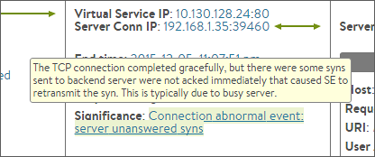

Avi Vantage records the following Significant Log events types.  These errors are recorded in the virtual service > logs page when Significant Logs are enabled (the default).  A log may contain one or more of the following events listed below.

Errors that trigger significant events may be adjusted within the Analytics profile attached to the virtual service.  For instance, HTTP 4xx response codes or server RST packets may be omitted from being recorded as an error. The profile is also used to define a slow connection from a client or server.

 

### Connection Setup Failed

* The connection setup was aborted by the client, which sent a RST during the TCP three way handshake.
* The connection setup was refused by the server, which sent a RST during the TCP three way handshake.
* TCP three way handshake with the client timed out despite multiple retries.
* TCP three way handshake with the server timed out despite multiple retries.
* Avi Vantage was unable to complete the TCP three way handshake with the client due to an internal Avi Vantage error. This may be due to lack of memory or other resources.
* Avi Vantage was unable to complete the TCP three way handshake with the server due to an internal Avi Vantage error. This may be due to lack of memory or other resources. 

 

### Connection Closed Abnormally

* Client abnormally terminated the connection by sending a TCP RST.
* Server abnormally terminated the connection by sending a TCP RST.
* The established TCP connection with the client was closed due to timeout. Despite multiple retry attempts, the client stopped responding to Avi Vantage's packets.
* The established TCP connection with the server was closed due to timeout. Despite multiple retry attempts, the server stopped responding to Avi Vantage's packets.
* The connection was deleted due to an Avi Vantage configuration update.
* The connection timed out waiting for the client to send HTTP request.
* The connection was prematurely closed by the client.
* The connection dropped due to SSL handshake failure.
* The connection was closed due to internal error.
* The established TCP connection was closed due to the TCP profile's idle timeout triggered.
* The connection was dropped due to server side SSL handshake failure.
* Validation of the server's x509 certificate failed. 

 

### Connection Abnormal Event:

* The TCP connection established successfully, but there are a high number of retransmitted packets due to timeouts from Avi Vantage to the client. This could be due to lossy network or a slow client.
* The TCP connection established successfully, but there were a high number of retransmitted packets due to timeouts from Avi Vantage to the server. This could be due to lossy network or a slow server.
* The TCP connection completed gracefully, but there were instances when the TCP window advertised by the client depleted to zero. This means Avi Vantage could not send any more packets until the client opened the TCP window. This is typically due to a slow client.
* The TCP connection completed gracefully, but there were instances when the TCP window advertised by the server depleted to zero. This means Avi Vantage could not send any more packets until the server opened the TCP window. This is typically due to a slow server.
* The TCP round trip time between Avi Vantage and the client is greater than 1 second.
* The TCP round trip time between Avi Vantage and the server is greater than 500ms.
*  The TCP connection completed gracefully, but there were a high number of retransmitted packets from Avi Vantage to the client. This may be due to a lossy or congested network.
* The TCP connection completed gracefully, but there were a high number of retransmitted packets from Avi Vantage to the server. This may be due to a lossy or congested network.
* The TCP connection completed gracefully, but Avi Vantage received a high number of out of order packets from the client. This is generally due to lossy or congested network or drops by Avi Vantage.
* The TCP connection completed gracefully, but Avi Vantage received a high number of out of order packets from the client. This is generally due to lossy or congested network or drops by Avi Vantage. 

 

### Connection Setup Failed

* Connection setup failed: The connection was dropped due to bad packets received from client during TCP three way handshake. 

 

### Request Ended Abnormally

* A 4xx 'client error' HTTP response code was sent to the client.
* A 5xx 'server error' HTTP response code was sent to the client.
* Client sent request with HTTP Protocol version 0.9.
* The connection attempt was reset due to no servers available. This may be because the server connection limits setting was reached, or all servers are in a down state. 

 

### Request Abnormal Event

* The response time was greater than the configured threshold.
* Server response time greater the configured threshold.
* The server this connection was persisted to is no longer a valid destination. 

 

### Avi Rule Failed to Execute

* The Avi Vantage Policy or DataScript failed to execute. For DataScript failures, the expanded log may have a "View All Headers" button, which brings up a modal containing the DataScript error and stacktrace. 