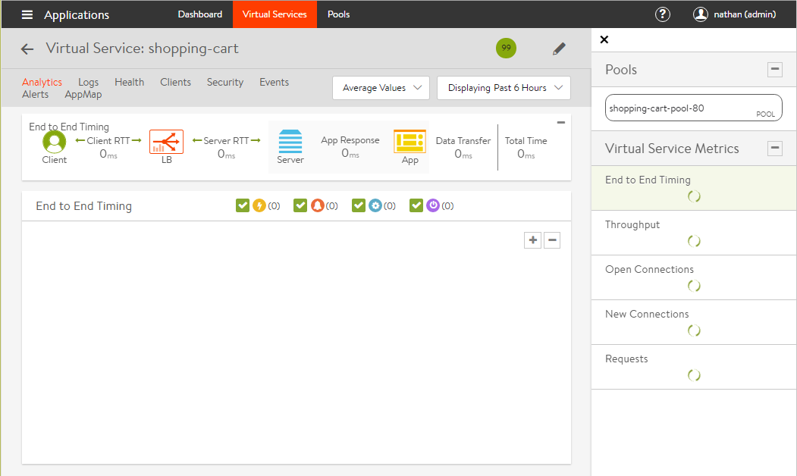

A known issue in the UI may cause a condition where some graphs in the virtual service page are blank or have an endless spinning circle for each metric. This is often due to pop-up blockers, which prevent some API calls from being sent or retrieved by the client browser.  Disable any pop-up or ad blockers for the site and refresh the page.

If this does not resolve the issue, contact Avi Support for additional assistance.

 

