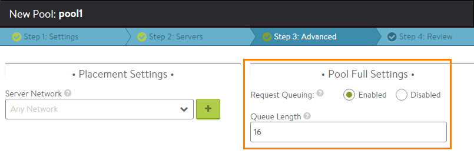

HTTP request queuing allows Avi Vantage to queue requests that are received after a backend server has reached its maximum allowed number of concurrent connections. Queuing HTTP requests provides time for new connections to become available on the server, without performing the configured <a href="/docs/16.2/configuration-guide/applications/pools/#servers">pool down action</a>.

HTTP request queuing is disabled by default. The feature can be enabled on a per pool basis. The default queue length is 128 requests (when the feature is enabled). The queue length is configurable, from 1 up to any required amount. The only limitation is that memory must be available on the Service Engine (SE).

## How the Queue Is Managed

Queued requests are managed on a last-in, first-out (LIFO) basis. For example, if the queue length is 128, Vantage can queue up to 128 requests for a saturated server.

Only GET requests can be queued. PUT requests are not queued.

While the server is unable to accept new requests, Vantage queues the new requests, up to the maximum number of requests the queue can hold (the queue length). If the queue is full and the server is still unable to accept new requests, the queue is bypassed and Vantage begins applying the configured <a href="/docs/16.2/configuration-guide/applications/pools/#servers">pool down action</a> to new requests.

When the server is able to accept new requests again, priority is given to new requests. New requests have priority over the queued requests and are sent to the server first. Only when there are no new requests to send to the server, does the SE send requests from its queue, beginning with the most recent (the last one queued).
> Sending the most recently queued requests instead of the oldest requests from the queue helps minimize impact on end-users, since some newer requests may be resends of older requests, or the client may have ended the unresponsive session. 
> Sending a request to the queue because the server is full does not generate a failure event. If the queue also is full, then an event is generated.
 

### Effect on Persistence

HTTP request queuing can be used along with persistence. If both features are enabled, and persistence requires a connection to remain on a particular server and that server is full, requests for that connection are queued until the required server has available connections for them. The requests are not sent to another server. Within the queue, the requests are still managed as described above, on a LIFO basis.

### Effect on HTTP Caching

If HTTP caching is enabled and Vantage receives a request for an object that is in the cache, Vantage fulfills the request by sending the object from the cache instead of requesting the object from the server. In this case, even if none of the servers has a free connection to receive the request, the request does not need to be queued.

## Queue Size Recommendations

SEs must have enough memory to support the configured HTTP queue size.

For an average request size of 2 KB per request, setting the queue length to 128 would require 256 KB of memory. For higher queue sizes, the appropriate amount of memory must be allocated to the SE.

### Effects of Changing the Queue Length

If the queue length is changed, the change goes into effect immediately.

* Increasing the queue length allows more requests to be queued while the server is saturated. 
* If the queue length is decreased and the new size is smaller than the number of requests that are currently in the queue, Vantage immediately drops the extra requests from the queue, beginning with the oldest one (first queued). For example, if the queue length is 128 and the queue is full, reducing the queue length to 64 results in the immediate drop of the 64 oldest requests from the queue.  

## Configuring HTTP Request Queuing

To enable request queuing for a pool:
<ol> 
 <li> 
Navigate to Applications &gt; Pools.
 </li> 
 <li> 
Click Create (if creating a new pool) or click the edit icon next to the pool name.
 </li> 
 <li> 
Go to the Advanced tab. (If a new pool, enter a name, then click Next twice.)
 </li> 
 <li> 
In the Pool Full Settings section, select Enabled next to Request Queuing.
 </li> 
 <li> 
(optional) To change the queue size, edit the number in the Queue Length field. There is no specific maximum length value. In this case, the amount of memory available on the SE for queuing presents the practical limit.
 </li> 
 <li> 
If configuring a new pool, finish configuring any other pool settings, then click Save.
 </li> 
</ol> 

