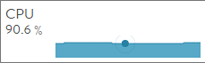

### High CPU Utilization of Service Engine

A hypervisor's monitoring tools or a virtual machine orchestrator such as VMware's vCenter may report  > 50% CPU utilization for a Service Engine (SE), while the Controller web interface reports significantly lower utilization for the same SE.

To minimize latency, the **se_dp** processes running on an SE listen in a polling mode for packets. These processes will show to be consuming CPU cycles whether they are sitting idle or busy processing packets. The web interface accurately shows the useful CPU available for processing and should be used as the source of truth for validating available CPU.

As a best practice, utilization of an SE's CPU (as reported in the Controller web interface) should not exceed 95%. The SE will likely be adding latency to network traffic when CPU is running at very high levels.

### SE-Group Autoscaling

SE-group autoscaling functionality, which allows the Avi Controller to automatically create additional SEs to handle increased load, is based on the CPU utilization of the SEs. The CPU measurement for this scaling is based on the CPU as reported by the web interface, not through top or the hypervisor.

See articles on scaling for more insight into how the CPU metric is incorporated into the scaling decision logic.

### View CPU Utilization

To see the effective CPU utilization of an SE:
<ol> 
 <li>Navigate to Infrastructure &gt; Clouds.</li> 
 <li>Select the cloud from the Clouds table.</li> 
 <li>Select the SE.</li> 
 <li>Select the CPU.</li> 
</ol> 