If using the IAM role method to define access for an Avi Vantage installation in Amazon Web Services (AWS), use the steps in this article to set up the IAM roles before beginning deployment of the Avi Controller EC2 instance.
<table class="myTable table table-bordered table-hover">  
<tbody>     
<tr>     
<th>IAM Role Name
</th>
<th>Policy Name
</th>
<th>Description
</th>
<th>Required
</th>
</tr>
<tr>     
<td>vmimport  <a href="https://s3-us-west-1.amazonaws.com/avikbs/vmimport-role-trust.json">vmimport-role-trust.json</a></td>
<td>vmimport  <a href="https://s3-us-west-1.amazonaws.com/avikbs/vmimport-role-policy.json">vmimport-role-policy.json</a></td>
<td>Allows Avi SE VM to be imported into AWS. Without this IAM role, the Avi SE cannot be launched. This role is associated with the AWS account (not with the Avi Controller).</td>
<td>Yes</td>
</tr>
<tr>     
<td rowspan="2">AviController-Refined-Role  <a href="https://s3-us-west-1.amazonaws.com/avikbs/avicontroller-role-trust.json">avicontroller-role-trust.json</a></td>
<td>AviController-EC2-Policy  <a href="https://s3-us-west-1.amazonaws.com/avikbs/avicontroller-role-policy.json">avicontroller-role-policy.json</a></td>
<td>Allows Avi Controller instance to be installed.</td>
<td>Yes</td>
</tr>
<tr>    
<td>AviController-R53-Policy  <a href="https://s3-us-west-1.amazonaws.com/avikbs/avicontroller-role-r53-policy.json">avicontroller-role-r53-policy.json</a></td>
<td>Allows access to the AWS cloud's DNS.</td>
<td>No</td>
</tr>
</tbody>
</table>  

## IAM Role Setup for Avi Vantage Installation into AWS

To begin, download the <a href="https://s3-us-west-1.amazonaws.com/avikbs/readme">readme</a> and the JSON files for the IAM role and policies onto a host that has the AWS CLI.

Then use one of the following workflows to set up the IAM roles:

### Using the CLI

The AWS CLI will need to be run from the same directory where you save the files.

At the command prompt, enter the following AWS CLI commands.
**Note: Do not use the commands to create and attach the AviController-R53-Policy unless the AWS DNS service (R53) will be used. **

<pre pre="" class="command-line language-bash" data-user="aviuser" data-host="avihost" data-output="1-100"><code>
aws iam create-role --role-name vmimport --assume-role-policy-document file://vmimport-role-trust.json
aws iam put-role-policy --role-name vmimport --policy-name vmimport --policy-document file://vmimport-role-policy.json
aws iam create-role --role-name AviController-Refined-Role --assume-role-policy-document file://avicontroller-role-trust.json
aws iam create-policy --policy-name AviController-EC2-Policy --policy-document file://avicontroller-role-policy.json
aws iam attach-role-policy --role-name AviController-Refined-Role --policy-arn "arn:aws:iam::123456789012:policy/AviController-EC2-Policy"
aws iam create-policy --policy-name AviController-R53-Policy --policy-document file://avicontroller-role-53-policy.json
aws iam attach-role-policy --role-name AviController-Refined-Role --policy-arn "arn:aws:iam::123456789012:policy/AviController-R53-Policy"
</code></pre> 

Notes:

* The **aws put-role-policy **command creates an inline policy in the role (as opposed to an attached policy).
* Make sure to replace "123456789012" with the applicable AWS account ID. 

### Using the Web Interface

<ol> 
 <li>Log into the AWS console using your AWS customer account.</li> 
 <li>Select Roles, then click Attach Policy. <a href="img/1-vmimport-gui-step1-3.png">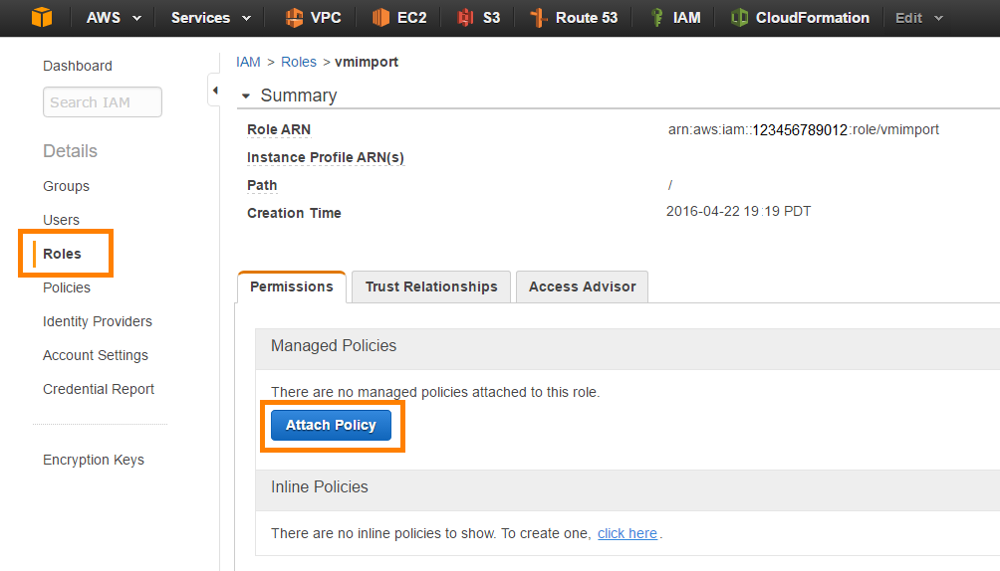</a> </li> 
 <li>Select the Custom Policy radio button, then click Select. <a href="img/1-vmimport-gui-step2-2.png">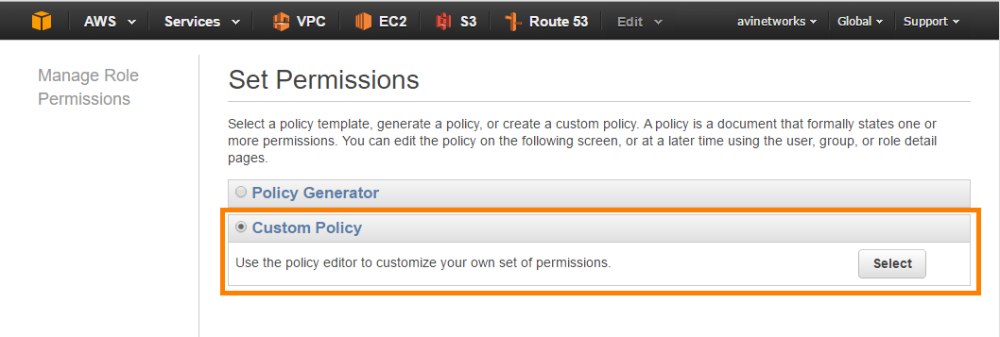</a> </li> 
 <li>Enter the name "vmimport" and copy-and-paste the contents of the vmimport-role-policy.json file into the Policy Document field. Then select Review Policy. The policy name should be "vmimport" and the policy should be in the Policy Document field. If ok, click Apply Policy. <a href="img/1-vmimport-gui-step3-2.png">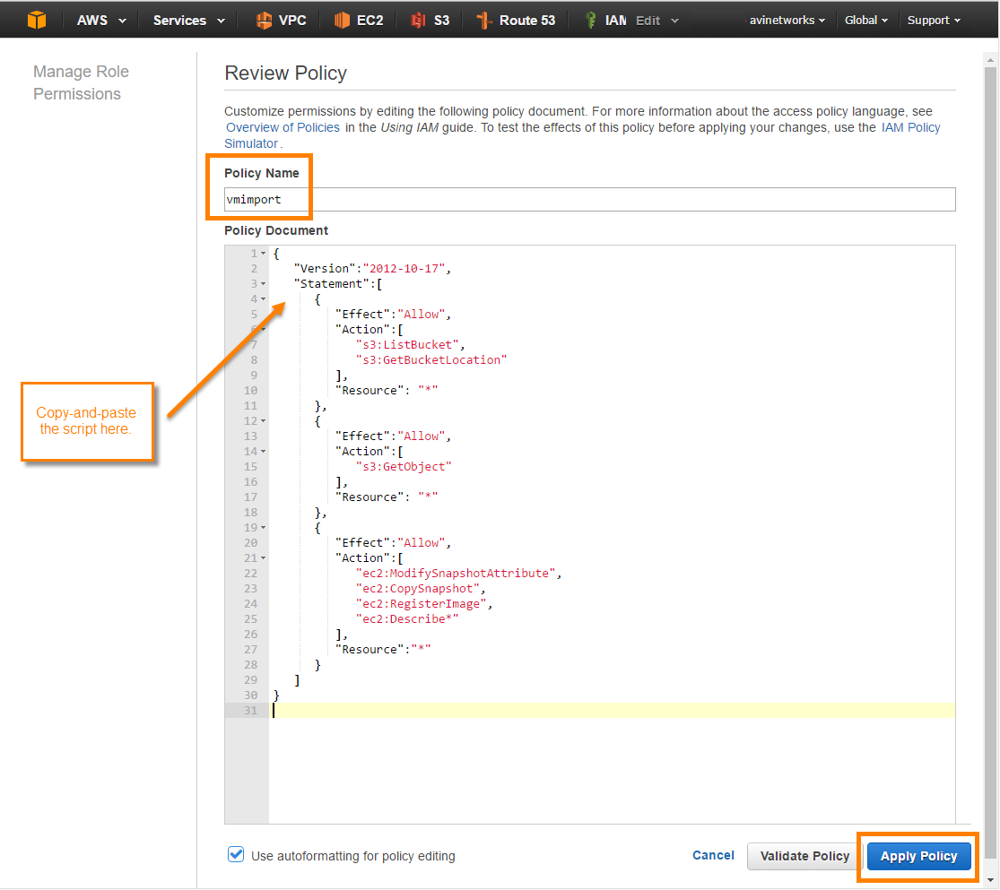</a>The new policy appears in the Inline Policies list. <a href="img/1-vmimport-gui-step4-3.png">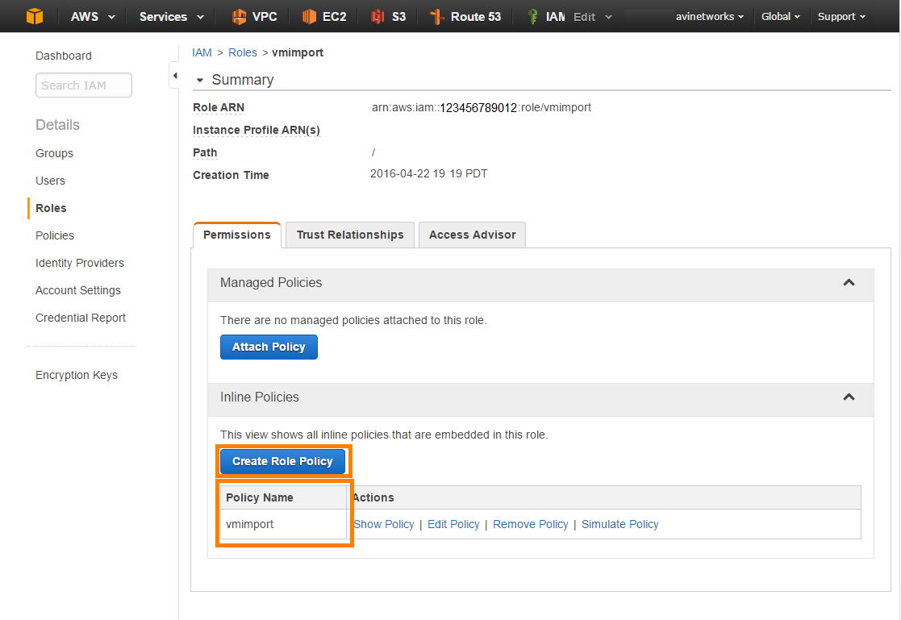</a> </li> 
 <li>Select Policies, and click Create Policy. </li> 
 <li>Click Select next to Create Your Own Policy. <a href="img/2-avi-controller-gui-step1-3.png">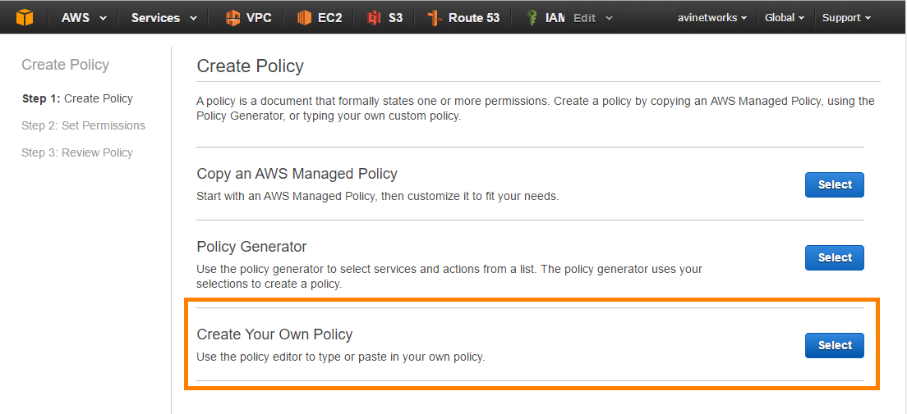</a> </li> 
 <li>Enter the name "AviController-EC2-Policy" and copy-and-paste the contents of the avicontroller-role-policy.json file into the Policy Document field. Click Create Policy. <a href="img/2-avi-controller-gui-step2-3.png">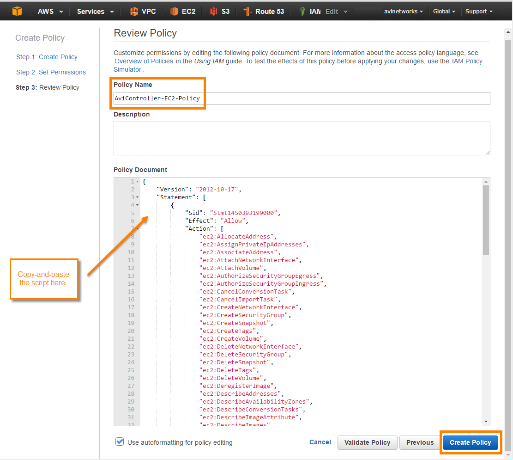</a> </li> 
 <li>If Avi Vantage will use the AWS DNS service, create a policy named "AviController-R53-Policy" and copy-and-paste the contents of the avicontroller-role-53-policy.json file into the Policy Document field. Then click Create Policy. <a href="img/2-avi-controller-gui-step3-3.png">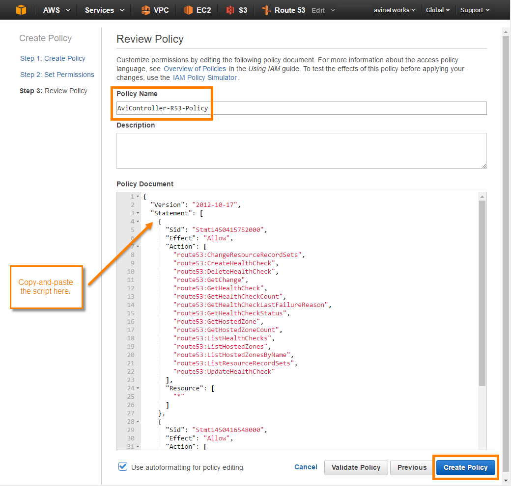</a> The new policies appear in the list. </li> 
 <li>Select Roles &gt; Create New Role. <a href="img/2-avi-controller-gui-step5-2.png">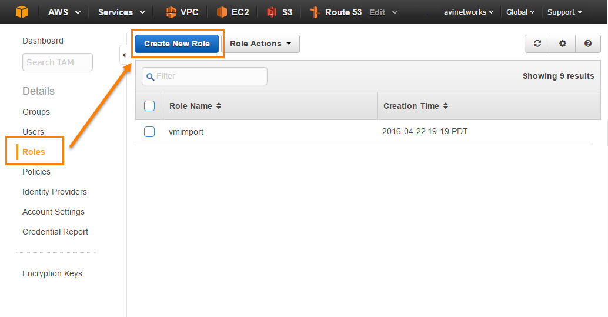</a> </li> 
 <li>Enter the role name for the Avi Controller role. Use "AviController-Refined-Role" to match the JSON file. <a href="img/2-avi-controller-gui-step6-2.png">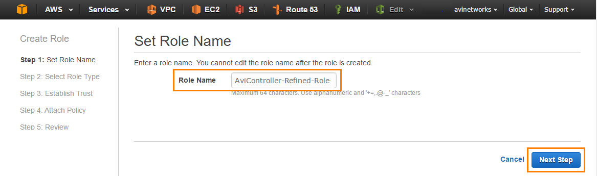</a> </li> 
 <li>Select the role type for the Avi Controller, Amazon EC2. Then click Next Step. <a href="img/2-avi-controller-gui-step7-3.png">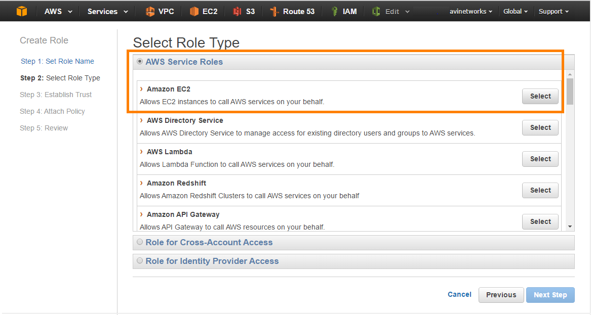</a> </li> 
 <li>Select the policies to attach to the role(s). Click Next Step. <a href="img/2-avi-controller-gui-step8-2.png">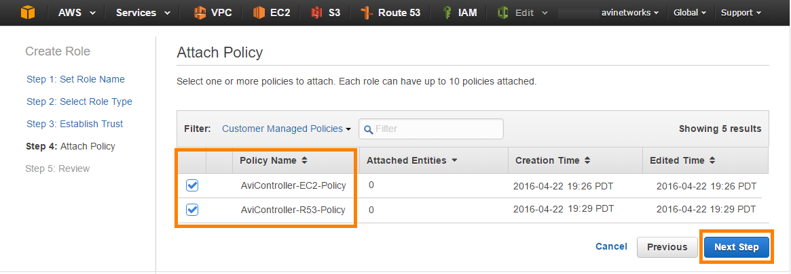</a> </li> 
 <li>Review the role information, then click Create Role. <a href="img/2-avi-controller-gui-step9-2.png">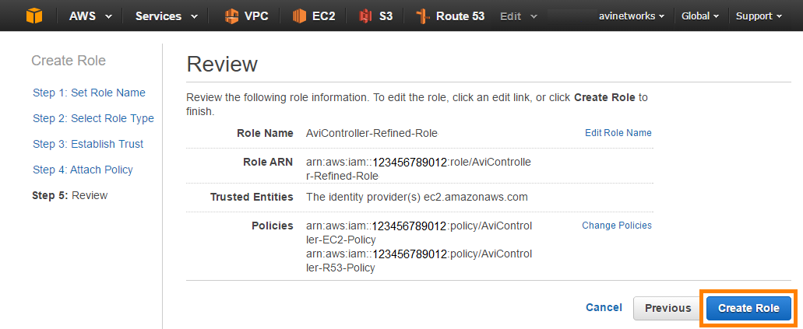</a> The new roles should be in the list. <a href="img/2-avi-controller-gui-step10-2.png">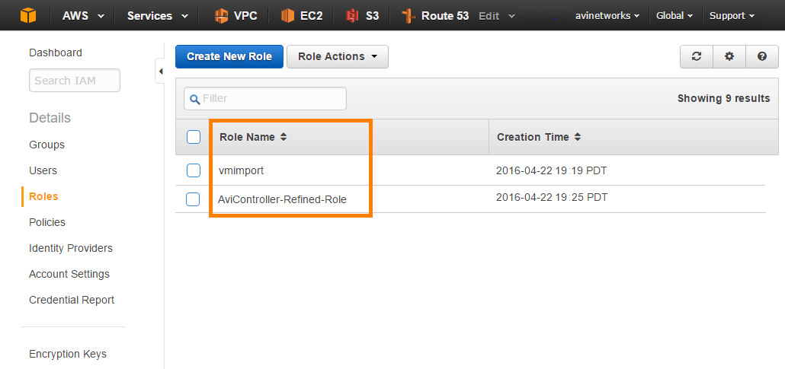</a> </li> 
</ol> 

After completing the IAM role setup steps above, go <a href="/docs/16.2/installation-guides/installing-avi-vantage-in-amazon-web-services">here</a> to install the Avi Vantage EC2 instance.

