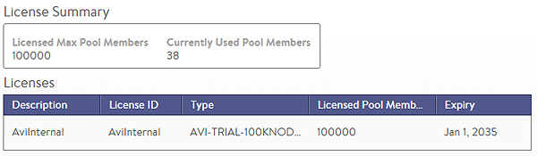

Avi Vantage requires a valid license to ensure disruption-free operation of service.  Licenses are generally valid for one year or three years, but they may occasionally be valid for a different timeframe.

When all applied licenses expire, Avi Vantage returns to an unlicensed state. In an unlicensed state, the system reverts to allowing no more than two servers. However, no configuration is lost. As soon as a valid license is reapplied, the system will immediately be able to utilize the total resources allocated by the new license.

If multiple licenses are attached to Avi Vantage and one of the licenses expires, the system immediately prevents capacity from exceeding the total resources allotted by the remaining valid licenses. 
