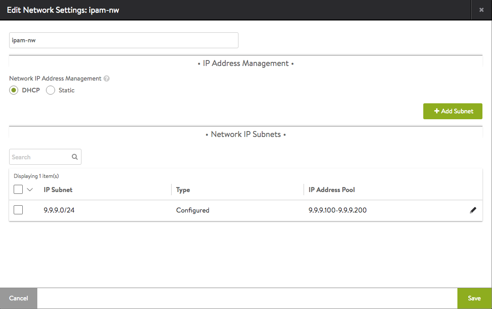
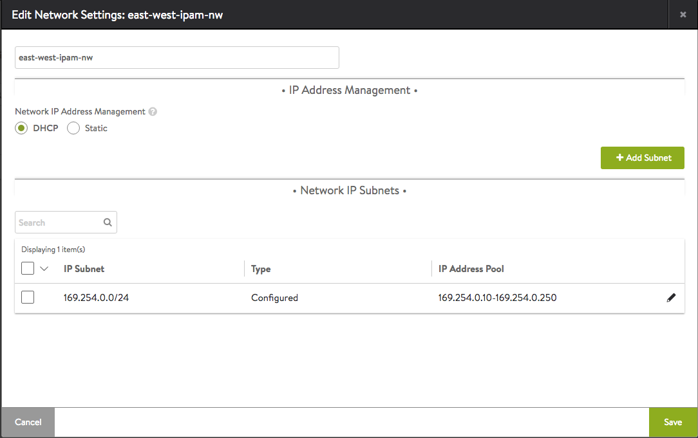
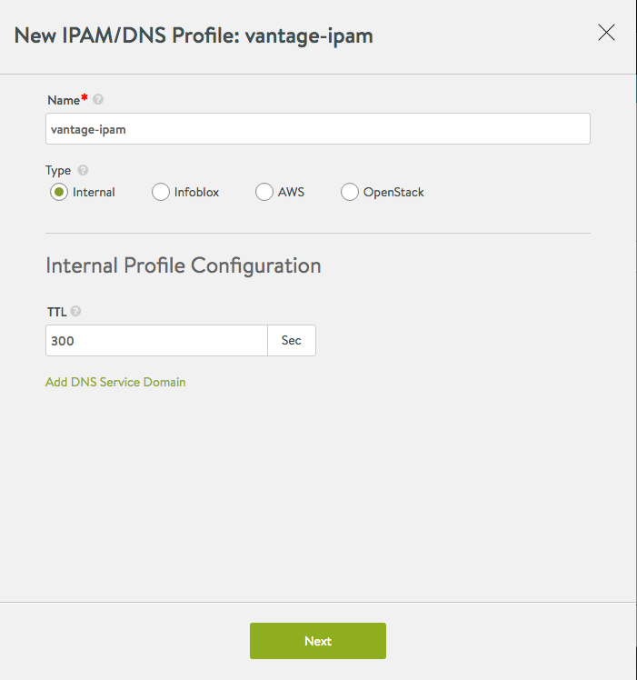
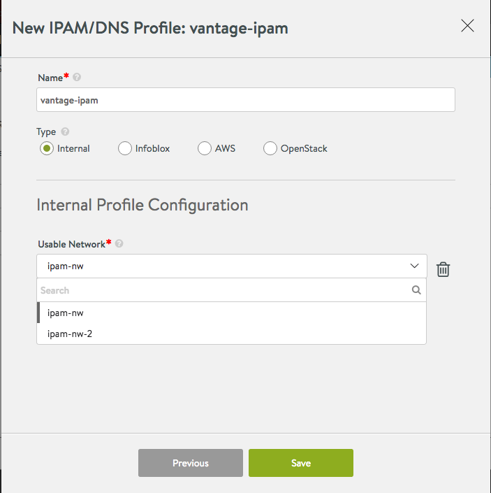
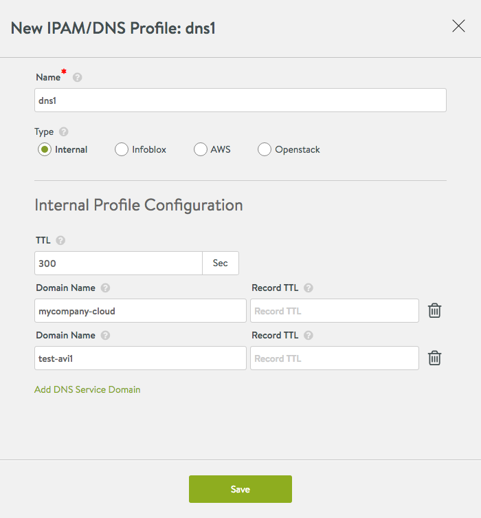
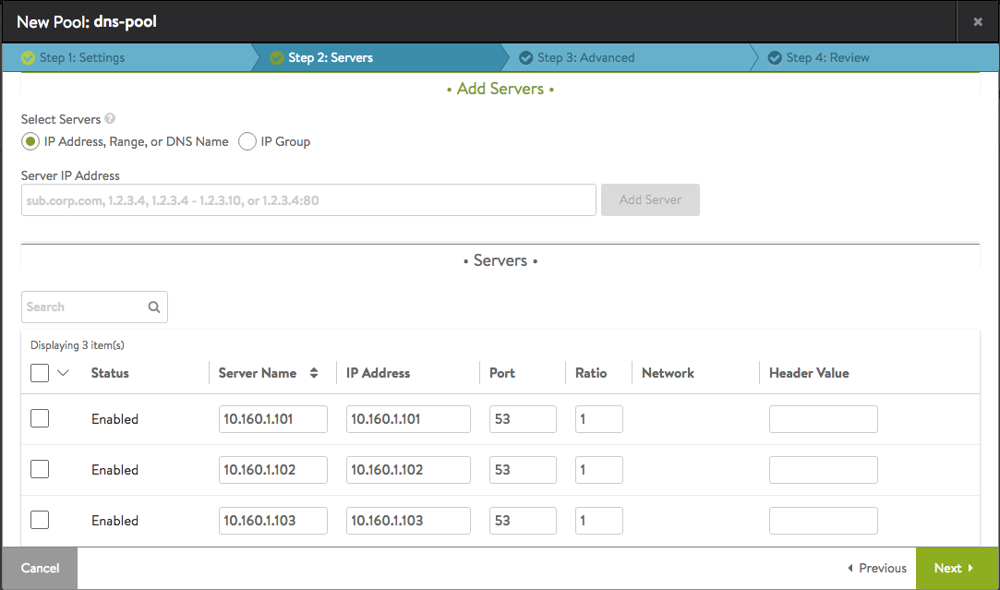
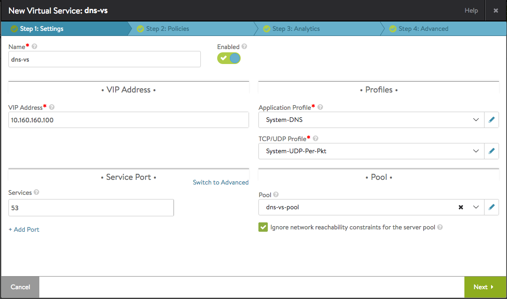

This article walks through the configuration of Avi Vantage's native IPAM and DNS solution for providing service discovery. The Vantage IPAM/DNS solution is available for the following clouds:

* Containers (Mesos, OpenShift, Docker UCP, Rancher)
* Linux server
* VMware Read Access
* No access
* OpenStack
* Amazon Web Services 

The Vantage IPAM/DNS profile consists of both IPAM- and DNS-related configuration in a single bundle. It is recommended to have both IPAM and DNS configuration in a single profile for ease of management. However, configuration of one can exclude the other if different profiles for IPAM and DNS are preferred. For example, "vantage-ipam" can be created without configuring any DNS domains and "vantage-dns" can be created without any networks/subnets and only domain names.

### IPAM Configuration

Vantage allocates IP addresses from a pool of IP addresses within the subnet configured as listed below.
<ol> 
 <li>Navigate to Infrastructure &gt; Clouds, and click on the cloud name.</li> 
 <li>Select Network and click Create.</li> 
 <li>Enter a name for the network.</li> 
 <li>Add networks for IP address allocation: 
  <ol> 
   <li>Click Add Subnet.</li> 
   <li>Enter the subnet address, in the following format: 9.9.9.0/24</li> 
   <li>Click Add Static IP address pool. Vantage will allocate IP addresses from this pool. For example, 9.9.9.100-9.9.9.200.</li> 
   <li>Click Save.</li> 
   <li>Repeat 1-4 for each network to be used for IP address allocation.</li> 
  </ol> </li> 
 <li>Click Save.</li> 
</ol> 

Note:

* Virtual service creation will fail if the static IP address pool is empty or exhausted.
* For East West IPAM (applicable to container-based clouds, i.e., Mesos, OpenShift, Docker UCP, and Rancher), create another network with the appropriate link-local subnet and a separate IPAM/DNS Profile. 

IPAM network creation after following steps 1 through 5 above:

East-west IPAM network creation after steps 1 through 5 above:

Navigate to Templates -> IPAM/DNS Profile and create a placeholder IPAM profile as shown below.

 

**Usable Networks**

This feature enables assigning one or more of the networks created above to be default usable networks, if no specific network/subnet is provided in the virtual service configuration. An administrator can configure these networks, thus eliminating the need for a developer to provide a specific network/subnet while creating a virtual service for the application.

 

 

### DNS Configuration

<ol> 
 <li>Navigate to Templates -&gt; IPAM/DNS Profile and create a DNS profile.</li> 
 <li>Add one or more DNS Service Domain names. Vantage will be the authoritative DNS server for these domains.</li> 
 <li>Configure a TTL value for all records for a particular domain, or leave the Record TTL field blank to accept the default TTL of 300 seconds.</li> 
 <li>Click Save (or Next -&gt; Save).</li> 
</ol> 

 

 

**Using Vantage DNS**

After configuring a DNS profile (above) with a set of domains for which Vantage DNS will be serving records, configure a DNS virtual service in Vantage for applications to discover each other. This serves two purposes, DNS high availability and interoperability with other DNS providers in the same cluster (Mesos-DNS, for example).

Setting up DNS virtual service:
<ol> 
 <li>Create a DNS Pool with back-end servers consisting of all Controller IPs in the cluster, with the server port as 53.</li> 
</ol> 
* Note: If the Controllers are running on Mesos nodes with Mesos DNS enabled, use port 8053. 

2. Create a virtual service with the following attributes:

* Publicly-accessible virtual IP address.
* "System-DNS" as the Application Profile.
* Check "Ignore network reachability constraints for the server pool."
* If the Controller is on an external network (requires routing for SE data traffic to reach the Controller), then add a static route to the Controller network as shown below. 

To add a static route (when the Controller is in an external network), navigate to Infrastructure > Routing > Create and add a Default-Gateway IP address for the cluster.

3. There are 2 ways to enable Avi DNS service in your data center.

* Add DNS VIP ("10.160.160.100" as configured above) to the nameservers' list in /etc/resolv.conf on all nodes requiring service discovery. Create applications and verify resolution works for the application's FQDN by issuing "dig app-name.domain" anywhere in the cluster.
* Add DNS VIP in the corporate DNS server as the nameserver for serving domain names configured in the DNS profile above. Any requests to "mycompany-cloud" will be redirected to and serviced by the Avi DNS service. 