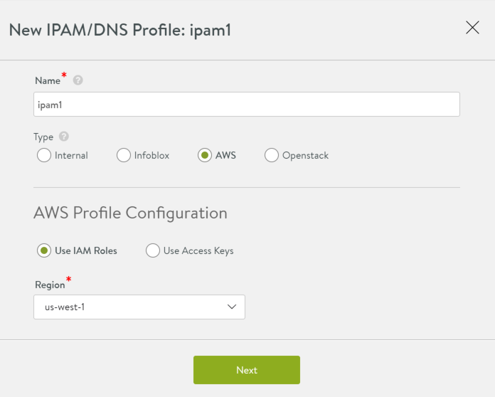

Avi Vantage integrates with Amazon Web Services (AWS) for providing IPAM services to applications running on instances in AWS.

Note:

* AWS Cloud in Avi supports IPAM, by default, without this configuration. This is required only for cases where AWS provides the infrastructure service for other clouds (e.g., Mesos Cluster running on AWS instances).
* No DNS support in Avi with AWS as the DNS provider. 

**IPAM Configuration**

To use AWS as the IPAM provider, one of the following types of credentials is required:

* Identity and Access Management (IAM) roles: Set of policies that define access to resources within AWS.
* AWS customer account key: unique authentication key associated with the AWS account. 

**If Using IAM Role:**

Select AWS and Use IAM Roles. Then select the AWS region into which the VIPs will be deployed.

**If Using Access Key:**

Select AWS, then select Use Access Keys and enter the following information:

* Access Key ID: AWS customer key ID.
* Secret Access Key: customer key.
* Region: AWS region into which the VIPs will be deployed. 

After clicking Next, a drop down of available networks to choose from for IPAM is displayed. Select the appropriate network and click Save.

