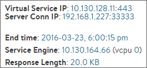
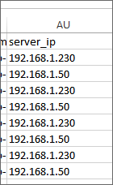

### Description

A common requirement when testing a new load balancer is to validate that it correctly balances load. And round robin, due to its grandfather status among load-balancing algorithms, is often used as a simple test case.

Round robin load balancing, although the oldest and most trusted of load balancing methods, can exhibit unexpected (non-uniform) distribution of traffic upon close scrutiny. Often, this non-uniform distribution of traffic is due to interoperation with other features.

From an external view, such as through tcpdump, it may appear as if round robin is not operating correctly, since connections are distributed in a non-uniform fashion. While it is reasonable to expect round robin to interoperate with other features without issues, there are many possible reasons for non-uniform distribution of load. These are described below.

### Potential Causes of Non-uniform Round-robin Load Balancing

* **Persistence:** Persistence is the opposite of load balancing. Once a client has connected, stick them to the same server for a duration of time. Validate no persistence is configured within the pool.
* **Passive Health Monitor:** This monitor is listening to client-to-server interaction, and may dynamically adjust the ratio of traffic a server receives depending on the responses it is sending. So while the server may be passing the active (static) health monitor, if a server is sending out a few 503 (server busy) messages, the passive monitor will throttle back the volume of traffic sent to the server, thereby disrupting the expected round robin behavior.
* **Server Ratio:** Within the pool's server edit tab, ensure that all servers have the same ratio.
* **Connection Multiplex:** Enabled by default within the HTTP application profile, connection multiplex attempts to accelerate traffic by keeping idle connections open for further reuse, rather than tearing down a client connection, then immediately opening a new one for the next client. This reuse means you will not see a clear one-to-one correlation of client connections to server connections.
* **Scaled Across SEs:** Avi Service Engines are based on a distributed-system model. This impacts round robin at various levels. First, virtual services may be scaled out across multiple SEs for increased capacity or better high availability. Each SE individual performs round robin for the connections it manages.
* **Scaled Across CPU Cores:** Internally within an SE, a CPU core is designated as a 'dispatcher', which picks up packets from the NIC and distributes them (based on packet streams / connections) to the CPU cores (including the one it is residing on). It takes into account how busy each core is to ensure the least-loaded CPU core answers the connection. On a busy system, this means the CPU core with the dispatcher (generally vCPU0) will tend to handle less traffic than the other cores. Each CPU (or vCPU) within the SE independently makes load balancing decisions. So CPU0 and CPU1 both perform round robin. The first client connection goes to CPU0, which sends the connection to server 1. The second connection may go to CPU1, which may also send the connection to server 1.

### How to Validate

To validate that the load balancing behavior is correct, first make configuration changes based on the recommendations above, if applicable. Then view the logs for the virtual service. Make sure to display both the significant and the non-significant logs. (In the web interface, these are separate checkboxes.) If non-significant logs are not captured, they will need to be enabled on the Analytics page of the virtual service configuration.

Open a log to see the expanded view. In the middle column, there is a row for Service Engine, which also shows the vCPU used by the connection. If the virtual service is scaled across multiple SEs, click the SE IP address to add to the log filter. Then click the vCPU number, which filters logs for connections that were handled by this CPU.

The resulting logs can be downloaded by clicking the Export button, at the top right of the logs page. In the resulting CSV file, the Server_IP column shows the order of requests or connections sent to servers from the filtered SE CPU. In the example shown here, column AU shows that round-robin server selection is occurring correctly.
