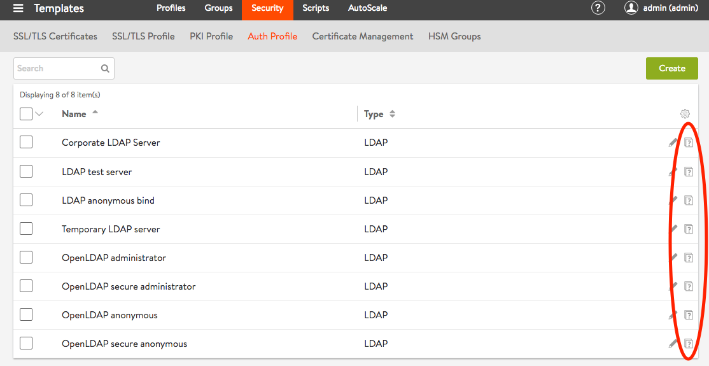
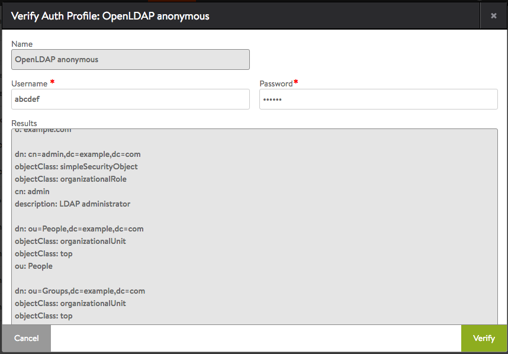
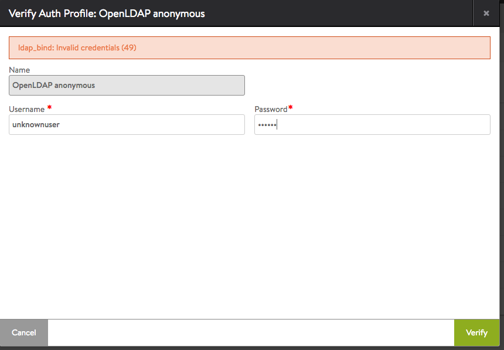
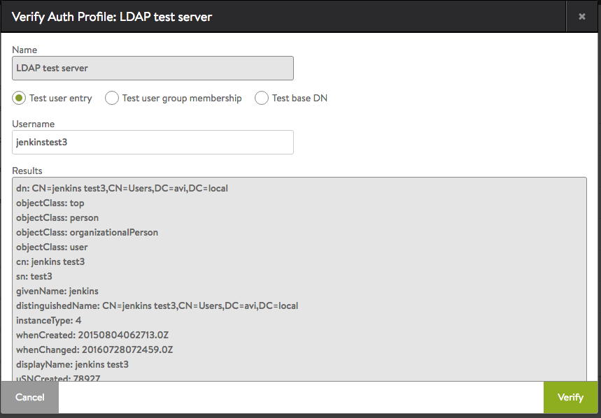
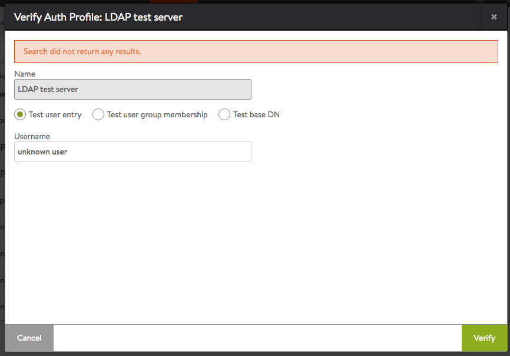
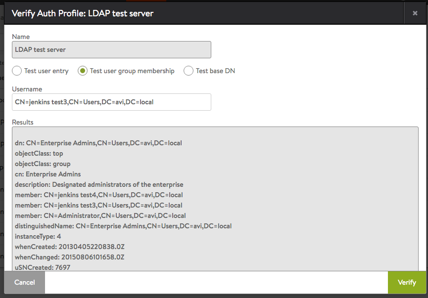
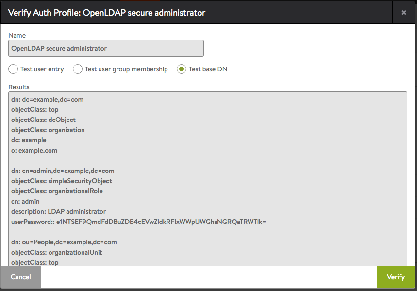
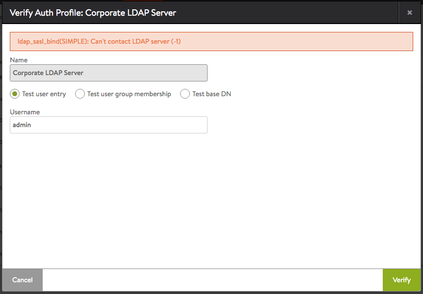
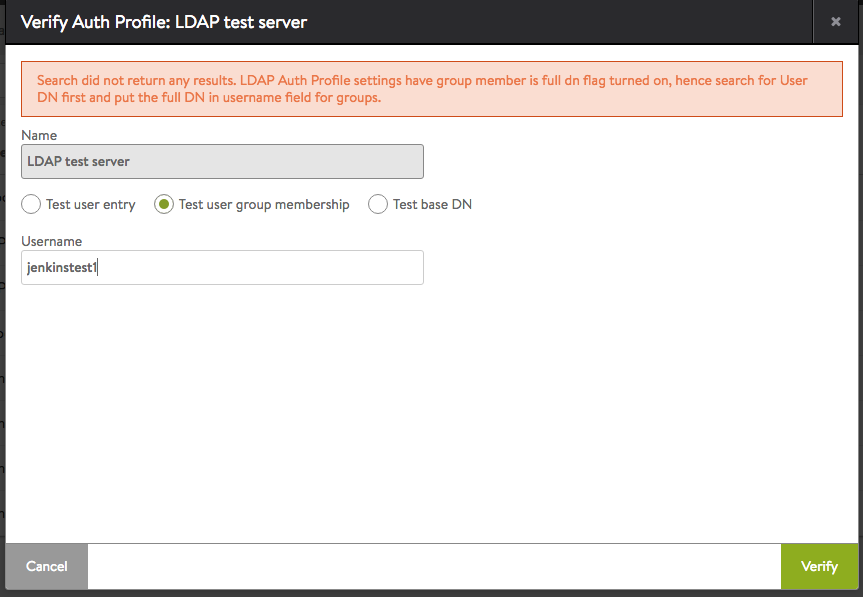

Avi Vantage provides an option for testing authentication profiles configured on the Avi Controller.

## Testing an Authentication Profile

After an authentication profile is created, it is added to the list on the Templates > Security > Auth Profile page. Click the verify icon  next to a profile name to test that profile. A popup appears, prompting for information needed to perform the test.

 

## Test Options for LDAP Authentication Profiles

The popup for testing an LDAP authentication profile requires some information to be entered. The information is used in the request Vantage sends to the LDAP server to test the profile.

### Test Inputs for Anonymous Bind

If the LDAP authentication profile is configured to use anonymous binding for authentication requests, the popup for testing the profile prompts for the LDAP user's username and password. Testing whether a user can bind successfully verifies that the LDAP authentication profile is configured correctly to authenticate users with the same user DN pattern.

### 

 

### Test Inputs for Administrator Bind

If the LDAP authentication profile is configured to use administrator binding for authentication requests, one of the following types of information can be specified on the verification popup for the profile.

 

* **Test user entry:** Searches the LDAP server's database for the specified username, and returns the corresponding user entry from the LDAP database. This option is useful for listing all attribute key-value pairs for any given user. The user search settings configured in the authentication profile are used. If the Username field is left empty, Vantage pulls the entire list of user records from the LDAP database. (While this causes no harm, it can take some time to fulfill, which may be undesirable in some deployments.) 

 

     

 

* **Test user group membership:** Lists all group memberships for the specified user. The group search settings configured in the authentication profile are used. If the Username field is left empty, all groups are returned. 

 

 

* **Test base DN:** Returns all objects under the base DN. This option is useful for testing administrator permissions and for reading the DN tree of the LDAP server. 

 

 

**Error Scenarios:**  The test page can identify some common error scenarios.

 

* LDAP server IP/port incorrect. 

 

 

* Bad username or User Search settings are incorrect 

 

 

* User is either not a member of any group or Group Search settings are incorrect 

 

 

 
