LDAP authentication profile examples

* Active Directory common settings: with Administrator bind, group membership tends to include full user DN. 

<a href="img/Screen-Shot-2016-08-08-at-12.53.47-AM.png">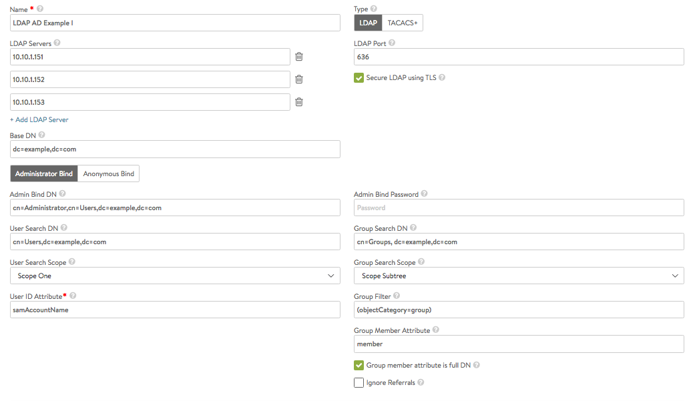</a>

 

* Active Directory common settings: with Anonymous bind. If LDAP/AD user can bind with the DN jdoe@example.com and password, it validates the user login 

<a href="img/Screen-Shot-2016-08-08-at-1.15.57-AM.png">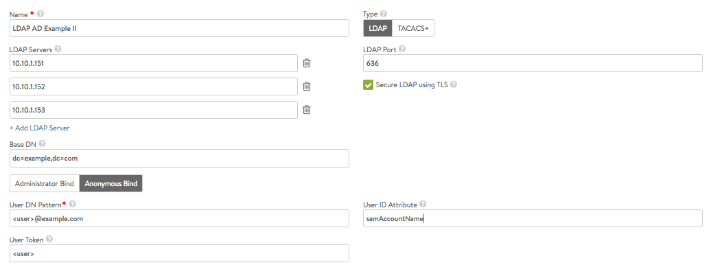</a>

* OpenLDAP settings: with Administrator bind. 

<a href="img/Screen-Shot-2016-08-08-at-12.51.49-AM.png">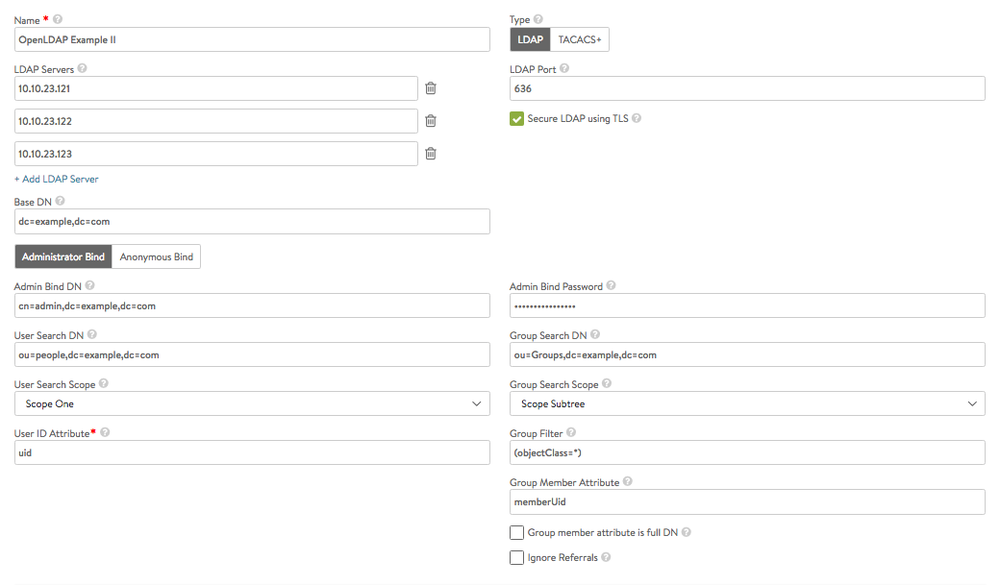</a>

* OpenLDAP settings: with Anonymous bind, If LDAP user can bind with the DN "cn=jdoe, ou=People, dc=example, dc=com" and password, it validates the user login 

<a href="img/Screen-Shot-2016-08-08-at-1.23.28-AM.png">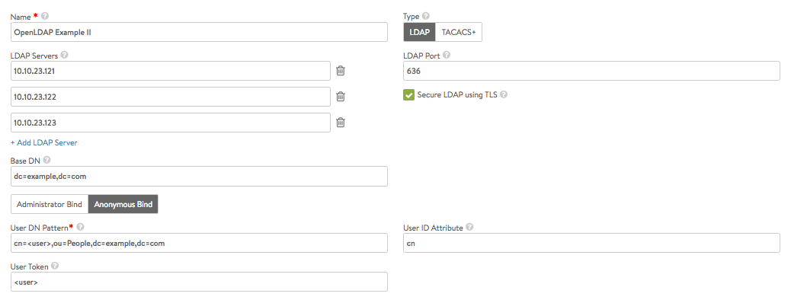</a>

* Secure vs Non-Secure LDAP settings: typically LDAP uses port 389 for clear text, port 636 for LDAPS. Where possible LDAPS is preferable. Just port alone does not determine LDAP security mode, hence administrator should explicitly check the box to indicate whether secure LDAP is in use or not. 

 

<a href="img/Screen-Shot-2016-08-10-at-5.17.11-PM.png">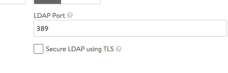</a>                <a href="img/Screen-Shot-2016-08-10-at-5.16.51-PM.png">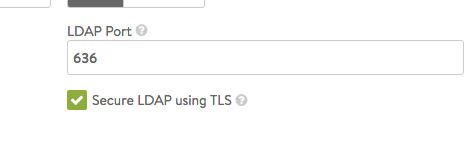</a>

 

* Group Filter, (objectClass=*): safest option to set and will ensure every object is assumed as an LDAP group and searched for members. least optimal. 

 

<a href="img/Screen-Shot-2016-08-10-at-5.37.16-PM.png">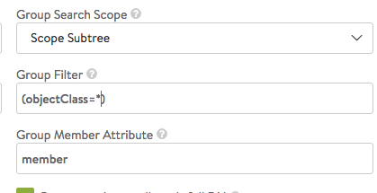</a>

 

* Group Filter, (objectCategory=group): typically group objects in LDAP have a category value set to "group".  
    * Documentation from Active Directory: If you have a choice between using objectCategory and objectClass, it is recommended that you use objectCategory. That is because objectCategory is both single valued and indexed, while objectClass is multi-valued and not indexed (except on Windows Server 2008 and above). A query using a filter with objectCategory will be more efficient than a similar filter with objectClass. Windows Server 2008 domain controllers (and above) have a special behavior that indexes the objectClass attribute. 

 

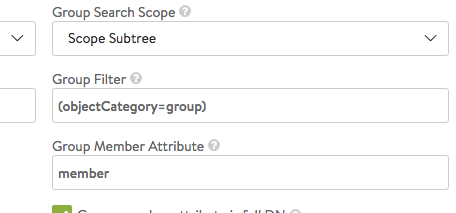

 

* Group Filter, (objectClass=posixGroup): openLDAP groups can in some environments be of type "posixGroup" instead of just "group". 

 

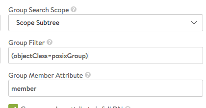

 

* Group Filter, more complex options: (&(objectCategory=group)(cn=Avi-*)) -- if all known groups of interest start with the name "Avi-"; the search can avoid fetching other groups. Some organizations have thousands of groups in some hierarchy and its preferable to filter them based on known scenarios. 

 

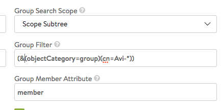

 

* Group member is full DN or not? Auth Profile test page can print the full DN tree from base DN level. For group entries the member attribute value shows whether it is full DN or not. 

 

<a href="img/Screen-Shot-2016-08-11-at-12.43.48-AM.png">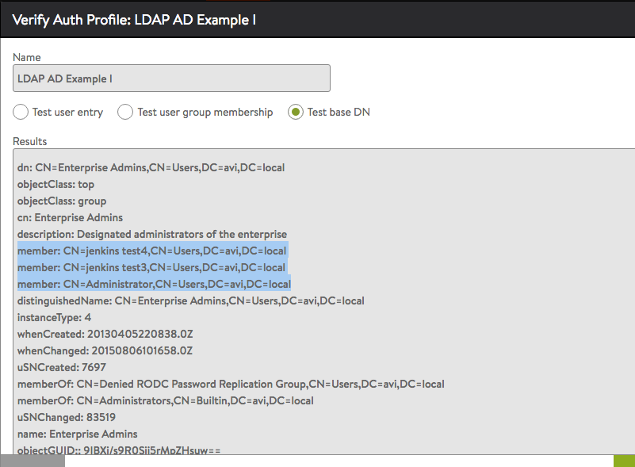</a>

 

* Ignore referrals: this is a useful option if LDAP group search is delayed due to unnecessary referral searches. When enabled, the group search will skip referrals links that connect to another LDAP server. 

 

<a href="img/Screen-Shot-2016-08-11-at-12.49.39-AM.png">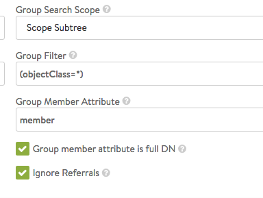</a>

 

 
