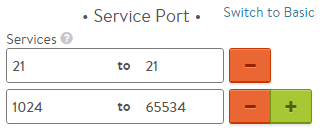

The File Transfer Protocol comes in two flavors, active and passive.  In both cases, clients open a TCP based control channel on port 21.  For active FTP, a second data channel is initiated from the server to the client via port 21.  For passive FTP, the client initiates the data channel via a high port negotiated with the server.  

### Passive FTP

Avi Vantage supports passive FTP via the following configuration.

**Virtual Service Settings**: 

**Application Profile**: L4 

**TCP/UDP Profile**: TCP-proxy 

**Service Ports**:  Set to Advanced via GUI 

**Port**: 21 to 21 

**Port**: 1024 to 65534 

**Pool Settings**: 

**Load Balance Algorithm**:  Least Connections 

**Persistence**:  Client IP 

**Health Monitor**:  TCP 

**Health Monitor Port**:  21 

**Port Translation**: Disable 

For version v15.3 and older, Avi only supports Passive FTP in non scaled out high availability modes. If Service Engine scaling is required, please contact Avi for early access to functionality that will enable FTP in a scaled out environment.

### Active FTP

Active FTP requires support for Service Engines to be the server's default gateway.  Until this support is available, active FTP is not supported.  Avi recommends use of passive FTP as a workaround.

<pre>&gt; <strong>ftp  ftp.test.com</strong>
Connected to ftp.test.com.
ftp.test.com FTP server ready.
Name (test:user): <strong>anonymous</strong>
Password required for anonymous.
Password: <strong>******</strong>
User anonymous logged in.
Remote system type is UNIX.
Using binary mode to transfer files.
ftp&gt; <strong>passive</strong>
Passive mode on.</pre> 