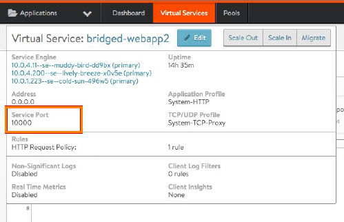
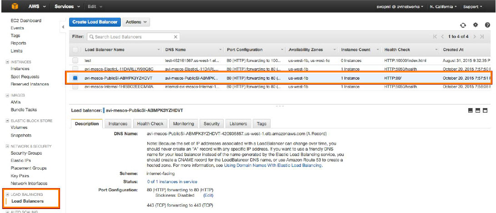
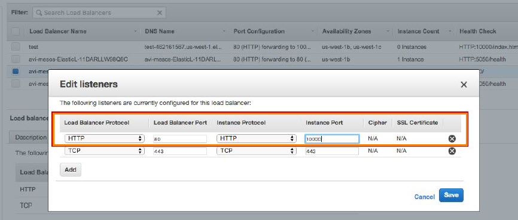
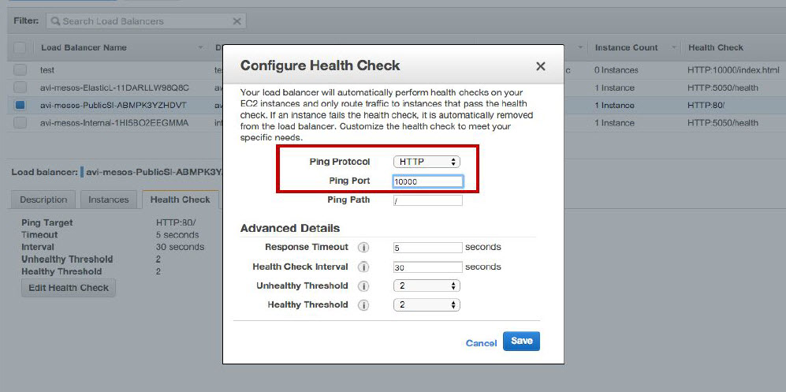
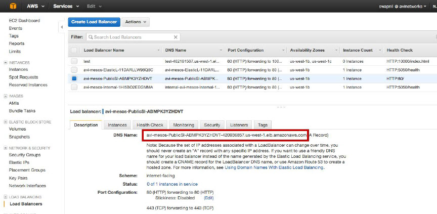
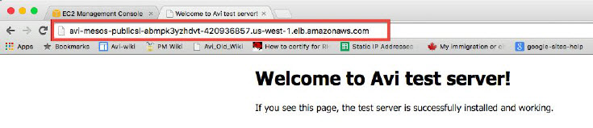

This article describes how to deploy and verify load-balanced application in a Mesos / Marathon cloud hosted by Amazon Web Services (AWS).

Applications must be created through Marathon, for example with a *curl* command through the CLI or using the "avi_proxy" label in a CloudFormation template. This article includes steps for creating a simple test application using the Marathon CLI. To create an application using labels, see <a href="/docs/16.2/creating-applications-in-mesos-with-marathon-labels/">here</a>.

To deploy a service in this environment:
<ol> 
 <li> 
Create the application through Marathon.
 </li> 
 <li> 
Set the health check and application port numbers in the AWS EC2 instance to the port number assigned to the application by Marathon.
 </li> 
 <li> 
Use a browser to navigate to the application.
 </li> 
</ol> 

Detailed steps are provided below.

## Requirements

The article assumes that Avi Vantage is already <a href="/docs/16.2/installation-guides/installing-mesos-aws-using-the-vantage-cloudformation-template/">installed</a> in the Mesos / Marathon cloud.

The steps in this article require access to the following resources:

* Marathon account with privileges to create an application through Marathon 
* AWS account through which Avi Vantage was installed 
* User account on Avi Controller 
* Docker application (if creating a new application using the CLI)  

## Create an Application Through Marathon

The following commands are entered in an SSH session with Marathon to create a test application:
<ol> 
 <li> 
Download Docker.json (<a href="https://s3uswest1.amazonaws.com/avitm/Docker.json">https://s3uswest1.amazonaws.com/avitm/Docker.json</a>) and save it in the /Downloads directory.
 </li> 
 <li> 
Create a Docker image file such as the following for the application:
 <pre crayon="false" class="command-line language-bash" data-user="aviuser" data-host="avihost" data-output="1-100" white-space="pre"><code>
{
  "id": "webapp-ew1",
  "cpus": 0.5,
  "mem": 64.0,
  "instances": 2,
  "container": {
    "type": "DOCKER",
    "docker": {
      "image": "avinetworks/server",
      "network": "BRIDGE",
      "portMappings": [
        { "containerPort": 80, "hostPort": 0, "servicePort": 0, "protocol": "tcp" }
      ]
    }
  },
  "labels": {}"
  },
  "healthChecks": [
    {
      "protocol": "HTTP",
      "portIndex": 0,
      "path": "/",
      "gracePeriodSeconds": 5,
      "intervalSeconds": 20,
      "maxConsecutiveFailures": 3
    }
  ]
}
</code></pre> </li> 
 <li> Start the application to create a virtual service for it: <pre crayon="false" class="command-line language-bash" data-user="aviuser" data-host="avihost"><code>curl -H "Content­Type: application/json" -X POST -d@Downloads/Docker.json http://marathon-ip-or-hostname:8080/v2/apps</code></pre> 
 The H and X options are required. The H option inserts a Content­Type header for the Avi SE application. The X option changes the HTML method of the request from GET (the default) to POST. Replace marathon-ip-or-hostname with the IP address or hostname of Marathon. 
</li> 
</ol> 

## Set the Health-check and Application Port Numbers

<ol> 
 <li> 
Locate the port number assigned to the application by Marathon:
 
a. Log into the Avi Controller web interface.
 
b. Navigate to Applications &gt; Dashboard, and click on the icon for the virtual service.
 
c. Hover over the virtual service name, to the left of the Edit button. Copy or write down the port number. 
 </li> 
 <li> 
Log into your AWS account, and browse to EC2 Load Balancing instance.
 </li> 
 <li> 
Click on  to go to the AWS home page.
 </li> 
 <li> 
Select EC2 and click on Load Balancing in the left pane.
 </li> 
 <li> 
Click on <em>stack-name</em>-public instance in the Load Balancer field as shown in this example: 
 </li> 
 <li> 
Click on the Listeners tab and edit the application port number to the application port number assigned by Marathon. 
 </li> 
 <li> 
Click on the Health Check tab and edit the ELB health check port number to the application port number assigned by Marathon. 
 </li> 
</ol> 

## Browse to the Application

<ol> 
 <li> 
In AWS, click on the Description tab for the ELB instance. 
 </li> 
 <li> 
Copy-and-paste the DNS name (URL) into a new browser window. 
 </li> 
</ol> 